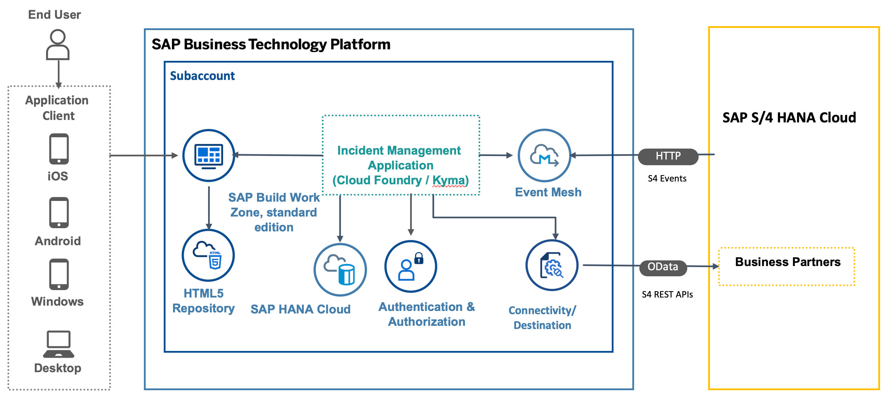

# SAP BTP Developer's Guide

## Overview

The goal of the SAP BTP Developer’s Guide is to help you implement business applications on SAP BTP. The SAP BTP Developer's Guide explains the building blocks for developing, delivering, and integrating business applications.
Development projects for business applications have similar characteristics. Standardized development guidance is driving developer efficiency.
The Incident Management sample application is a showcase of the SAP Cloud Application Programming Model (CAP) and adheres to the development recommendations set out in the SAP BTP Developer’s Guide. Best practices are documented in step-by-step tutorials based on the Incident Management application for learning how to develop, deploy, and operate a full-stack application using CAP and SAP Fiori. The tutorials also show how to use a set of important SAP BTP services in a CAP application.

## Business Scenario

The Incident Management application uses the following sample business scenario:

ACME is a popular Electronics company. ACME hires call center support representatives to process and manage customer incidents. A call center support representative (Processor) receives a phone call from an existing customer and creates a new incident on behalf of the customer. The newly created incident is based on a customer complaint received during the phone call so the call center support representative also adds the conversation with the customer to the incident.

## Solution Diagram

## Tutorials

The tutorials are organized in the following way.

* Basic groups of tutorials for the Incident Management application. See:

    * [Develop a Full-Stack CAP Application](https://developers.sap.com/group.cap-application-full-stack.html)
    * [Deploy a Full-Stack CAP Application in SAP BTP, Cloud Foundry Runtime](https://developers.sap.com/group.deploy-full-stack-cap-application.html)
    * [Deploy a Full-Stack CAP Application in SAP BTP, Kyma Runtime](https://developers.sap.com/group.deploy-full-stack-cap-kyma-runtime.html)

* Separate tutorials for the additional modules based on the Incident Management application

    * Remote service integration using SAP Destination and Connectivity service
    * Eventing using the SAP Event Mesh service which is built on top of the remote service integration
    * Integrating change tracking to the Incident Management application

## TUTORIALS : BTP-Developer-guide-cap

The tutorials in this repository provide hands-on experience following the [SAP BTP Developer's Guide](https://help.sap.com/docs/btp/btp-developers-guide/tutorials-for-sap-cloud-application-programming-model?version=Cloud) for SAP Cloud Application Programming Model. The tutorials cover topics from basic onboarding to creating development pipelines.

### Getting Started
1. [Introduction to Application Development Using CAP](./documentation/tutorials/introduction/introduction.md)
2. [Set Up SAP Business Application Studio](./documentation/tutorials/set-up-bas/set-up-bas.md)
3. [Build a CAP Application](./documentation/tutorials/build-cap-app/build-cap-app.md)

### Development & Enhancement
4. [Add Fiori Elements UIs](./documentation/tutorials/add-fiori-elements-uis/add-fiori-elements-uis.md)
5. [Add Custom Logic](./documentation/tutorials/add-custom-logic/add-custom-logic.md)
6. [Use a Local Launch Page](./documentation/tutorials/use-local-launch-page/use-local-launch-page.md)
7. [Add Authorization](./documentation/tutorials/add-authorization/add-authorization.md)
8. [Add Test Cases](./documentation/tutorials/add-test-cases/add-test-cases.md)

### Production Preparation
9. [Prepare for Production](./documentation/tutorials/prep-for-prod/prep-for-prod.md)

### Deployment - Cloud Foundry Runtime
10. [Prepare for SAP BTP Development with Cloud Foundry Runtime](./documentation/tutorials/prepare-btp-cf/prepare-btp-cf.md)
11. [Deploy in SAP BTP, Cloud Foundry Runtime](./documentation/tutorials/deploy-to-cf/deploy-to-cf.md)
12. [User Role Assignment](./documentation/tutorials/user-role-assignment/user-role-assignment.md)
13. [Integrate Your Application with SAP Build Work Zone, Standard Edition](./documentation/tutorials/integrate-with-work-zone/integrate-with-work-zone.md)
14. [Set Up a CI/CD Pipeline](./documentation/tutorials/set-up-cicd/set-up-cicd.md)

### Deployment - Kyma Runtime
15. [Prepare for Deployment in the SAP BTP, Kyma Runtime](./documentation/tutorials/prepare-btp-kyma/prepare-btp-kyma.md)
16. [Deploy in SAP BTP, Kyma Runtime](./documentation/tutorials/deploy-to-kyma/deploy-to-kyma.md)
17. [User Role Assignment](./documentation/tutorials/user-role-assignment/user-role-assignment.md)
18. [Integrate Your Application with SAP Build Work Zone, Standard Edition (Kyma Runtime)](./documentation/tutorials/integrate-with-work-zone-kymaruntime/integrate-with-work-zone-kymaruntime.md)
19. [Set Up a CI/CD Pipeline for Kyma](./documentation/tutorials/set-up-cicd-kyma/set-up-cicd-kyma.md)

### Remote Services - Mock Server Integration
20. [Introduction to Remote Service Connectivity](./documentation/tutorials/remote-service-intro/remote-service-intro.md)
21. [Get the Business Partner API and Extend the Incident Management Application](./documentation/tutorials/remote-service-extend/remote-service-extend.md)
22. [Test the Extended Incident Management Application with the Business Partner API](./documentation/tutorials/remote-service-run-dev-test/remote-service-run-dev-test.md)
23. [Install a Mock Server in the SAP BTP, Cloud Foundry Runtime](./documentation/tutorials/remote-service-set-up-mock-cf/remote-service-set-up-mock-cf.md)
24. [Install a Mock Server in the SAP BTP, Kyma Runtime](./documentation/tutorials/remote-service-set-up-mock-kyma/remote-service-set-up-mock-kyma.md)
25. [Deploy and Run the Incident Management Application in the SAP BTP, Cloud Foundry Runtime with a Mock Server](./documentation/tutorials/remote-service-deploy-with-mock-cf/remote-service-deploy-with-mock-cf.md)
26. [Deploy and Run the Incident Management Application in the SAP BTP, Kyma Runtime with a Mock Server](./documentation/tutorials/remote-service-deploy-with-mock-kyma/remote-service-deploy-with-mock-kyma.md)

### Remote Services - S/4HANA Cloud Integration
27. [Configure Connectivity Between SAP S/4HANA Cloud and SAP Business Technology Platform](./documentation/tutorials/remote-service-configure-connectivity/remote-service-configure-connectivity.md)
28. [Deploy and Run the Application on Cloud Foundry with SAP S/4HANA Cloud Backend](./documentation/tutorials/remote-service-deploy-to-cf/remote-service-deploy-to-cf.md)
29. [Deploy and Run the Application on Kyma with SAP S/4HANA Cloud Backend](./documentation/tutorials/remote-service-deploy-to-kyma/remote-service-deploy-to-kyma.md)

### External Resources
For additional context, you can also refer to the published tutorial groups on SAP Developer Center:
- [Develop a Full-Stack CAP Application](https://developers.sap.com/group.cap-application-full-stack.html)
- [Deploy a Full-Stack CAP Application in SAP BTP, Cloud Foundry Runtime](https://developers.sap.com/group.deploy-full-stack-cap-application.html)
- [Deploy a Full-Stack CAP Application in SAP BTP, Kyma Runtime](https://developers.sap.com/group.deploy-full-stack-cap-kyma-runtime.html)

## Known Issues

No known issues.

## How to Obtain Support

In case you find a bug, or you need additional support, please open an issue in this GitHub repository.

## License

Copyright (c) 2023 SAP SE or an SAP affiliate company. All rights reserved. This project is licensed under the Apache Software License, version 2.0 except as noted otherwise in the [LICENSE](LICENSE) file.
