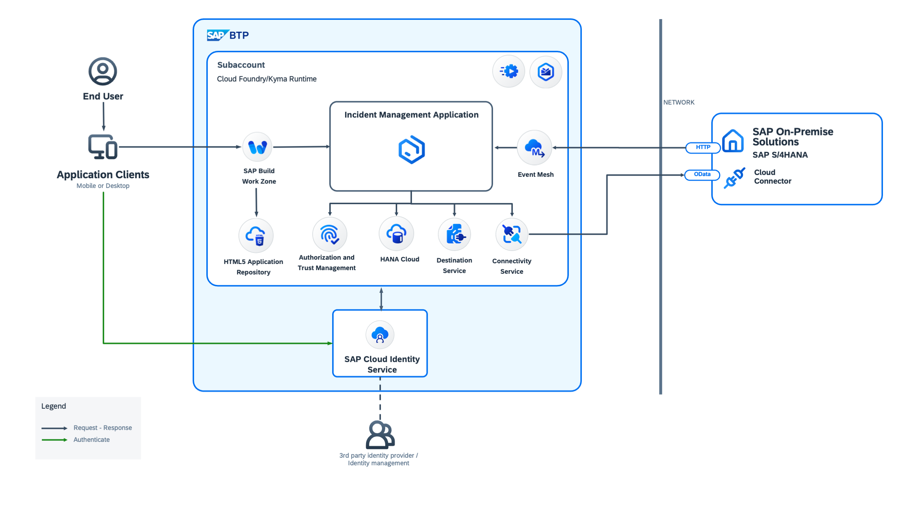

# SAP BTP Developer's Guide

## Overview

The goal of the SAP BTP Developer’s Guide is to help you implement business applications on SAP BTP. The SAP BTP Developer's Guide explains the building blocks for developing, delivering, and integrating business applications.
Development projects for business applications have similar characteristics. Standardized development guidance is driving developer efficiency.
The Incident Management sample application is a showcase of the SAP Cloud Application Programming Model (CAP) and adheres to the development recommendations set out in the SAP BTP Developer’s Guide. Best practices are documented in step-by-step tutorials based on the Incident Management application for learning how to develop, deploy, and operate a full-stack application using CAP and SAP Fiori. The tutorials also show how to use a set of important SAP BTP services in a CAP application.

## Business Scenario

The Incident Management application uses the following sample business scenario:

ACME is a popular Electronics company. ACME hires call center support representatives to process and manage customer incidents. A call center support representative (Processor) receives a phone call from an existing customer and creates a new incident on behalf of the customer. The newly created incident is based on a customer complaint received during the phone call so the call center support representative also adds the conversation with the customer to the incident.

## Solution Diagram

## Tutorials

The tutorials are organized in the following way.

* Basic groups of tutorials for the Incident Management application. See:

    * [Develop a Full-Stack CAP Application](https://developers.sap.com/group.cap-application-full-stack.html)
    * [Deploy a Full-Stack CAP Application in SAP BTP, Cloud Foundry Runtime](https://developers.sap.com/group.deploy-full-stack-cap-application.html)
    * [Deploy a Full-Stack CAP Application in SAP BTP, Kyma Runtime](https://developers.sap.com/group.deploy-full-stack-cap-kyma-runtime.html)

* Separate tutorials for the additional modules based on the Incident Management application

    * Remote service integration using SAP Destination and Connectivity service
    * Eventing using the SAP Event Mesh service which is built on top of the remote service integration
    * Integrating change tracking to the Incident Management application

## Known Issues

No known issues.

## How to Obtain Support

In case you find a bug, or you need additional support, please open an issue in this GitHub repository.

## License

Copyright (c) 2023 SAP SE or an SAP affiliate company. All rights reserved. This project is licensed under the Apache Software License, version 2.0 except as noted otherwise in the [LICENSE](LICENSE) file.
