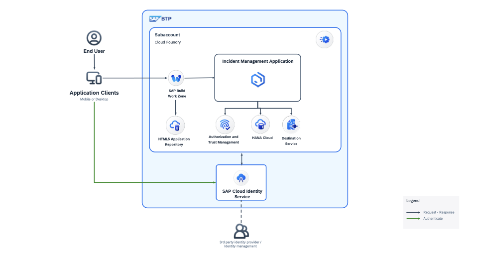

# Introduction to SAP Build Code

SAP Build Code is a turn key development environment that combines runtime and design-time capabilities with built-in solutions for DevOps and application lifecycle management.

# Benefits of SAP Build Code

With the help of SAP Build Code, you can:

- Achieve a clean core by developing side-by-side extensions
- Optimize developer efficiency with generative AI, productivity tools, and application lifecycle management
- Build and extend powerful end-to-end business applications with programming language of choice
- Leverage interoperability between classic development and low-code development tools. 

# Key Capabilities of SAP Build Code. 
- Enable developers to code faster and smarter, generate code from natural language descriptions using generative AI
- Build extension applications, and integrate them with SAP and non-SAP systems
- Use the centralized Lobby for fusion development

# SAP Build code with Joule

SAP Build Code offers an AI-powered cloud development environment specifically tailored for SAP Cloud Application Programming Model (CAP), SAP Fiori, mobile, and SAPUI5 developers.

By seamlessly integrating coding, testing, and application management, it streamlines the application development process on SAP BTP. SAP Build Code combines SAP Business Application Studio with the most essential services and SDKs on SAP BTP.

With the integration of Joule, the innovative AI copilot of SAP, SAP Build Code enables automatic generation of application code, data models, services, and sample data. Using SAP Build Code ensures adherence to the best practices and guidance outlined in the SAP BTP Developer's Guide.

## Business Scenario

The Incident Management application uses the following sample business scenario:

ACME is a popular Electronics company. ACME hires call center support representatives to process and manage customer incidents. A call center support representative (Processor) receives a phone call from an existing customer and creates a new incident on behalf of the customer. The newly created incident is based on a customer complaint received during the phone call so the call center support representative also adds the conversation with the customer to the incident.

## Solution Diagram

<!-- ## Prerequisites 

1. [Get an Account on SAP BTP Trial](https://developers.sap.com/tutorials/hcp-create-trial-account..html) Or
[Get SAP BTP Productive account]() -->
<!-- 2. [Create space](./document/create-space.md) -->

### Hands on Exercise: Develop Basic Incident Management Application using Build Code

<!-- 1. [Setup Build Code](./document/setup-build-code.md) -->
1. [Create full stack application](./document/create-full-stack-project.md)
2. [Generate data entities](./document/create-data-entities.md)
3. [Enhance sample data](./document/enhance-sample-data.md)
4. [Generate services](./document/generate-service.md)
5. [Create Backend Logic with Joule](./document/custom-logic.md)
6. [Create Fiori UI using Joule](./document/fiori-ui.md)
7. [Deployment to Cloud Foundry Runtime](./document/deploy-cf.md)
8. [End to End testing](./document/e2e-testing.md)
