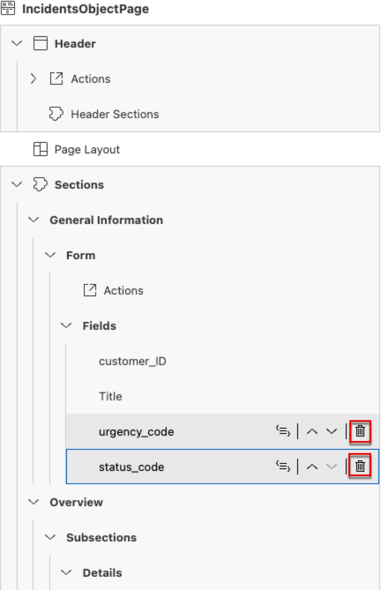

# Configure the Object Page

In this section, you'll modify the Incident Object Page of the UI with the SAP Fiori page editor.

## Prerequisites

Extend fiori UI list report page by following the tutorial [Configure List Report UI](extend-fiori-ui.md)

### Edit header

1. Make sure the SAP Fiori page editor is open. If you closed it, choose the **Open Page Map** option in the **Application Info - incidents** tab.

    > To open the **Application Info - incidents** tab: 
    >
    >1. Invoke the Command Palette - **View** &rarr; **Command Palette** or <kbd>Command</kbd> + <kbd>Shift</kbd> + <kbd>P</kbd> for macOS / <kbd>Ctrl</kbd> + <kbd>Shift</kbd> + <kbd>P</kbd> for Windows. 
    >2. Choose **Fiori: Open Application Info**.

2. In the **Incident Object Page** tile, click the **Pencil** icon next to the title.

    

3. Select **Header**. In the **Title** dropdown menu, select property **title**.

    

4. In the **Description Type** dropdown menu, select **Property**. A dialog opens.

    

5. In the **Define Property** dialog, open the dropdown menu for the **Description** field.

    - Select **customer** &rarr; **name**.
    - Click **Apply**.

    

6. In the **Icon URL** field, enter `sap-icon://alert`.

    

### Add Overview section

7. Select **Sections**. Click the **Plus** icon and select **Add Group Section**.

    

8. In the **Add Group Section** dialog:

    - Enter **Overview** in the **Label** field.
    - Click the **Globe** icon to generate a translatable text key. Click **Apply** to confirm.
    - Click **Add**.
 
    

### Add Details subsection

9. Expand **Sections** &rarr; **Overview** &rarr; **Subsections**.

10. Click the **Plus** icon. Select **Add Form Section**.
 
    

11. In the **Add Form Section** popup:

    - Enter **Details** in the **Label** field.
    - Click the **Globe** icon to generate a translatable text key. Click **Apply** to confirm.
    - Click **Add**.

    

### Configure fields

12. Select **Sections** &rarr; **General Information** and click the **Globe** icon in the **Label** field for **General Information** to generate a translatable text key.  

    
13. Select **Sections** &rarr; **General Information** &rarr; **Form** &rarr; **Fields** and delete the **urgency_code** and **status_code** fields.

    

14. Select field **customer_ID**, change the label to **Customer** and generate a text key for it.

    

15. For the the now renamed **Customer** field, click **Edit properties for Value Help**.

        

16. Dialog **Define Value Help Properties for Customer** opens. 

    - Switch off **Display as Dropdown**
    - Under **Result List**, we only keep column **email**. Delete columns **firstName**, **lastName** and **phone**
    - click **Add Column**, select property **name** and move the column up before column **email**
    - Click **Apply** to confirm changes

    

17. For field **Title**, Click icon **Move Up** to place it before field **Customer** in the section.
    
    

18. Drag and drop section **General Information** into the **Overview** &rarr; **Subsections** node, just above the **Details** subsection.

    

19. Expand **Sections** &rarr; **Overview** &rarr; **Subsections** &rarr; **Details** &rarr; **Form** &rarr; **Fields**. Click the **Plus** icon and select **Add Basic Fields**.

    

20. In the **Add Basic Fields** dialog

    - Open the dropdown **Fields** and select **status_code**, **urgency_code**. 
    - Click **Add**.

    

Please note that when you use the Page Map to configure fields by adding for example a label, a Text/TextArrangement or a value help configuration, the corresponding CDS annotations are generated on property level. As we have already configured and added fields **status_code** and **urgency_code** to the List Report table, these annotations are automatically leveraged when displaying them also at other parts of the UI. You can access the property annotation directly from the Page Map.

21.  Click field **Status**. Move the mouse pointer to property **Text** and click the **Edit in source code** icon. This will open the corresponding CDS annotation for field **Status** in a separate tab.

### Add Conversation section

We will now add another section to the object page displaying a table with conversation related to the incident.

22.  Navigate to **Sections** and click the **Plus** icon. 

23. Select **Add Table Section**. A dialog appears.

    

24. In the **Add Table Section** dialog:

    - Enter **Conversation** in the **Label** field.
    - Click the **Globe** icon to generate a translatable text key. 
    - Select **conversation** in the **Source Value** dropdown menu and choose **Add**.
 
    

### Configure columns

25. Expand **Conversation** &rarr; **Table** &rarr; **Columns** and click the **Plus** icon to add columns. 

26. Choose **Add Basic Columns**. A dialog appears.

    

27. In the **Add Basic Columns** dialog:

    - Open the **Columns** dropdown menu.  All properties of the composition of aspects **conversation** are listed, as defined inline for the `Incidents` entity in file **./db/schema.cds**. 
    - Select **author**, **message**, and **timestamp**. 
    - Click **Add**.

    

28. We will now change the default labels for the added fields. For each of the **CreatedBy**, **message**, and **CreatedOn** columns:

    - In the **Label** field, change the value to **Author**, **Message**, and **Date**, respectively.
    - Press <kbd>Enter</kbd> to confirm the change.
    - Choose the **Globe** icon in the **Label** field to generate a translatable text key.

    

### Configure table and check the result

1.  For **Table**, in the **Type** dropdown menu, select **ResponsiveTable**.

    

2.  In the **Creation Mode: Name** dropdown menu, select **Inline**. With it, the create action adds a new row at the table instead of navigating to a new object entry page.

    

3.  The complete Object Page looks like this:

    

## Next Steps

Deploy your application in SAP BTP, Cloud Foundry and test using [Deploy in SAP BTP, Cloud Foundry Runtime](deploy-cf.md)