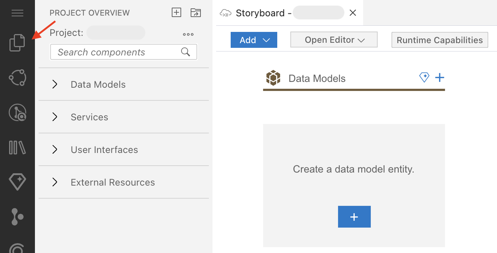
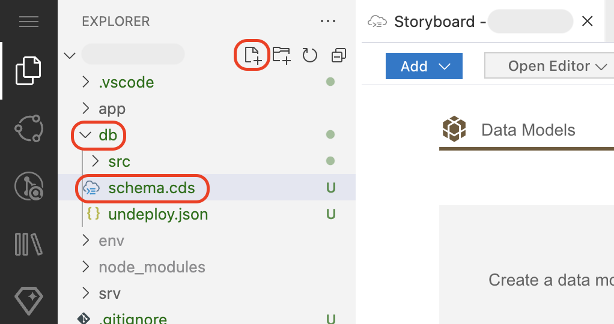
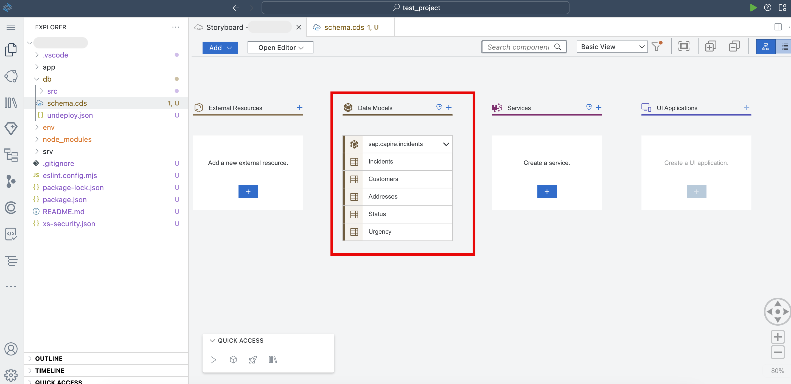

# Create Data Entities

Joule is an AI copilot that can generate the data model of an application as CDS (Core Data Services) entities. However, since the generated model may slightly vary each time a prompt is triggered, we provide a predefined CDS data model. Following a structured manual approach ensures consistency in the exercises. Follow the step-by-step tutorial for manually creating CDS entities instead of relying on AI-generated code.

1. In the SAP Business Application Studio, choose **Project Explorer**.

    

2. Expand the **db** folder. Choose the icon to create a new file, and provide the **schema.cds** file name.

    

3. Copy the following schema to the **schema.cds** file.

```
using { User, cuid, managed, sap.common.CodeList } from '@sap/cds/common';
namespace sap.capire.incidents; 

/**
* Incidents created by Customers.
*/
entity Incidents : cuid, managed {  
customer     : Association to Customers;
title        : String  @title : 'Title';
urgency        : Association to Urgency default 'M';
status         : Association to Status default 'N';
conversation  : Composition of many {
    key ID    : UUID;
    timestamp : type of managed:createdAt;
    author    : type of managed:createdBy;
    message   : String;
};
}

/**
* Customers entitled to create support Incidents.
*/
entity Customers : managed { 
key ID        : String;
firstName     : String;
lastName      : String;
name          : String = firstName ||' '|| lastName;
email         : EMailAddress;
phone         : PhoneNumber;
incidents     : Association to many Incidents on incidents.customer = $self;
creditCardNo  : String(16) @assert.format: '^[1-9]\d{15}$';
addresses     : Composition of many Addresses on addresses.customer = $self;
}

entity Addresses : cuid, managed {
customer      : Association to Customers;
city          : String;
postCode      : String;
streetAddress : String;
}

entity Status : CodeList {
key code: String enum {
    new = 'N';
    assigned = 'A'; 
    in_process = 'I'; 
    on_hold = 'H'; 
    resolved = 'R'; 
    closed = 'C'; 
};
criticality : Integer;
}

entity Urgency : CodeList {
key code: String enum {
    high = 'H';
    medium = 'M'; 
    low = 'L'; 
};
}

type EMailAddress : String;
type PhoneNumber : String;
```

4. Navigate to **Storyboard** in the editor and make sure the **Data Models** section is updated following the entities created in the **schema.cds** file.

    

## Next Step

[Enhance Sample Data](enhance-sample-data.md)
