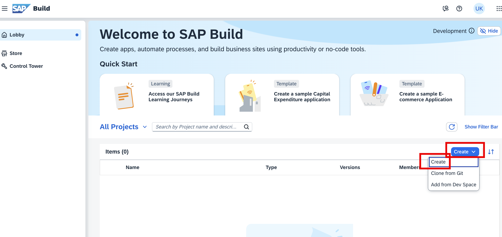
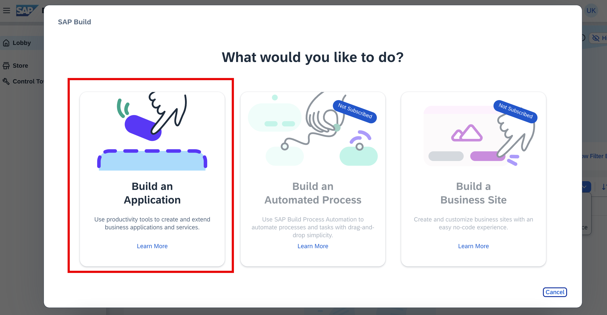
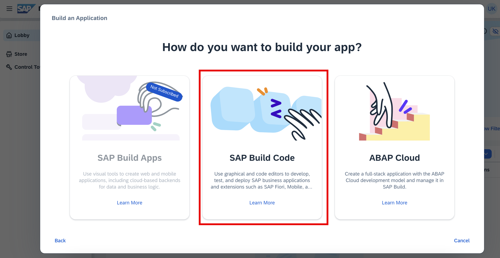
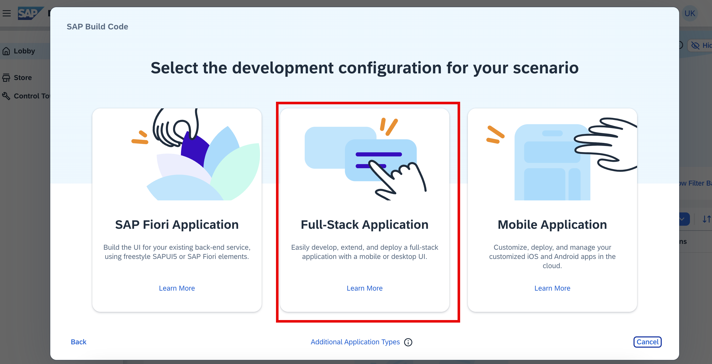
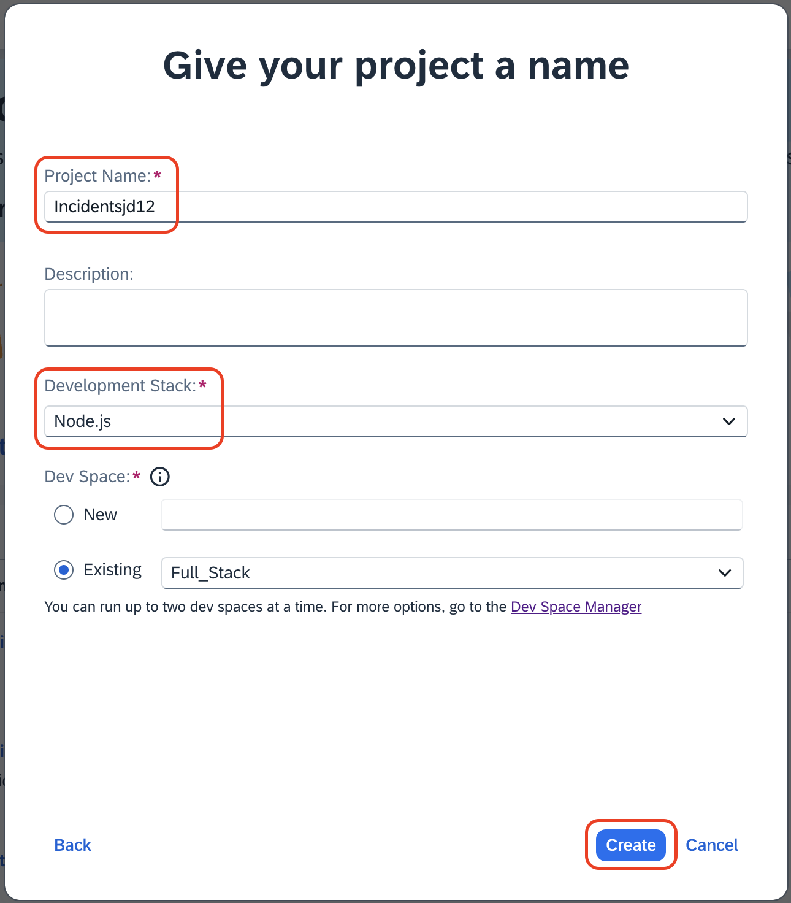
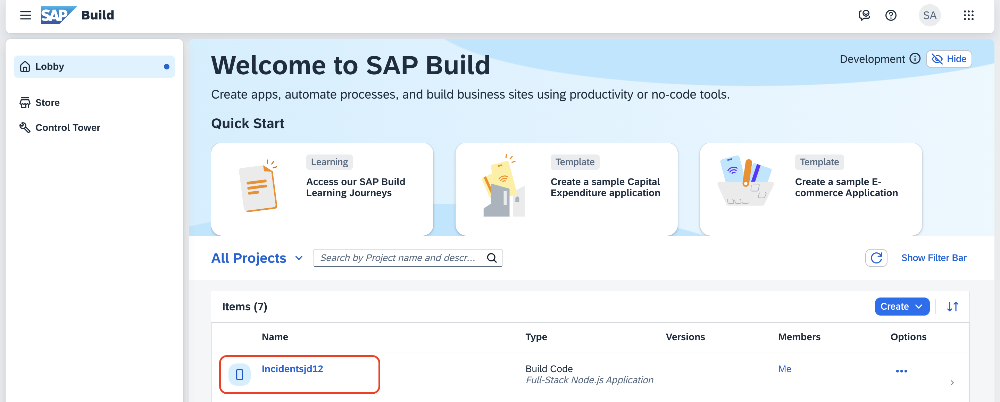

# Create full stack project

This section explain how to access Build Code lobby and create full stack application using SAP build code.

1. Open [SAP Build Lobby](https://sit-buildcode.ap10.build.cloud.sap/index.html).

2. Click on create to create a new project.

    

3. Click on **Build an Application**.
    
    

4. Click on **SAP Build Code**.

    

5. Choose **Full-Stack Application**.

    

6. To give project details, do the following:

    1. Enter **project Name** as `Incidents<your-initials><unique-random-number>`. For example, if your name is `John Doe`, then the project name would be **Incidentsjd12**, (12 is some random number).

        > **Note:** Project name should be unique because to identify your project during deployment phase and also to avoid duplication error.

    2. Select **Node.js** from the **Development stack** dropdown.
    3. You can use the existing Dev Space instead of creating a new Dev space. Let the **Full_Stack** be the default Dev Space.
    4. Click on **Create**.

        

7. Wait for the project to get created. Once its done, click on the created project, which opens in a new tab.

    

## Next Step

[Create data entities](create-data-entities.md)
