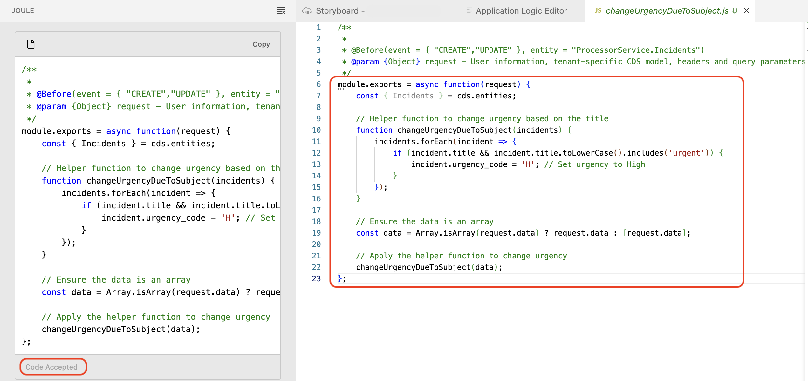

# Create Backend Logic with SAP Joule

In this section with the help of Joule we will generate custom logics before creating and updating of incidents in ProcessorService generated in previous section.

## Prerequisites

You have created Services using [Create Services](generate-service.md)

## Custom Logic for ProcessorService

1. Go back to the Storyboard.

    

2. Under Services, click on the **Incidents** entity under **ProcessorService** and click on the **Add Logic**.

    

3. It opens the Application Logic Editor.

### Logic 1: changeUrgencyDueToSubject

1. In the Application Logic Editor, update the **Name** field to **changeUrgencyDueToSubject** and Click on **Add**.

    

2. Select **Before** Phase and select **Create** and **Update** Standard Events.

    

    > This logic will be automatically executed before creating or updating a particular incident.

3. Click on **Open Code Editor**, and select **Application Logic** under that.

    

4. This will open Joule to create logic for changeUrgencyDueToSubject.

    

    > In the Joule Prompt, **/cap-app-logic** is used for creating custom backend logic for the services created. Once the code is generated from the Joule, **#srv/code/changeUrgencyDueToSubject.js** tells which file to fill the generated code.

5. Joule Prompt will be pre-filled with /cap-app-logic #srv/code/changeUrgencyDueToSubject.js. After the pre-filled command, use the below Prompt to create the custom logic.

    ```console
    Create a helper function named 'changeUrgencyDueToSubject' which checks the title of the incident is having urgent keyword and update the urgency_code field to High. Ensure the data is array or wrap in an array.
    ```
    
6. Click on **Send** icon.

    

7. Once the Joule responds with the code, check the implementation and Accept it. 

    

    > Joule may generate different codes for the same prompt. If the code for the backend logic differs but achieves the same result, you can ignore the variation.

### Logic 2: onUpdate

1. Go back to the Application Logic Editor, and click on **+**.

    

2. Update the **Name** field to **onUpdate** and Click on **Add**.

    

3. Select **Before** Phase and select **Update** Standard Event.

    

    > This logic will be automatically executed before updating a particular incident.

4. Click on **Open Code Editor**, and select **Application Logic** under that.

    

5. This will open Joule to create logic for onUpdate.

    

    > In the Joule Prompt, **/cap-app-logic** is used for creating custom backend logic for the services created. Once the code is generated from the Joule, **#srv/code/onUpdate.js** tells which file to fill the generated code.

6. Joule Prompt will be pre-filled with /cap-app-logic #srv/code/onUpdate.js. After the pre-filled command, use the below Prompt to create the custom logic.

    ```console
    Create a helper function named 'onUpdate' and check if the status_code is 'C' and reject the request with 'cannot modify the closed incident'
    ```
    
7. Click on **Send** icon.

    

8. Once the Joule responds with the code, check the implementation and Accept it. 

    

    > Joule may generate different codes for the same prompt. If the code for the backend logic differs but achieves the same result, you can ignore the variation.

## Next Step

[Create Fiori UI with Joule](./fiori-ui.md)


