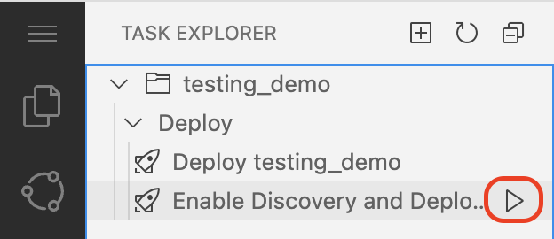
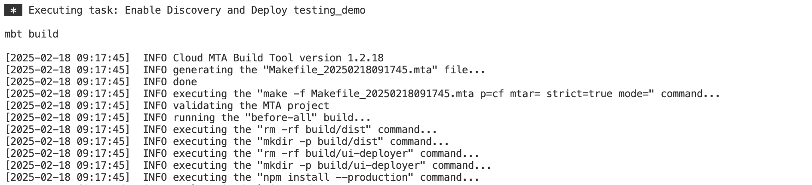
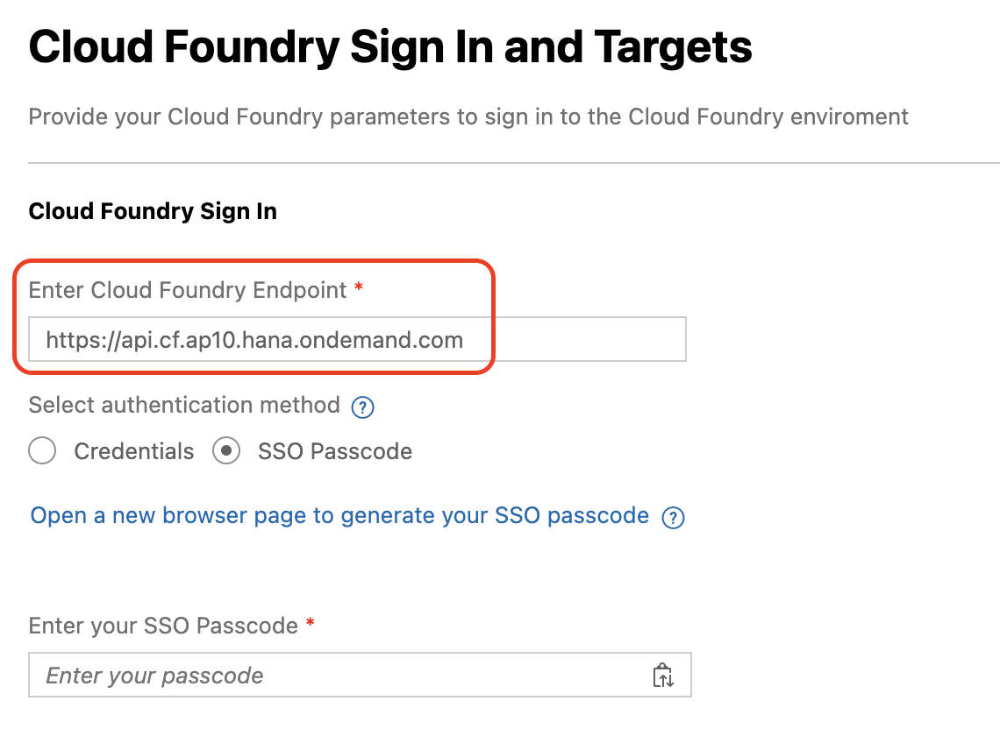
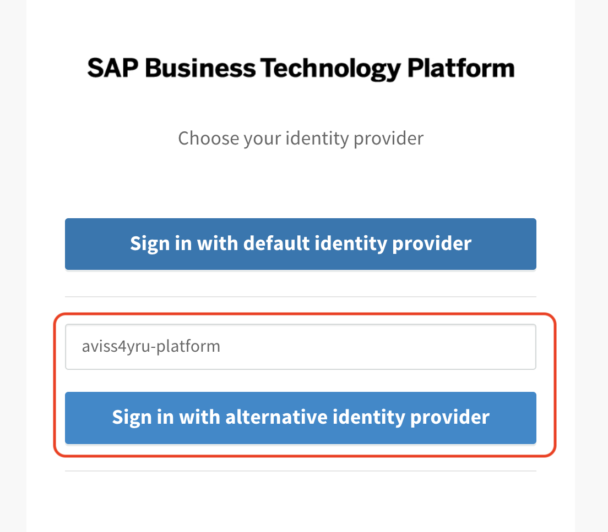
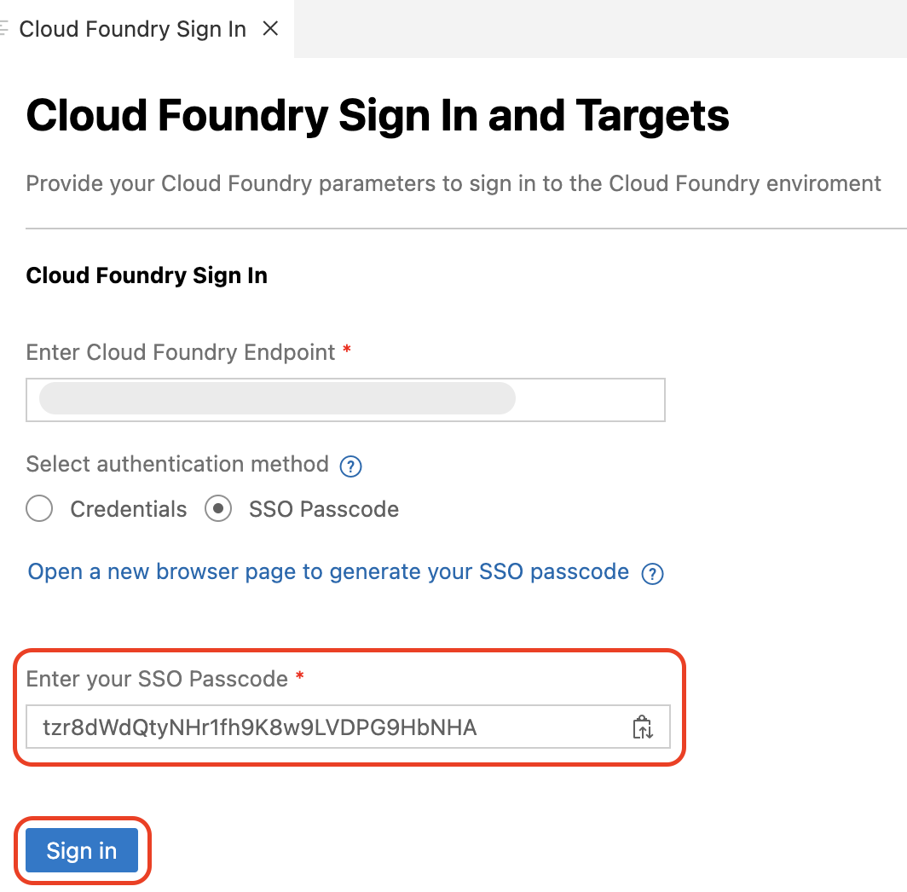
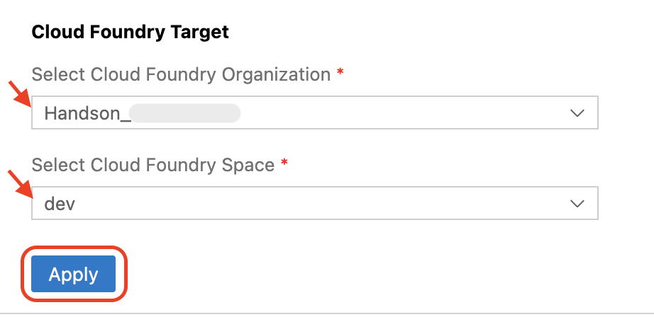
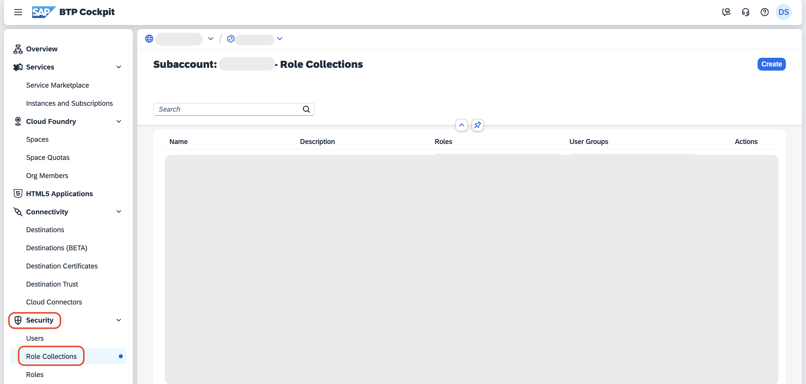
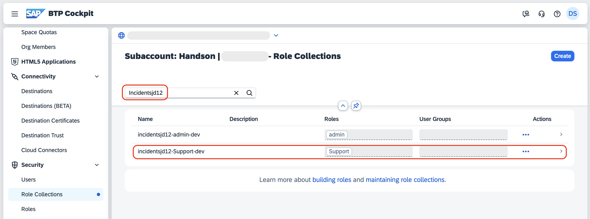
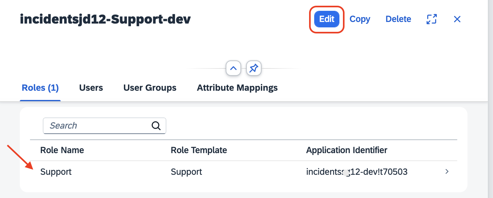
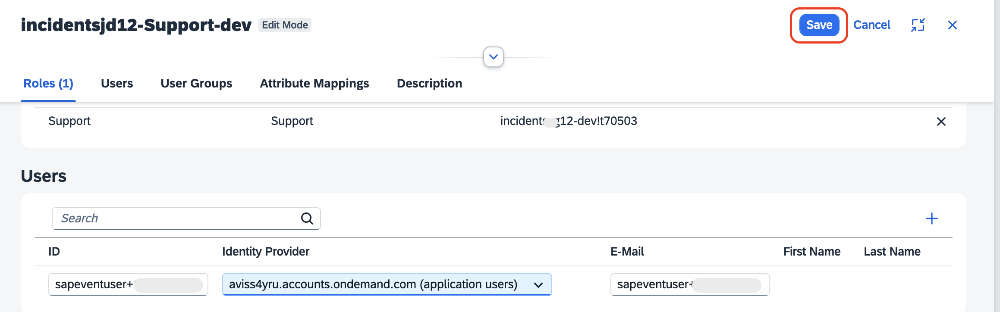

# Deploy the Application to SAP BTP, Cloud Foundry Runtime

This section describes how to deploy the application to the SAP BTP, Cloud Foundry runtime.

## Prerequisites

1. Create a UI application using a Joule prompt following the steps at [Create SAP Fiori UI with Joule](./fiori-ui.md).

2. The sample data generated in the previous steps, creates the **data** folder in the **test** folder. When deploying the application, copy the **data** folder to the **db** folder. Open the terminal, and run the following command to copy the csv files.

    ```sh
    cp -r test/data db/data
    ```

## Deploy the Application

The final step in SAP Build Code is to deploy the application to the SAP BTP, Cloud Foundry runtime. This process also involves the automatic creation of destinations, enabling ODATA services to be utilized by other tools such as SAP Build Apps.

1. Navigate to **Task Explorer** and run **Enable Discovery and Deploy**.

    

2. Check if the task has been launched in the terminal.

    

3. During the deployment, a new page pops up asking you to sign in to Cloud Foundry. Follow these steps:

    1. In the **Enter Cloud Foundry Endpoint** field, enter ***https://api.cf.ap10.hana.ondemand.com***.

    2. Select **SSO Passcode** as an authentication method.

        

    3. Choose **Open a new browser page to generate your SSO passcode** to sign in to your subaccount in SAP BTP, which opens in a new browser.

    4. If you want to log in with an alternative identity provider, find the text box with **Enter the origin key**, and enter **aviss4yru-platform**. Then, choose **Sign in with alternative identity provider**.

        

        > Note: When choosing **Sign in with alternative identity provider**, if your are prompted to sign in, enter your username and password.

    5. Choose the **Copy** icon to get a temporary authentication code.

        
    
    6. Paste the copied code in the **Enter your SSO Passcode** field in the Cloud Foundry login page.

    7. Choose **Sign In**.

        

4. In the **Cloud Foundry Target** section, do the following:

    1. In the **Select Cloud Foundry Organization** dropdown menu, select the **Handson-session** Org name.

    2. In the **Select Cloud Foundry Space** dropdown menu, select the **dev** space. 

    3. Choose **Apply**.

        

5. Check the terminal for the deployment progress. 

6. Once the deployment is completed, the application is started log and you can see the Overview URL.

    

## Assign the User Roles

### Create a Role Collection and Add a Role

1. Open the SAP BTP cockpit and navigate to your subaccount.

2. Choose **Security** > **Role Collections**.

    

3. In the **Search** field, type your project name. For example, project name is **Incidentsjd12**, and choose **incidentsjd12-Support-dev**.

    

4. Choose **Edit**.

    > Make sure the **Support** role is already listed in the **Roles** tab.

    

5. In the **Users** tab:

    1. Type the username in the **ID** field, for example, **sapeventuser**, and select your username from the suggestions.

    2. Select **aviss4yru.accounts.ondemand.com (application users)** from the **Identity Provider** dropdown.

    

6. Choose **Save**.

## Next Steps

Test the flow end to end by following the steps at [Test the Application End to End](e2e-testing.md).
