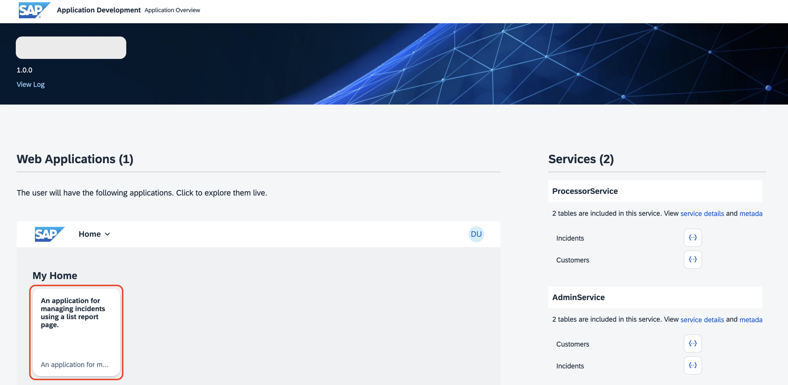
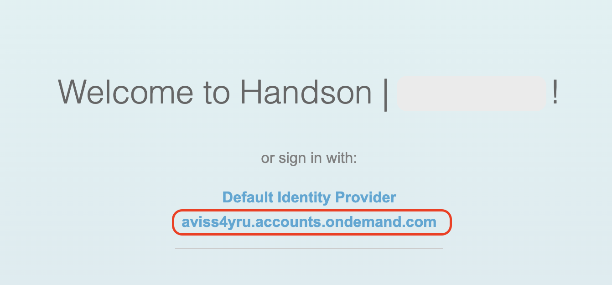
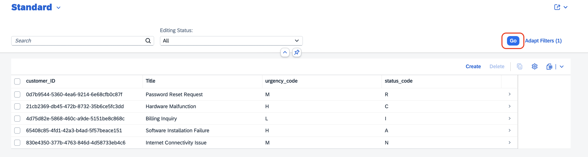
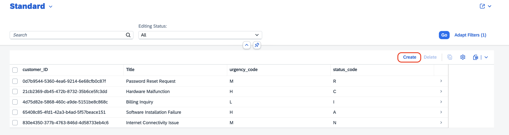
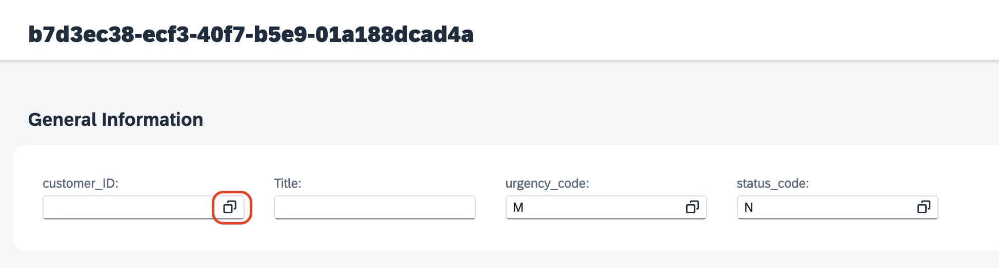
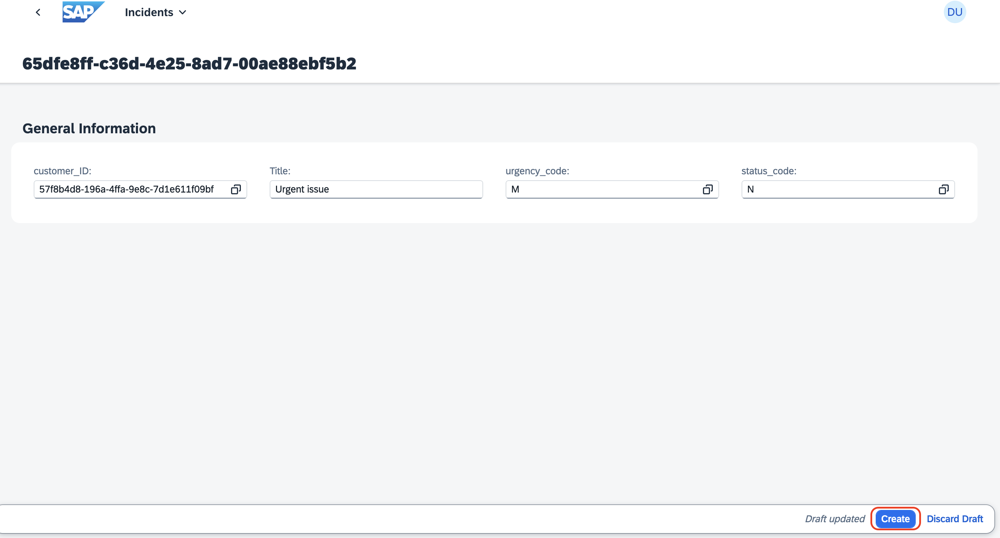
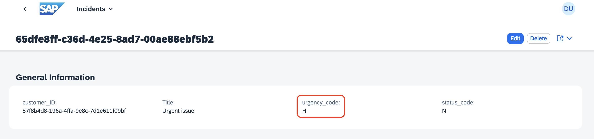
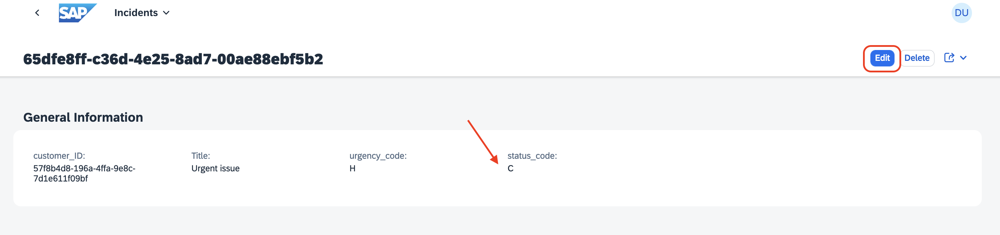
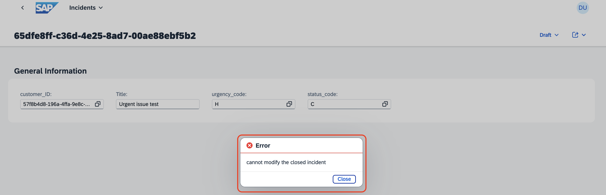
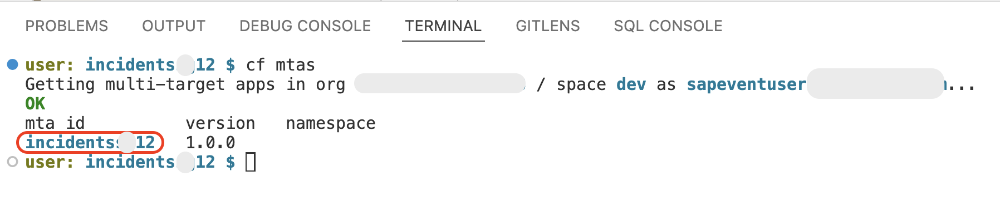

## Test the Incident Management Application

### Prerequisites

Deploy the Incident Management application following the step at [Deploy Application to SAP BTP, Cloud Foundry Runtime](./deploy-cf.md).

## End to End Testing

1. Find the **Project OverviewURL** in the terminal you used when deploying the application. 

    

2. Choose the URL. The application opens in a new browser tab.

3. The **Application Overview** page appears. Choose the UI application tile in **Web Applications**.

    

    > Note: While opening the application, if it asks you to sign in, choose **aviss4yru.accounts.ondemand.com**.

    

4. Once the application opens, choose **Go**.

    

> **Disclaimer**: The UI screenshots given here are from the basic SAP Fiori UI application without any enhancements. If you have followed the **Enhance UI** tutorial, then screenshots would be bit different.   

## Validate the Custom Logic 1

Update the **Urgency** from *Low/Medium* to *High*, if it encounters ```urgent``` keyword in the title.

1. Choose **Create**, to create a new incident.

    

2. Fill in the incident details:

    1. In the **Customer ID** dropdown menu, select a customer of your choice.

        

    2. In the **Title** field, enter **Urgent issue**.

    3. Leave the **urgency_code** and **status_code** fields.

    4. Choose **Create**.

        

3. Once the incident has been created, you see that the **urgency_code** field is automatically changed to from **M** (Medium) to **H** (High).

    

## Validate the Custom Logic 2

Cannot update the closed incident.

1. Close one of the incidents. 

2. The **status_code** changes to **C** (Closed). Choose **Edit**.

    

3. Change the value in the **Title** field, and choose **Save**.

4. It will throw the error saying `cannot modify the closed incident`.

    

## Clean Up the Cloud Foundry Space

1. Go back to the **Dev** space, open the terminal and type the following command. Then, get the mta_id from the output of the command.

    ```shell
    cf mtas
    ```

    

    > **Note:** You run `cf mtas` command to get the MTA ID.

2. (Optional) To undeploy the application, use the following command:

    ```shell
    cf undeploy mta_id --delete-service-keys --delete-services
    ```

    If its asks for confirmation, type **y**.

    

    > **Note:** The mta_id is the same you got from Step 1.


## Congratulations! 

You have successfully completed the exercise!

Learn more about SAP BTP Developer’s Guide in [GitHub](https://help.sap.com/docs/btp/btp-developers-guide/btp-developers-guide) or in [SAP Help Portal](https://help.sap.com/docs/btp/btp-developers-guide/btp-developers-guide?version=Cloud) or scan the QR code on the screen to bookmark it for future reference.

The SAP BTP Developer’s Guide is the starting point for developing a business application on SAP BTP. It contains recommendations and best practices that give you an overview of what you should consider when working on development projects on SAP BTP. It also contains links to step-by-step instructions.

<p align="center">
 
</p>

## Tell Us What You Think

We would love to hear your feedback to improve the content to better suit your learning needs. Please use the [feedback form](https://forms.office.com/e/YLFTM1TurN) or scan the QR code below.

<p align="center">
 
</p>
