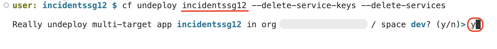

## Test the Incident Management Application

### Prerequisites

Deploy the Incident Management application following the step by step from [Deploy to CF](./deploy-cf.md)

## End to End Testing

1. Find the Project OverviewURL from the terminal of the deployment in Lcap dev space. 

    

2. Click on the URL, which opens in a new tab.

3. Application Overview screen appears. Click on the UI application under Web Applications.

    

    > Note: While opening the application, if it asks for sign in with, choose **aviss4yru.accounts.ondemand.com**.

    

4. Once the application opens, click on the **Go**.

    

> **Disclaimer**: The UI screenshots given here is the from basic Fiori UI application without enhacing the UI. If you have followed the tutorial Enhance UI, then UI would be bit different.   

## Validate the custom logic scenario 1: 

Update the **Urgency** from *Low/Medium* to *High*, if it encounters ```urgent``` keyword in the title.

1. Click on Create, for creating a new incident.

    

2. For creating the incident, do the following:

    - Select any one of the customer by clicking on the value help.

        

    - Give title as `Urgent issue`

    - Leave the urgency_code and status_code by default.

    - Click on **Create**.

        

3. Once the incident is created, you will observe the **urgency_code** is automatically changed to H which means High from M - Medium.

    

## Validate the custom logic scenario 2:

Cannot update the closed incident.

1. Make any one of the incidents to be in closed state. 

2. The status_code is C - Closed. Now click on the Edit button.

    

3. Update the title with some text, and click on **Save**.

4. It will throw the error saying `cannot modify the closed incident`

    

## Clean up of the space

1. Go back to the Dev space, open the terminal and type the below command. Get the mta_id from the output of the command.

    ```shell
    cf mtas
    ```

    

    > **Note:** We run cf mtas command to get the MTA ID

2. To undeploy the application, use the below command

    ```shell
    cf undeploy mta_id --delete-service-keys --delete-services
    ```

    If its asks for confirmation, type **y**.

    

    > **Note:** mta_id got from step 1.


## Congratulations! You have successfully completed the exercise.

## To learn more about SAP BTP Developer’s Guide, you can visit the link [here](https://help.sap.com/docs/btp/btp-developers-guide/btp-developers-guide) or scan the QR code on the screen to bookmark it for future reference.

The SAP BTP Developer’s Guide is the starting point for developing a business application on SAP BTP. It contains recommendations and best practices that give you an overview of what you should consider when working on development projects on SAP BTP. It also contains links to step-by-step instructions when required.

<p align="center">
 
</p>

## We would love to hear your feedback to improve the content to better suit your learning needs. Please use the [link](https://forms.office.com/e/YLFTM1TurN) or scan the below QR code.

<p align="center">
 
</p>
