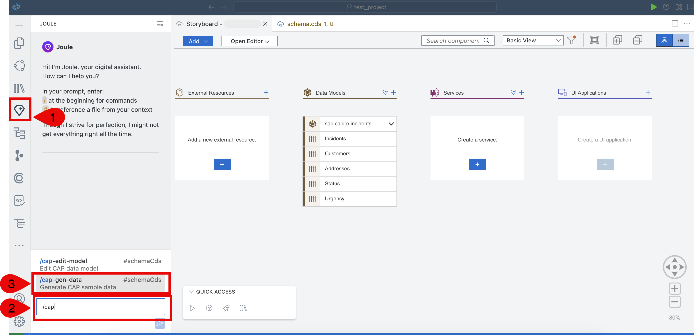
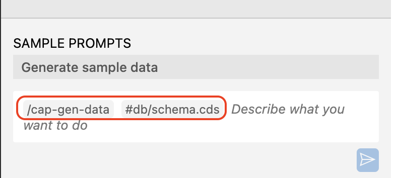
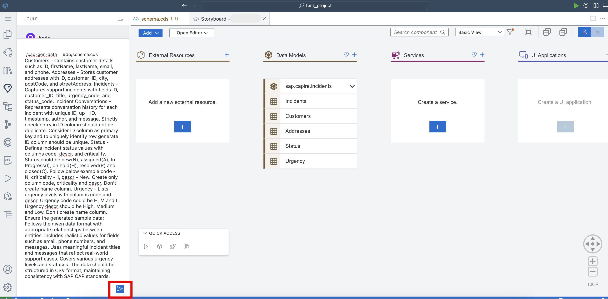
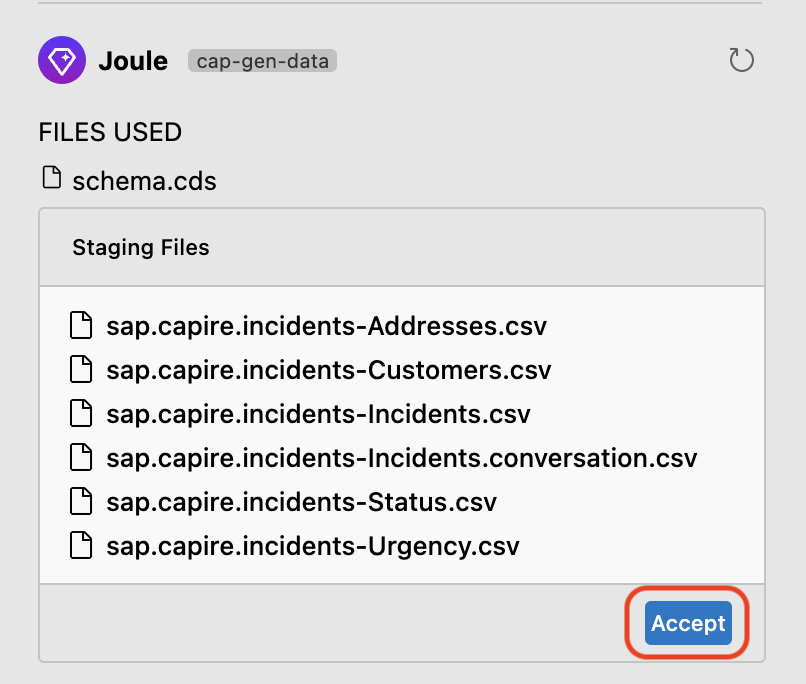
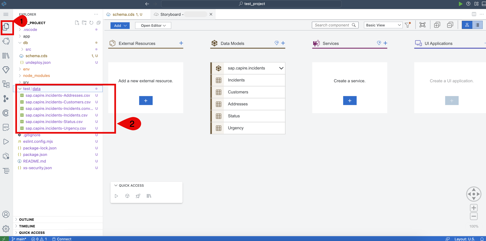

# Enhance the Sample Data Using Joule

## Prerequisites

You have created the data model following the steps at [Create Entities](create-data-entities.md).

## Add the Sample Data

Data entities have been defined in the previous step. Using Joule, let's create some sample data which can be used for local testing of the application.

1. Choose the **Joule** icon. Start typing ```/cap``` in text box and then choose **/cap-gen-data**. 

    

    > **Note:** By default, **/cap-gen-data #db/schema.cds** should be displayed in a text box.

    

2. The Joule prompt will be prefilled with **/cap-gen-data #db/schema.cds**. Paste the following prompt to generate the sample data. 

```
Customers - Contains customer details such as ID, firstName, lastName, email, and phone. Addresses - Stores customer addresses with ID, customer_ID, city, postCode, and streetAddress. Incidents - Captures support incidents with fields ID, customer_ID, title, urgency_code, and status_code. Incident Conversations - Represents conversation history for each incident with unique ID, up__ID, timestamp, author, and message. Strictly check entry in ID column should not be duplicate. Consider ID column as primary key and to uniquely identify row generate ID column should be unique. Status - Defines incident status values with columns code, descr, and criticality. Status could be new(N), assigned(A), In Progress(I), on hold(H), resolved(R) and closed(C). Follow below example code - N, criticality - 1, descr - New. Create only column code, criticality and descr. Don't create name column. Urgency - Lists urgency levels with columns code and descr. Urgency code could be H, M and L. Urgency descr should be High, Medium and Low. Don't create name column. Ensure the generated sample data: Follows the given data format with appropriate relationships between entities. Includes realistic values for fields such as email, phone numbers, and messages. Uses meaningful incident titles and messages that reflect real-world support cases. Covers various urgency levels and statuses. The data should be structured in CSV format, maintaining consistency with SAP CAP standards.
```

3. Choose the **Send** icon.

    

4. Joule will create list of .csv files that contain sample data as per the provided schema. Choose **Accept**.

    

5. All the generated .csv files will be saved in the **test/data** folder of your project.

    

## Next Step

[Generate Services](generate-service.md)
