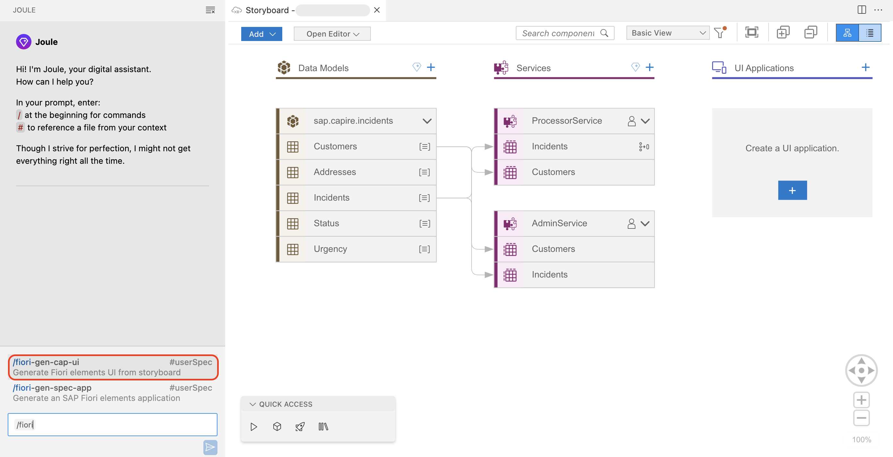
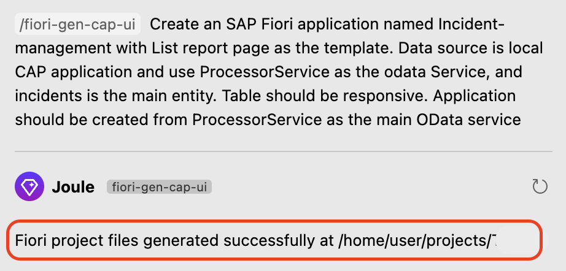
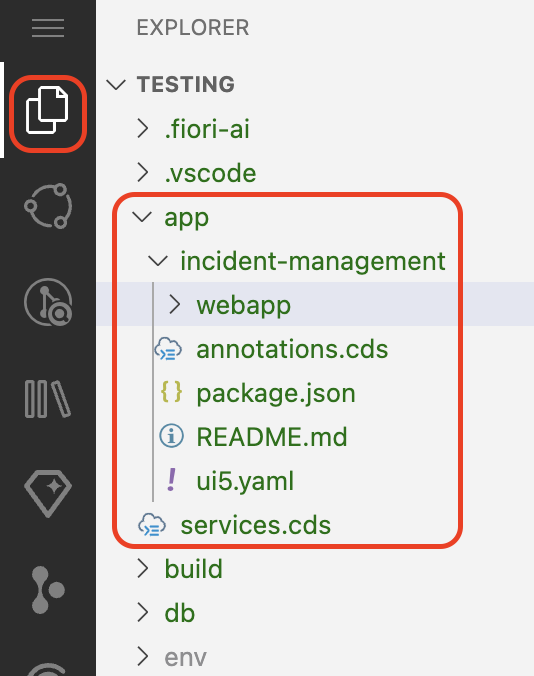
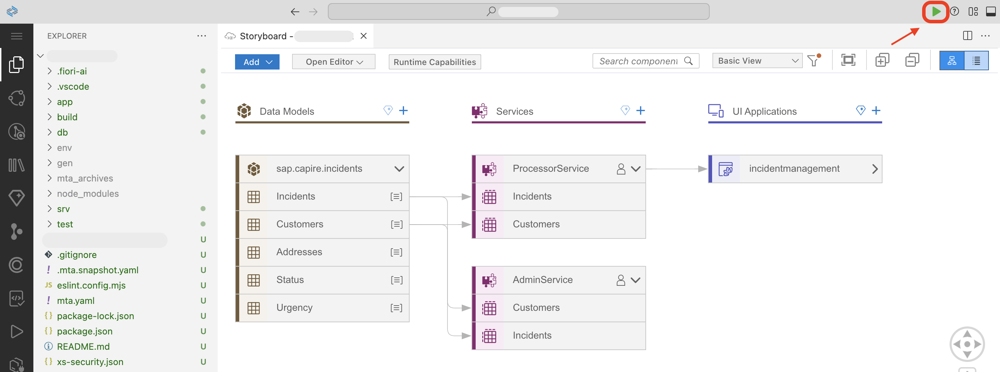
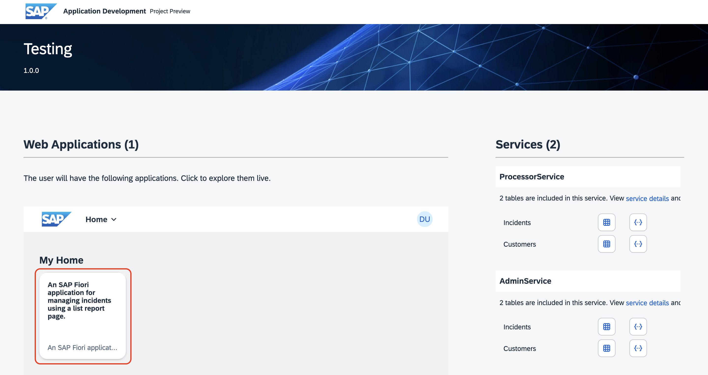
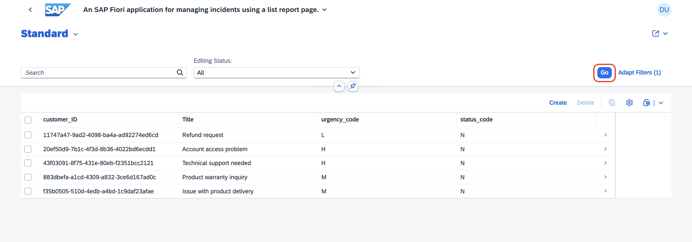
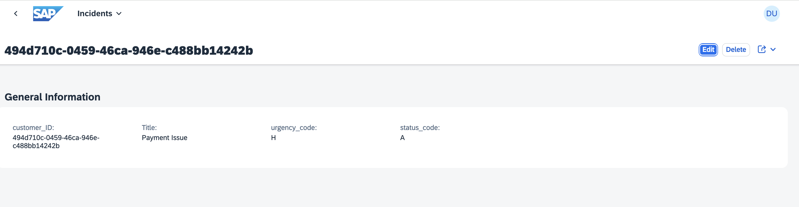
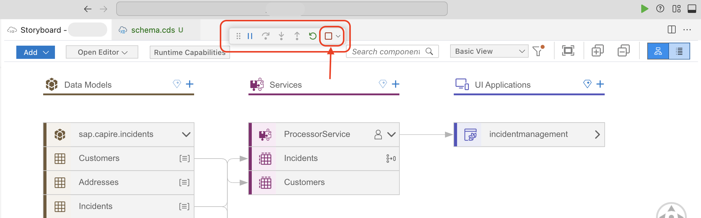

## Create a SAP Fiori UI with Joule

This section describes how to create a UI application using a Joule prompt.

## Prerequisites

You have created custom logic following the steps at [Create Backend Logic with Joule](custom-logic.md).

## Generate an SAP Fiori UI

1. In Joule, start typing ```/fiori``` and select **/fiori-gen-cap-ui** from the suggestions.

    

2. Use the following prompt to create a user interface.

    ```
    Create an SAP Fiori application named Incident-management with List report page as the template. Data source is local CAP application and use ProcessorService as the odata Service, and incidents is the main entity. Table should be responsive. Application should be created from ProcessorService as the main OData service
    ```

    > The prompt asks Joule to create an SAP Fiori application with List report as the SAP Fiori template. Because there might be many services, mention which service you want to be mapped with the UI application. In this case, ProcessorService is the OData service and incidents is the main entity in it. 

3. Joule responds with `files generated successfully`.

    

4. Go to **Explorer**. In the **app** folder, check that the following folder structure is generated.

    

5. Choose **Run and Debug** to start the application.

    

6. The application is started and opens in a new tab. Choose the SAP Fiori application tile to view the user interface.

    

7. The list report page opens in new tab. Choose **Go** to view the list of incidents.

    

8. Choose one of the incidents. The incident details are displayed.

    

9. To stop the running application, choose the **Disconnect** icon at top of the screen.
    
    

## Next Step

**[Optional]** If you want to enhance the user interface, follow the steps at [Extend SAP Fiori UI](./extend-fiori-ui.md). 

To deploy the application to SAP BTP, Cloud Foundry runtime, follow the steps at [Deploy in SAP BTP, Cloud Foundry Runtime](deploy-cf.md).


