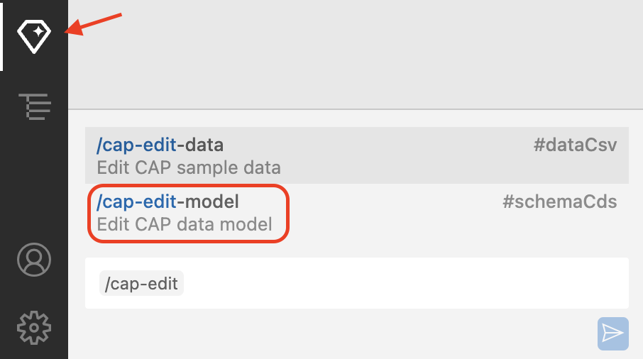
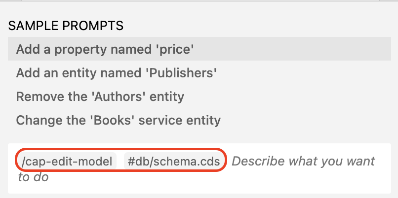
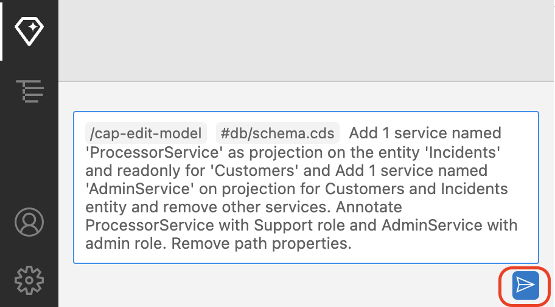
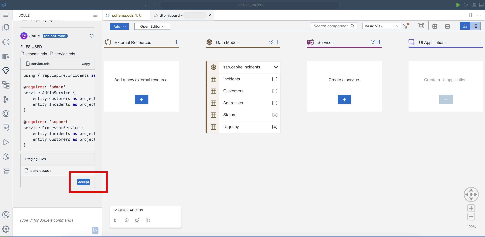
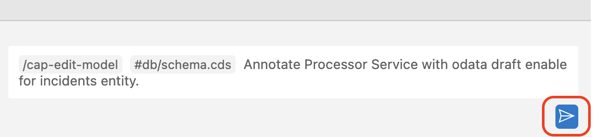
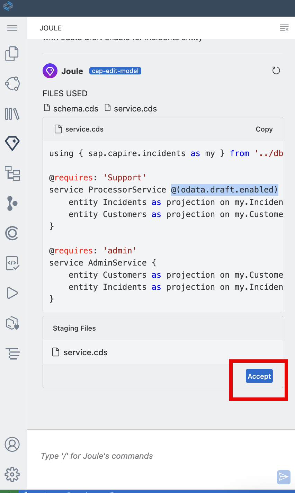
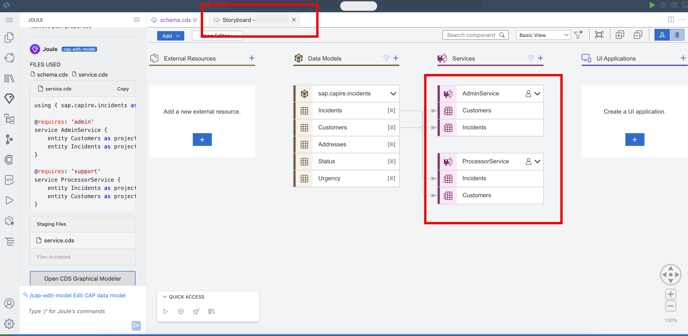
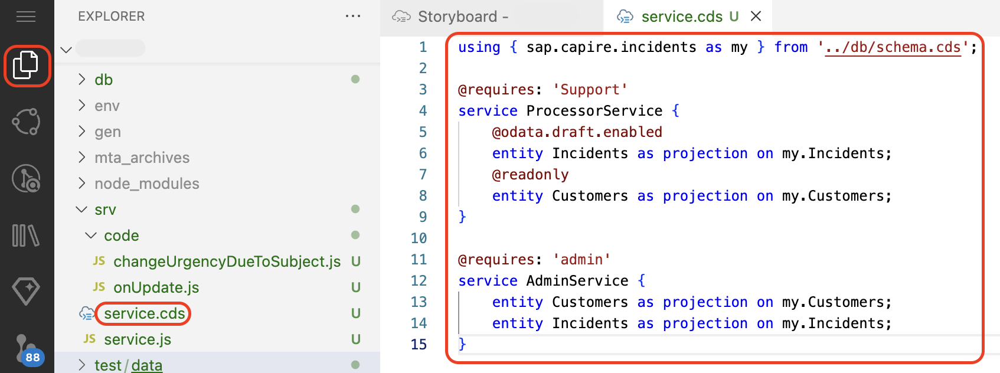

# Create service using SAP Joule

This section describes how to generate services using SAP Joule.

## Prerequisites

You have enhanced the sample data using [Enhance sample data](enhance-sample-data.md)

## Steps to create service

1. Make sure you have click on Joule. Start typing ```/cap-edit``` into Joule prompt and select **/cap-edit-model** from the suggestion to create service.

    

    > **Note:** By default **/cap-edit-model #db/schema.cds** should be displayed in text box.

    

2. Joule prompt will be prefield with **/cap-edit-model #db/schema.cds**, after that paste below prompt to generate service. 

    ```html
    Add 1 service named 'ProcessorService' as projection on the entity 'Incidents' and readonly for 'Customers' and Add 1 service named 'AdminService' on projection for Customers and Incidents entity and remove other services. Annotate ProcessorService with Support role and AdminService with admin role. Remove path properties.
    ```

3. Click on send icon.

    

4. Click on **Accept** button to accept generated service.

    


5. For odata draft enabling, use the below prompt to make ProcessorService to draft enable. Start typing `/cap-edit`, and select **/cap-edit-model** from the suggestion.

    ```
    Annotate Processor Service with odata draft enable for incidents entity.
    ```

6. Click on Send icon.

    

7. Click on **Accept** button to accept the generated code.

    

8. Go to story board. Under Services make sure **AdminService** and **ProcessorService** have been created.

    

9. Open service.cds in project explorer and validate generated service. 

    

10. Joule may generate different codes for the same prompt. Make sure generated service is align with below code.

```
using { sap.capire.incidents as my } from '../db/schema.cds';

@requires: 'Support'
service ProcessorService {
    @odata.draft.enabled
    entity Incidents as projection on my.Incidents;
    @readonly
    entity Customers as projection on my.Customers;
}

@requires: 'admin'
service AdminService {
    entity Customers as projection on my.Customers;
    entity Incidents as projection on my.Incidents;
}
```

> **Note** - As we know Joule may generate different codes for the same prompt. If generated service is different than above sample provide then this can be edited using Joule.

## Next Step

[Generate custom logic](custom-logic.md)