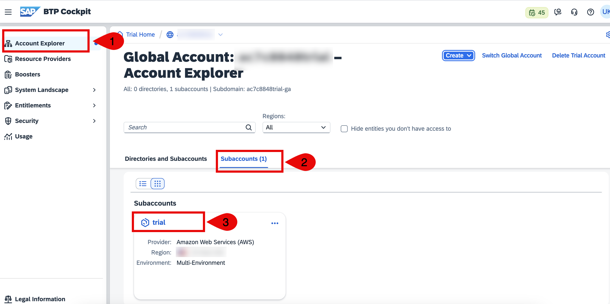
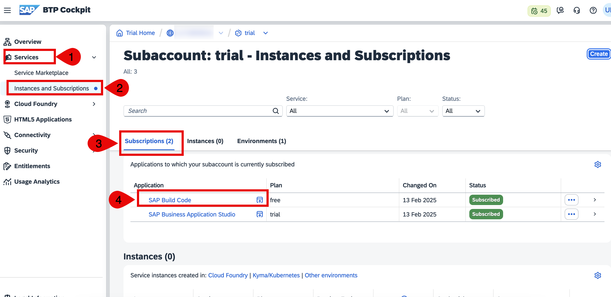

## Access Build Code through Subaccount

1. Navigate to global account. Click on **Account Explorer**, Click on **Subaccounts**. Choose your subaccount.

    

2. Expand **Services**, Click on **Instances and Subscriptions**. Choose on **Subscriptions** tab then click on **SAP Build Code** to open build code lobby.

    
