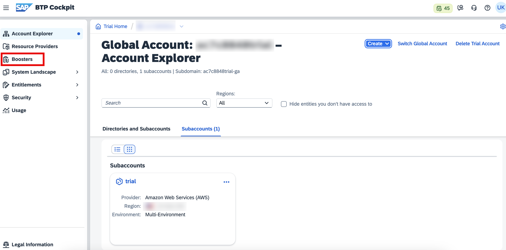
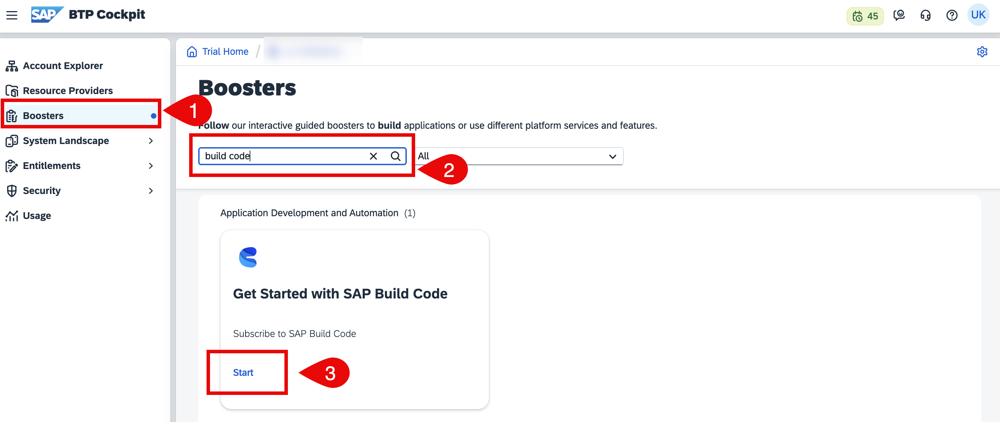
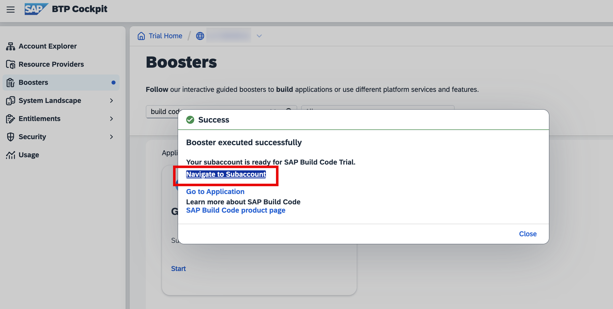

# Setup SAP Build Code in SAP BTP

##  Prequisite 

You should have a trial or an enterprise SAP BTP global account. If you don't have [Get an Account on SAP BTP Trial](https://developers.sap.com/tutorials/hcp-create-trial-account..html)

## Run the SAP Build Code Booster

1. In the SAP BTP cockpit, access your global account. It can be either trial or enterprise account.

2. Navigate to trial global account
    
    

3. Click on booster, select build code to create build code subscription.

    

4. After running the booster, in the popup window, choose **Navigate to Subaccount**.

    

# Next Step

[Create full stack application](create-full-stack-project.md)

