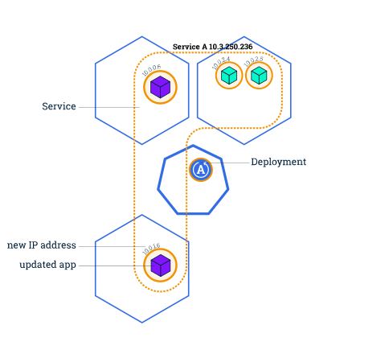

# Zero Downtime Maintenance 

Zero Downtime Maintenance is a process of updating your application without affecting its availability or performance. It means that your users can access your application at any time, even when you are deploying new features, bug fixes, or security patches.

If an application has goal of 99.99% availability. This means it may be unavailable for only 30 * 24 * 0.001 = **1.12 hours per month**. Longer downtimes, entitle customers to financial compensation or even to cancel the contract.

We will be referring to Zero Downtime Maintenance as ZDM in the rest of the section.

## Why Is Zero Downtime Maintenance So Important for Cloud SaaS Solutions?

- **Business Continuity and User Experience**: SaaS applications are often mission-critical for businesses, meaning any downtime can disrupt operations and lead to lost revenue. Zero downtime maintenance ensures continuous availability, minimizing disruptions and keeping users productive.
- **Customer Satisfaction**: In today's competitive landscape, user experience is paramount. Downtime creates frustration and reflects poorly on the service. By maintaining smooth operation, SaaS providers build trust and user loyalty.
- **Subscription Model Reliance**: SaaS relies on recurring subscriptions. Downtime directly translates to lost service time for which users are paying. - Zero downtime maintenance upholds the value proposition of the service and justifies subscription fees.
- **Competitive Advantage**: In a crowded SaaS market, providers offering uninterrupted service gain a significant edge. Zero downtime maintenance demonstrates a commitment to reliability and a superior product, attracting and retaining customers.
- **Operational Efficiency**: While it requires up front investment, zero downtime maintenance can improve operational efficiency in the long run. By avoiding downtime-related issues like customer support surges and revenue loss, providers can focus on core business activities.

## Blue-Green Deployment of Multitarget Applications
By using the blue-green deployment technique, you can update the system without downtime and with reduced risk. During the process, you can perform tests and validation of the new application version using productive data. A classical blue-green deployment of stateless applications, which are modeled as an MTA, is supported. [Read More Best Practices from Indurstry Solutions](https://help.sap.com/docs/btp/sap-business-technology-platform/blue-green-deployment-of-multitarget-applications?q=zero%20downtime)

## Rolling Update (For Kyma Runtime)
Users expect applications to be available all the time, and developers are expected to deploy new versions of them several times a day. In Kubernetes this is done with rolling updates. A rolling update allows a Deployment update to take place with zero downtime. It does this by incrementally replacing the current Pods with new ones. The new Pods are scheduled on Nodes with available resources, and Kubernetes waits for those new Pods to start before removing the old Pods. [Read more](https://kubernetes.io/docs/tutorials/kubernetes-basics/update/update-intro/)

**Kyma Runtime by default supports Rolling Updates.**

> Image credits: https://kubernetes.io/docs/tutorials/kubernetes-basics/update/update-intro/

## Implementing Zero Down Time Maintenance 
ZDM can be implemented at different parts of the application in different patterns. The following table showcases different implementations to achieve ZDM.

>
>**This table Showcases components with standalone approuter based application deployed to the Cloud Foundry Runtime**
> 
| Component | Pattern | Description |
|-----------|-----------|-----------|
| Approuter | [Redis](https://www.npmjs.com/package/@sap/approuter#external-session-management)     | Redis based custom implementation for session management|
| CAP Backend| [Blue-Green Strategy](https://help.sap.com/docs/btp/sap-business-technology-platform/blue-green-deployment-strategy?q=zero%20downtime)- Cloud Foundry|Blue-green deployment is a technique that reduces downtime and risk by running two identical productive environments called Blue and Green | 
|Database|Deploy only compatible database schema changes| Data base changes without breaking the current schema|
|Front End Updates|Avoid breaking changes|Be aware that he content in the HTML5 repository is NOT blue/green deployment enabled and is updated at the beginning of an MTA deployment before the blue/green deployment of the backend starts. This means that the new UI content is active during an MTA deployment when still the old and the new color is active. Therefore, the new UI code needs to be able to work with the old version of the OData service in the backend and the new version! Only when the blue/green deployment is finished and the routes are adapted to the new color, you can be sure that all ODAta requests are processed by the new OData version.|
|Service Updates(XSUAA, SaaS Registry etc)|Compatible Changes| Push small non braking changes to services to avoid any distruption. Use live URLs always when refering to backend or approuter URL in any services |

## Managing Maintenance with Zero Downtime for Various Application Components
We will be splitting components like Backend, User Interface and Persistence. Here's details of how to achieve ZDM for these components:
- **[Code Changes](./code-zdm.md)**
- **[Persistance Changes](./persistance-zdm.md)**
- **[Content Changes](content-zdm.md)**

