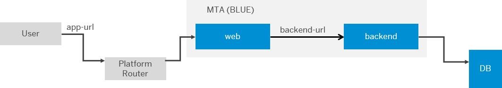
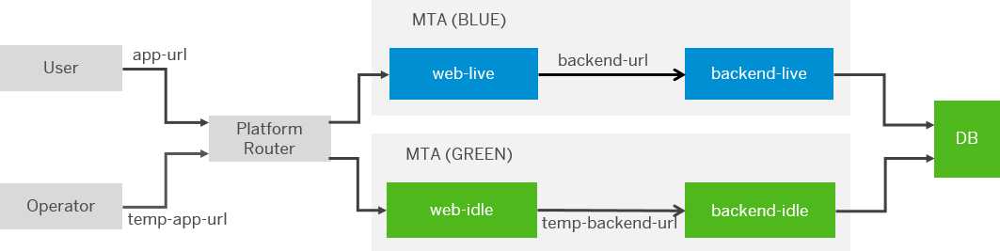
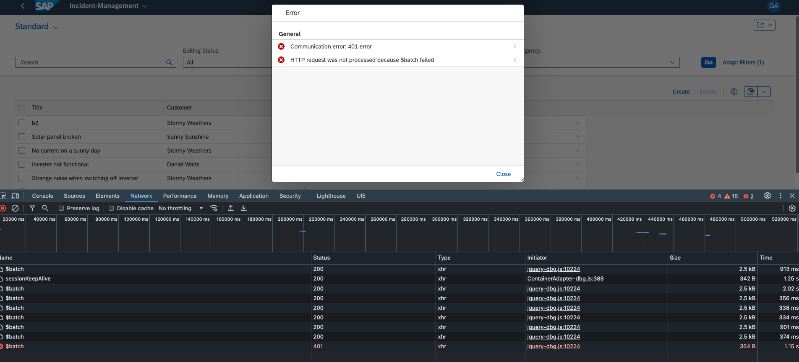

# Managing Zero Downtime Maintenance for Code Changes

## Prerequisites
You have a [deployed MTA](../saas/lep/5-subscribe.md), with functional productive applications and routes:


When deploying applications using the Blue-Green strategy, some of the services, which require a backend/sidecar application URL as a parameter, need to avoid updating the URLs because the default URL will be set to the idle route, which, after the testing phase, will not be available. 
> 
>To ensure that the services are always pointing to the live URL or your backend the following parameters can be used:
>`default-live-uri`.		
>Specify this parameter if you want to use `${default-uri}` without the “idle” suffix during the testing phase of the Blue-Green deployment.
>

You can add the following highlighted code block to your service configuration to have the live URL configured with the services:

```yaml
  - name: incident-management-mtx
    type: nodejs
    path: gen/mtx/sidecar
    build-parameters:
      builder: npm-ci
    parameters:
      memory: 256M
      disk-quota: 512M
    provides:
      - name: mtx-api
        properties:
          mtx-url: ${default-url}
          mtx-live: ${default-live-url}  // Added
  - name: incident-management-registry
    type: org.cloudfoundry.managed-service
    requires:
      - name: mtx-api
    parameters:
      service: saas-registry
      service-plan: application
      config:
        xsappname: incident-management-${org}-${space}
        appName: incident-management-${org}-${space}
        displayName: incident-management
        description: ZDM CAP APP.
        category: 'Refapps'
        appUrls:
          getDependencies: ~{mtx-api/mtx-url}/-/cds/saas-provisioning/dependencies // Deleted
          getDependencies: ~{mtx-api/mtx-live}/-/cds/saas-provisioning/dependencies // Added
          onSubscription: ~{mtx-api/mtx-url}/-/cds/saas-provisioning/tenant/{tenantId} // Deleted
          onSubscription: ~{mtx-api/mtx-live}/-/cds/saas-provisioning/tenant/{tenantId} // Added
          onSubscriptionAsync: true
          onUnSubscriptionAsync: true
          onUpdateDependenciesAsync: true
          callbackTimeoutMillis: 300000 # Increase if your deployments are taking longer than that

```

See [Module-Specific Parameters](https://help.sap.com/docs/btp/sap-business-technology-platform/modules#module-specific-parameters).

## Deploying Application with Blue-Green Deployment Strategy

Change the data of your application and then deploy it.

- Deploy your updated MTA in idle state by executing the command :

   ```sh
    cf deploy <your-mta-archive-v2> --strategy blue-green
   ```
This creates:

- New applications adding “idle” to the original application names
- Temporary routes to the idle applications

- Interrupt the process showing a message like this:

>
>Process has entered testing phase. After testing your new deployment, you can resume or abort the process.
>Use "cf deploy -i xxxxxx -a abort" to abort the process.
>Use "cf deploy -i xxxxxx -a resume" to resume the process.
>Hint: Use the '--skip-testing-phase' option of the deploy command to skip this phase


- Optionally, test the idle version of the application using the temporary routes.

>
>You can skip this step by using one of the following command-line options:
>
>`--skip-testing-phase` - you have to use it when starting the process.
>
>`--skip-idle-start` - this option will also skip the start of the newly deployed applications on idle routes.

- Now, you can upgrade the tenant either by some job or by using the Subscription Management Dashboard.

>
>If you use `cf deploy <your-mta-archive-v2> --strategy blue-green ` without pointing to the live URL, the SaaS registry route will be updated to idle route leading to the following error:
>
```
updateApplicationSubscription failed. Root Subscription Id: xxxxxx. Error description: 
CorrelationId: xxxx, Error build subscription tree : Error parse get dependencies of application with appName: 
incident-management-referenceapps_ga-zdm-dev. Error: CorrelationId: xxxxxxxxxxxxx, 
Error build subscription tree : Error invoke get dependencies callback of application with appName: incident-management-referenceapps_ga-zdm-dev. 
Error: Please open a ticket for application/service with appName: incident-management-referenceapps_ga-zdm-dev. 
Failed to call callback. URL:
GET https://referenceapps-ga-zdm-dev-incident-management-mtx-idle.cfapps.eu12.hana.ondemand.com/-/cds/saas-provisioning/dependencies?tenantId=xxxxxxxxx. Consumer tenant: xxxxxxxxx. 
Callback response: 404 Not Found: Requested route ('referenceapps-ga-zdm-dev-incident-management-mtx-idle.cfapps.eu12.hana.ondemand.com') does not exist.
status code: 404 NOT_FOUND
```
>

- When the the approuter routes are switched from idle to live, the session that is maintained in memory gets destroyed. This leads to a sudden **Forbidden** error interrupting the end-user session.


This can be prevented by using `Redis` for session management.

## Using Redis To Enable Zero Downtime Maintenance in Approuter

When the live application is replaced by the idle application, the in-memory data of the live application is lost. This means that the user session gets cleaned. 
To prevent this, the approuter allows external session management.

### Using External Session Management in Approuter

The application router supports a backup of user sessions in an external session store. This enables the session recovery in case the application router instance that stores a session crashes and another application router instance has to continue handling the running user session.
To enable this capability, you must bind a service instance of a service that supports fast persistence store, such as Redis. When such a service is bound, the application router backs up the in-memory session information into the external persistency store.

If, in subsequent requests, the session information is not found in the in-memory session store, the application router tries to rebuild the in-memory session information from the external persistency store.

>
>**Redis Hyperscaler** option is not yet supported in the **SAP BTP, Kyma runtime**.
>

### Implementing External Session Management in Approuter 

Approuter supports Redis for session management. To create the Redis instance and bind to it, you need to add the following configuration:

1. Open the **mta.yaml** file and under **resources** add the following configuration:
   
  ```yaml
    ..... 
    resources:
    .....
      ##### REDIS #######
    - name: incident-session-management // Add
      type: org.cloudfoundry.managed-service // Add
      parameters: // Add
        service: redis-cache // Add
        service-plan: development  // Add
  ```
2. Add the Redis configuration to the Approuter module:
   
  ``` yaml
  ##### Approuter #######
    - name: approuter
      type: approuter.nodejs
      path: packages/deploy-int/approuter
      parameters:
        memory: 128M
        keep-existing-routes: true
        disk-quota: 256M   
      requires:
        - name: incident-management-auth
        - name: incident-management-portal
        - name: incident-session-management # session management 
        - name: incident-management-html5-repo-runtime
        - name: srv-api
          group: destinations
          properties:
            forwardAuthToken: true
            strictSSL: true
            name: srv-api
            url: '~{srv-url}'
        - name: mtx-api
          group: destinations
          properties:
            name: mtx-api # must be used in xs-app.json as well
            url: ~{mtx-url}
      provides:
        - name: app-api
          properties:
            app-protocol: ${protocol}
            app-uri: ${default-uri}
      properties:
        TENANT_HOST_PATTERN: "^(.*)-${default-uri}"
        EXT_SESSION_MGT: '{ // Add
            "instanceName": "incident-session-management", // Add
            "storageType": "redis", // Add
            "sessionSecret": "VqO446NAgSd795NiBW7SXPvuKKH4pDso3qVcWC1GyLa2Zq6XASh0FNZ3b26ePlZe", // # 64 character unique string
            "defaultRetryTimeout": 10000, // Add
            "backOffMultiplier": 10 // Add
            }' // Add
  ```


> **TIP**
>In order to use this feature, you have to set the following environment variable:
>
>**EXT_SESSION_MGT**
>
>The variable value must be defined in the JSON format and provide the following properties:
>
>- **instanceName** (mandatory) - the name of the service instance of the storage service.
>- **storageType** (mandatory) - the type of the storage, for example - "redis". Note that if no custom storage driver is used, only “redis” is allowed.
>- **sessionSecret** (mandatory) - a secret to be used to generate a session cookie. Please generate a unique string with at least 64 characters.
>- **defaultRetryTimeout** - the maximum duration for automatic retries of failed Redis operations in milliseconds. The default value is 2000 ms.
>- **backOffMultiplier** - a multiplier of the Redis-defined pause that determines the time between consecutive automatic retries of failed Redis operations. The default value is 50.
>See [npm documentation: @sap/approuter](https://www.npmjs.com/package/@sap/approuter#external-session-management).
>

