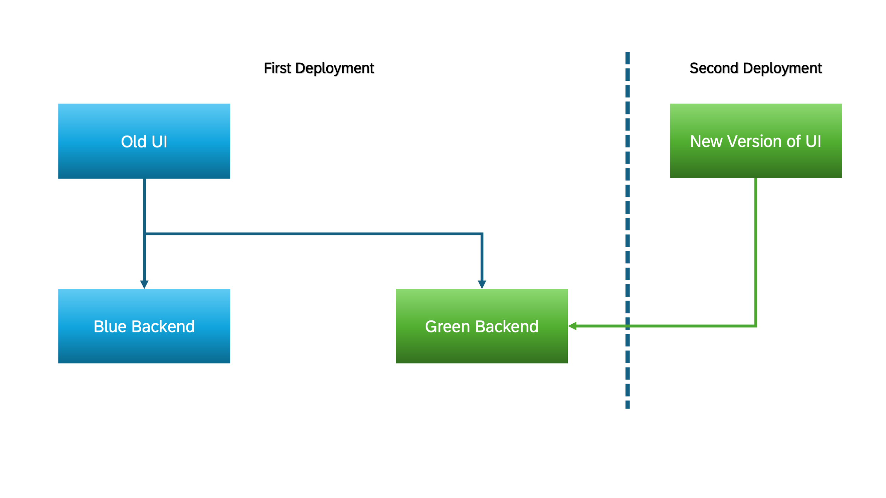

# Zero Downtime Maintenance for Application Contents

Deploying the User Interface (UI) differs from deploying the backend because UI files are not version-controlled, and the Blue-Green deployment strategy does not support having multiple UIs designated as live or idle. Instead, UI content is uploaded immediately, without waiting for live or idle applications, ensuring that users receive the latest codebase instantly. Consequently, it's essential to ensure that the pushed content is small and non-breaking, so the frontend remains stable even when the backend is in the testing phase.

## Sequence of Small Changes

Instead of one big change that modifies the setup, code, and data in the same step, run a sequence of small changes that changes things bit by bit.
If there are changes in the UI, the backend should be updated first, then the UI. This is necessary because if the UI needs to consume a new Entity which is not yet available in the backend, it will cause regressions. 
Here's an example of how this can be done.

>
>For example, imagine you want to deploy a new frontend feature that relies on a specific API endpoint.
>
>If you deploy both the frontend update and the new API endpoint together in one pipeline, there will be a moment when the frontend attempts to call the API before it’s fully deployed, leading to potential errors.
>
>To avoid this disruption, you can split the deployment in two steps:
>
>First, run a pipeline that deploys the API endpoint.
>Then, run a second pipeline to update the front-end to use the new API.
>
