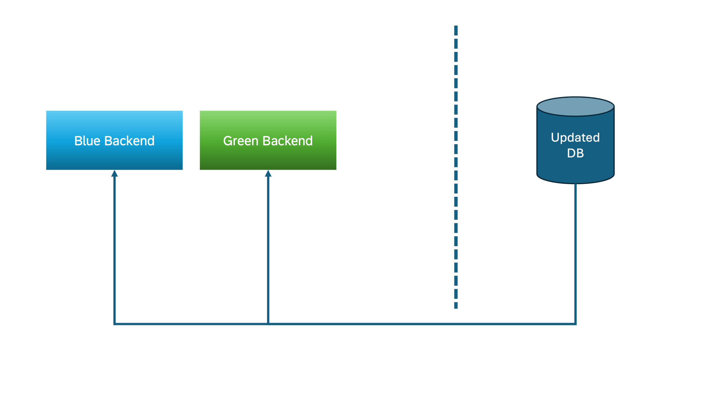

## Zero Downtime Persistence Updates

### Database Schema Update
When shipping a new application version with an updated CDS model, the database schema for each subscribed tenant needs an update. The database schema update needs to be triggered explicitly.
[Read More](https://cap.cloud.sap/docs/java/multitenancy#database-update)

## Compatible database changes

**Goal: Avoid data losses**

Certain database structure changes may result in a data loss. Therefore all incompatible changes have to be broken down into a series of compatible changes

- Deploy only compatible database schema changes.
- Ensure the Views and Projections are properly renamed and if they are consumed by any UI/Service. It should also be taken care
- Break down incompatible changes into a series of smaller changes which are compatible (considering Backend - Database dependencies and Data Migrations).
- Incompatible database changes are possible, if these tables/fields are not used any more by the backend and all relevant data has been migrated into other fields or tables.


### Deploying Compatible Database Schema Changes: An Example

Suppose you have the following schema for an entity called Incidents:
```sql
entity Incidents : cuid, managed {  
   customer     : Association to Customers;
   title        : String  @title : 'Title';
   urgency      : Association to Urgency default 'M';
   status       : Association to Status default 'N';
   conversation : Composition of many {
      key ID    : UUID;
      timestamp : type of managed:createdAt;
      author    : type of managed:createdBy;
      message   : String;
   };
}

```
Now, imagine you need to add a new field `severity` to the `Incidents` entity to track the severity level of each incident. Here's how you can deploy this change in a way that is compatible and avoids disruptions:

- Step 1: Deploy the Schema Change

First, add the new `severity` field to the `Incidents` entity in the database:
```sql
entity Incidents : cuid, managed {  
   customer     : Association to Customers;
   title        : String  @title : 'Title';
   urgency      : Association to Urgency default 'M';
   status       : Association to Status default 'N';
   severity     : String default 'Low';  // New field added
   conversation : Composition of many {
      key ID    : UUID;
      timestamp : type of managed:createdAt;
      author    : type of managed:createdBy;
      message   : String;
   };
}


```
In this step, you deploy only the schema change. The existing application code is not yet aware of or dependent on the severity field, so it continues to operate without any issues. The new severity column is populated with a default value ('Low') for existing records.

- Step 2: Deploy the Application Code

After the schema change is successfully deployed and verified, you can proceed to update the application code to use the new severity field:
  - Update the application logic to handle the severity field, such as displaying it in the UI, allowing users to set the severity level when creating or updating an incident, or applying business logic based on the severity.


Since the severity column already exists in the database, the updated application code can interact with it seamlessly.

Here's the representation of DB updates:



**Conclusion**: By splitting the deployment into two steps—first deploying the schema change and then updating the application code—you ensure that the application remains stable and functional throughout the process, avoiding errors due to missing or incompatible database elements.

