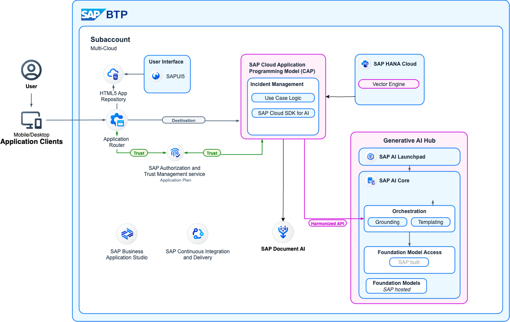

# Develop Full-Stack SAP BTP Applications Powered by AI

In this hands-on exercise, you will explore how to accelerate full-stack application development with the SAP Cloud Application Programming Model (CAP). This tutorial demonstrates the integration of advanced AI services, document processing showcasing how modern cloud capabilities can be combined to deliver intelligent, extensible business applications.

# Business Scenario

In this hands-on exercise, you will build an application called Incident Management using SAP Build Code. The business scenario of the Incident Management application is the following:

ACME is a popular Electronics company. ACME hires call center support representatives to process and manage customer incidents. A call center support representative (Processor) receives a phone call from an existing customer and creates a new incident on behalf of the customer. The newly created incident is based on a customer complaint received during the phone call. The call center support representative also adds the conversation with the customer to the incident for future reference.

# Solution Diagram

## Additional Entitlements Required

Adding eventing to the developed CAP application requires the following additional entitlements and quotas in the SAP BTP cockpit:

| Service                           | Plan       | Number of Instances |
|-----------------------------------|------------|:-------------------:|
| SAP AI Core| Standard | 1 |
| SAP AI Launchpad | Standard | 1 |
| SAP Document AI | default | 1 |
| Object Store on SAP BTP | Standard | 1 |
| SAP Malware Scanning Service | CLAMAV | 1 |

# Prerequisites

- Develop the Incident Management application by using one of these options:
  
    - Follow the [Develop a Full-Stack CAP Application](https://developers.sap.com/group.cap-application-full-stack.html) tutorial.
    - Clone the incident management application repository from GitHub using the command: `git clone https://github.com/SAP-samples/incidents-app.git`
      
- Create a service instance of SAP Document AI in your subaccount. See [Create Service Instances](https://help.sap.com/docs/btp/sap-business-technology-platform/create-service-instances).
- Create Schema in [SAP Document AI](https://help.sap.com/docs/document-information-extraction/document-information-extraction/create-schema-ui).
- Create a service instance of SAP AI Core in your subaccount. See [Create Instance of SAP AI Core](https://help.sap.com/docs/sap-ai-core/sap-ai-core-service-guide/create-service-instance).
- Create a service instance of SAP AI Launchpad in your subaccount. See [Create Instance of SAP AI Launchpad](https://developers.sap.com/tutorials/ai-launchpad-provisioning.html).

## Add AI Capabilities Using SAP AI SDK

Enhance the Incident Management application with AI-powered features using the SAP AI SDK. Learn how to add the necessary dependencies, extend the application logic to leverage AI services, and test the end-to-end scenario. By following these steps, the application gains intelligent automation and enrichment capabilities, such as analyzing incident descriptions, generating summaries, and prioritizing issues, all powered by integrated SAP AI services.

1. [Add Dependencies for SAP Cloud SDK for AI](./document/prerequisites.md)
2. [Extend the Incident Management Application](./document/extend-service.md)
3. [Test the Scenario End to End](./document/e2e-testing.md)

## Integrate SAP Document AI and Attachments Plug-In

Integrate the Incident Management application with SAP Document AI and an attachments plug-in. Set up the prerequisites, extend the backend to process and extract information from uploaded documents, add a Fiori UI for managing attachments, and test the complete scenario. These steps enable automated document analysis and seamless file handling, making the application smarter and more user friendly.

1. [Prerequisites](./document/prerequisites-2.md)
2. [Extend the Incident Management Application with Document AI](./document/extend-doc-ai.md)
3. [Add SAP Fiori UI Application with Attachments](./extended-ui.md)
3. [Test the Scenario End to End](./document/e2e-testing-ai.md)

## [Optional] Deploy to SAP BTP, Cloud Foundry Runtime

If you want, you can deploy the enhanced Incident Management application to SAP BTP, Cloud Foundry runtime. You deploy the application, integrate it with SAP Build Work Zone for a seamless user experience, and test the complete scenario in a production-like environment. These steps help ensure your AI-powered application is enterprise-ready and accessible to end users through SAP’s cloud platform.

1. [Deploy to SAP BTP, Cloud Foundry Runtime](./document/deploy-cf.md)
2. [Integrate Your Application with SAP Build Work Zone, Standard Edition](./document/integrate-workzone.md) 
3. [Test the Scenario End to End](./document/e2e-testing-cf.md)
