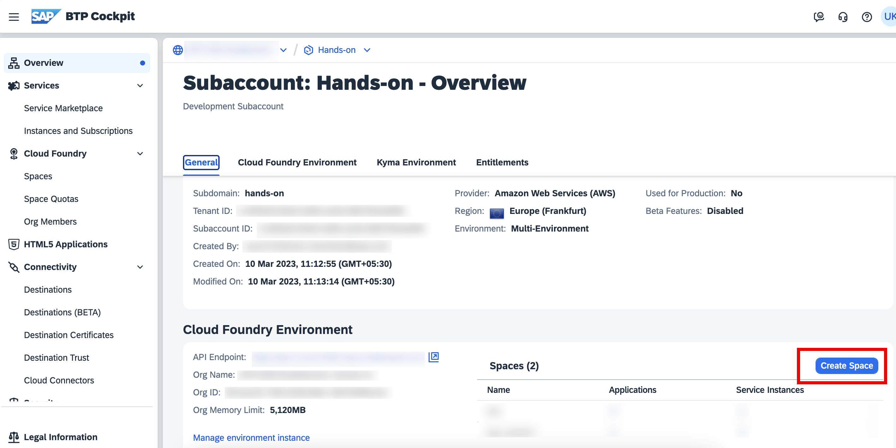
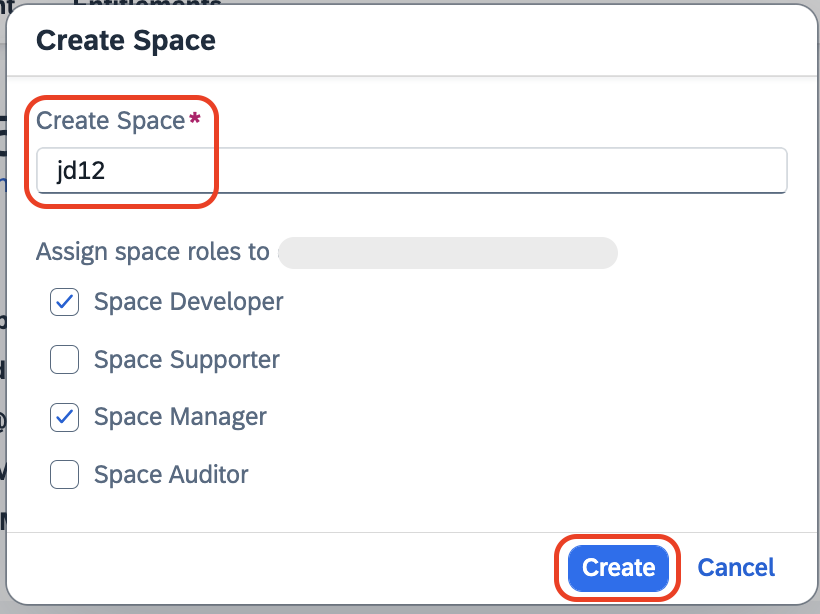

# Create Cloud Foundry Space

1. Open the SAP BTP Cockpit.

2. In the Overview, you will find the Spaces table. Choose **Create Space** from the top right hand-side corner of that table.

    

3. In the **Create Space** pop up, do the following:

    - Enter `<your-initials><unique-random-number>` in the **Create Space** field. For example, if your name is `John Doe`, then the space name would be **jd12**, (12 is unique random number).

        > **Note:** The name should be unique to identify your space during the deployment and also to avoid a duplication error.
    
    - Leave the roles assigned by default. 
    - Click on **Create**.

    

4. Pop-up message with **Space created successfully** will be displayed. You can also verify your space created.

## Next Step

[Create a Full-Stack Application](./create-full-stack-project.md)
