# Deploy the Application to SAP BTP, Cloud Foundry Runtime

This section describes how to deploy the application to the SAP BTP, Cloud Foundry runtime.

## Prerequisites

1. Open app &rarr; incident-managmenent &rarr; webapp &rarr; manifest.json, and copy the following code snippet of the **crossNavigation** object after **dataSources** object under "sap.app":

    ```sh
    "sap.app": {
        .....
        "crossNavigation": {
            "inbounds": {
                "intent1": {
                "signature": {
                    "parameters": {},
                    "additionalParameters": "allowed"
                    },
                "semanticObject": "Incidents",
                "action": "display"
                }
            }
        }
        ....
    ```


> [!Note]
> This code snippet is required to access and make the application clickable, while accessing the application via SAP Build Work Zone.

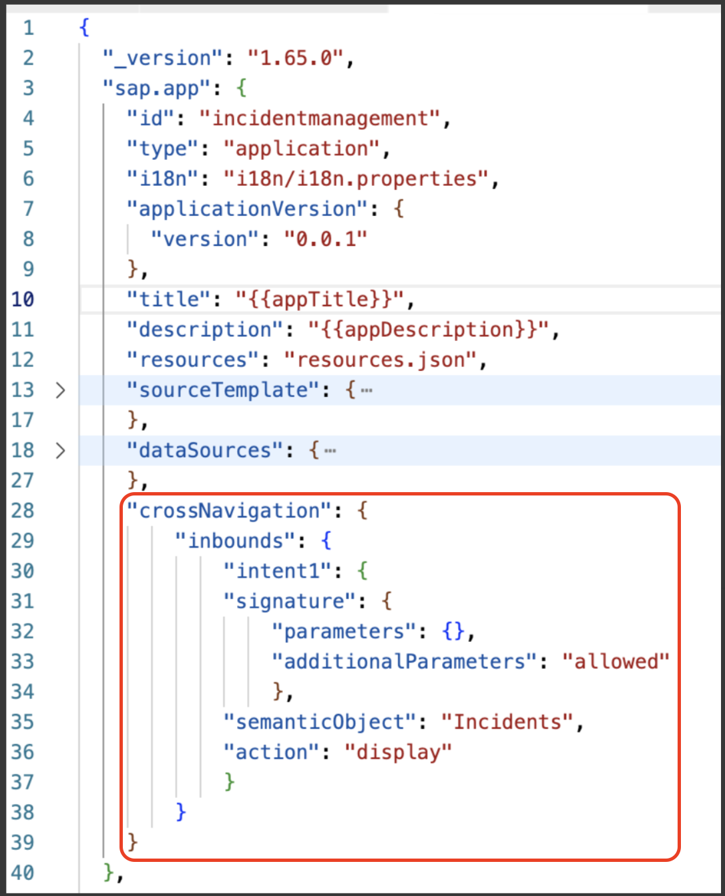  


> [!Note]
> **To identify uniquely your deployed application in SAP BTP cockpit, make the following changes to UI module of your application.**

2. Use the following pattern to name your UI application `incidentmanagement<your-initials><unique-random-number>`. For example, if your name is `John Doe`, then the project name would be **incidentmanagementjd12**, (12 is a random number). 

    1. Under **app &rarr; incident-management &rarr; webapp**, replace incidentmanagement with the new name in following files:

        - **Component.js**
            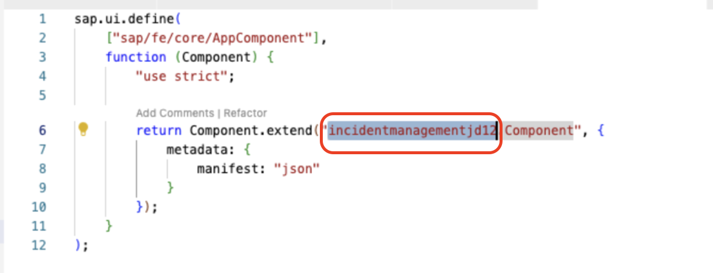  

        - **index.html**
            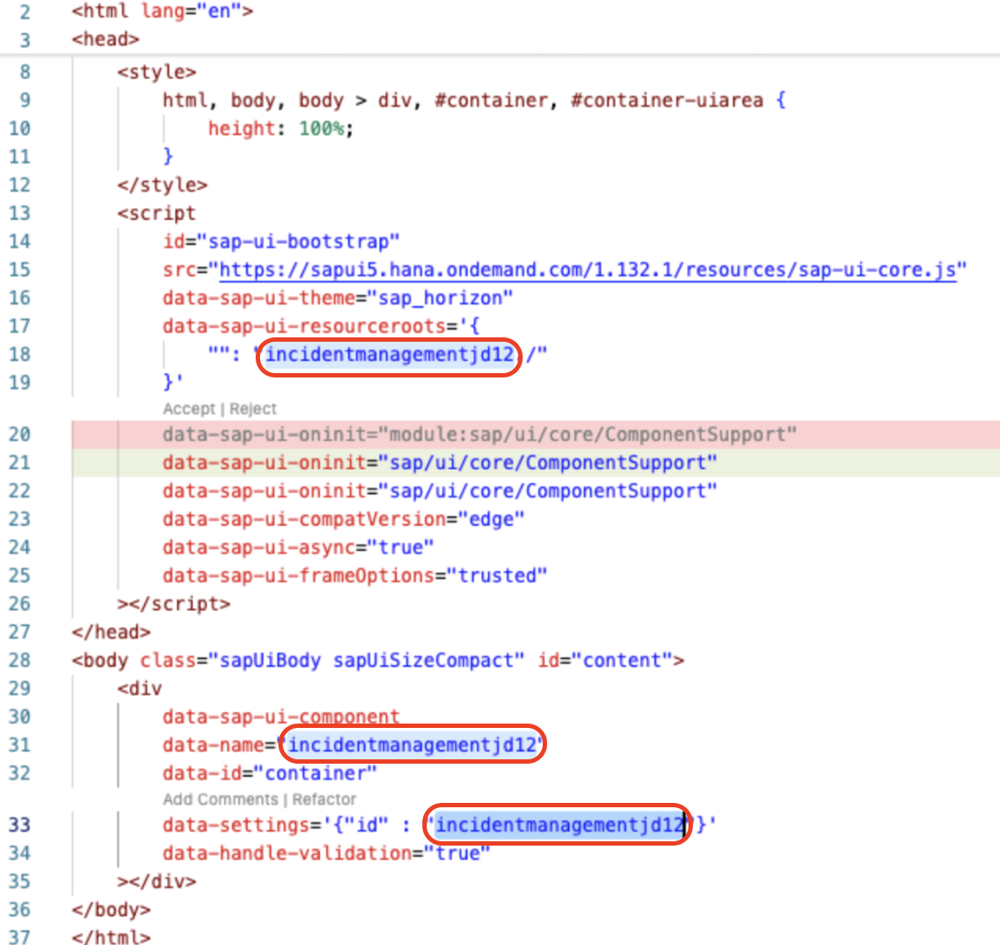

        - **manifest.json**
            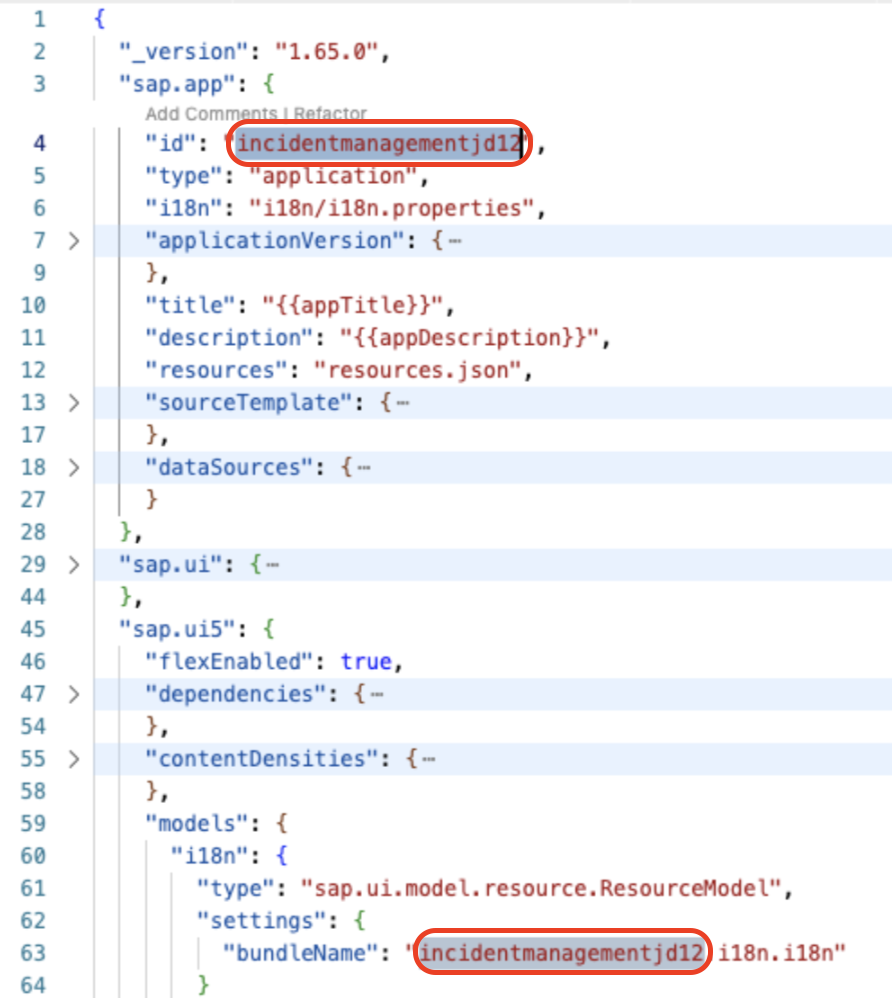

    2. Under **app &rarr; incident-management &rarr; ui5.yaml**, replace incidentmanagement with the new name:
            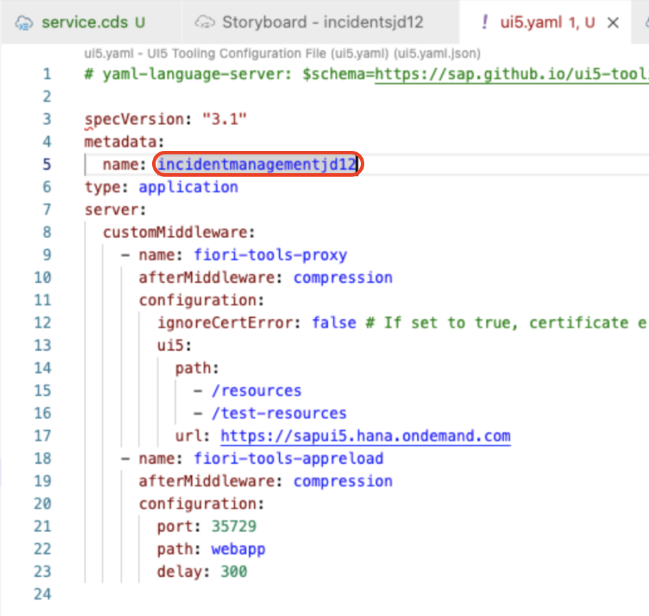

        > Note: Find all the instances and replace *incidentmanagement* with *incidentmanagementjd12*. 


## Deploy the Application

The final step in SAP Build Code is to deploy the application to the SAP BTP, Cloud Foundry runtime. This process also involves the automatic creation of destinations, and enabling ODATA services to be utilized by other tools such as SAP Build Apps.

1. Navigate to **Task Explorer** and run **Deploy** project name.

    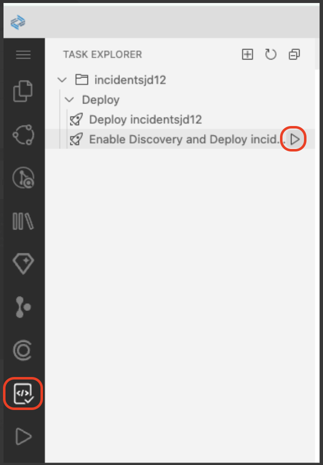

2. Check if the task has been launched in the terminal.

    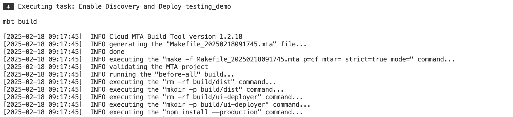

3. During the deployment, a new page pops up asking you to sign in to Cloud Foundry. Follow these steps:

    1. In the **Enter Cloud Foundry Endpoint** field, enter the **API Endpoint** from the SAP BTP cockpit.

        > Note: Get the Cloud Foundry endpoint from the SAP BTP cockpit.
         

    2. Select **SSO Passcode** as an authentication method.

        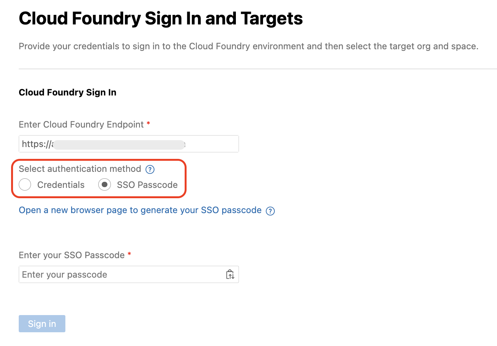

    3. Choose **Open a new browser page to generate your SSO passcode** to sign in to your subaccount in SAP BTP, which opens in a new browser.

    4. Find the **Enter the origin key** text box and choose **Sign in with alternative identity provider**.

        > Note: Ask the instructor for the origin key.

        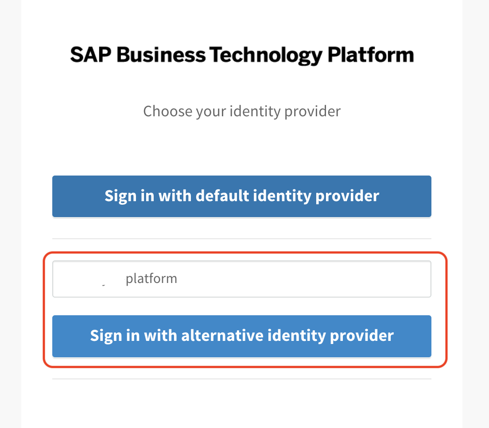

        > Note: When choosing **Sign in with alternative identity provider**, if your are prompted to sign in, enter your username and password.
        > If you are signed in with Default Identity, you can choose to sign in with default identity provider.

    5. Choose the **Copy** icon to get a temporary authentication code.

        
    
    6. Paste the copied code in the **Enter your SSO Passcode** field in the Cloud Foundry login page.

    7. Choose **Sign In**.

        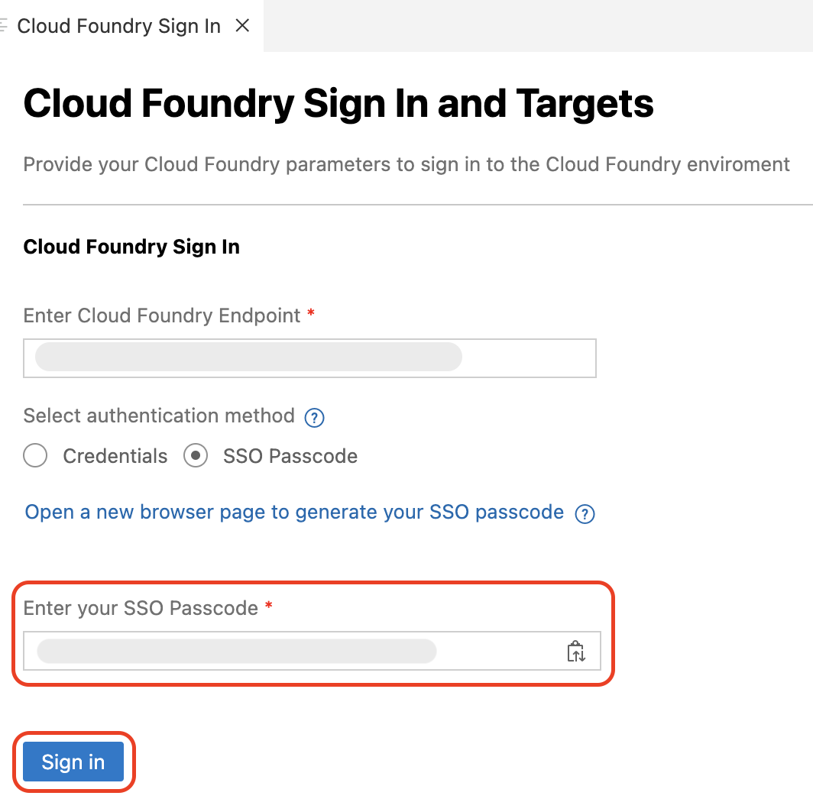

4. In the **Cloud Foundry Target** section, do the following:

    1. In the **Select Cloud Foundry Organization** dropdown menu, select the respective Org name.

    2. In the **Select Cloud Foundry Space** dropdown menu, select the created dev space in the prerequisite step. 

    3. Choose **Apply**.

        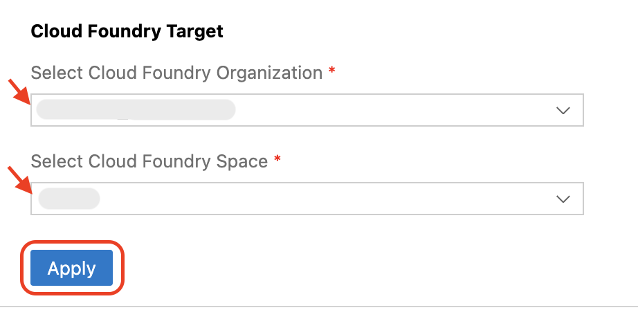

5. Check the terminal for the deployment progress. 

6. Once the deployment is completed, the application is started log and you can see the Overview URL.

    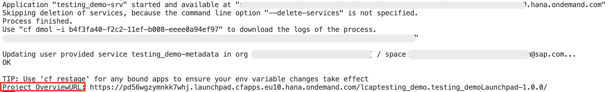

## Assign the User Roles

### Create a Role Collection and Add a Role

1. Open the SAP BTP cockpit and navigate to your subaccount.

2. Choose **Security** > **Role Collections**.

    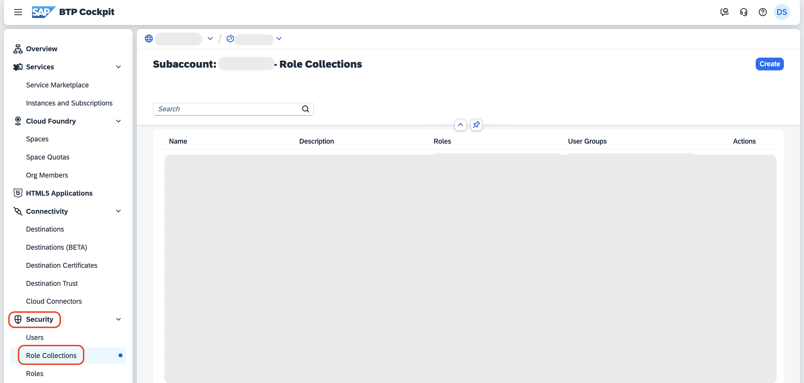

3. In the **Search** field, type your project name. For example, project name is **Incidentsjd12**, and choose **incidentsjd12-Support-dev**.

    

4. Choose **Edit**.

    > Make sure the **Support** role is already listed in the **Roles** tab.

    

5. In the **Users** tab:

    1. Type your username in the **ID** field, and select your username from the suggestions.

    2. Select **...accounts.ondemand.com(business users)** from the **Identity Provider** dropdown.

    > **Note:** Make sure you are selecting the Identity Provider with (application users).

    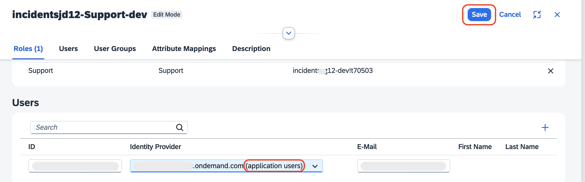

6. Choose **Save**.

## Next Steps

Integrate your application with SAP Build Work Zone by following the steps at [Integrate with SAP Build Work Zone](integrate-workzone.md).
