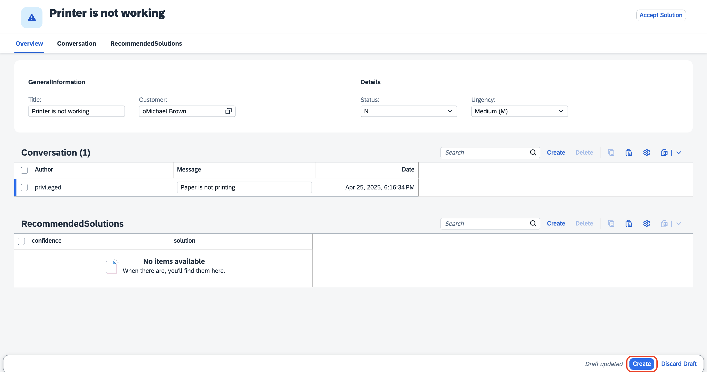

## Test the Incident Management Application

## Prerequisite

[Intergrate with SAP Build Work Zone](./integrate-workzone.md)

## Testing the Scenario End to End

1. Once you open the application, click the URL under **Web Applications**.

    

2. Choose **Go**, which loads all the incidents.

    

3. Choose **Create**.

    

4. Fill in the incident details:

    1. In the **Title** field, enter **Printer is not working**.
    
    2. In the **Customer** dropdown menu, select a customer of your choice.

        

    3. Leave the **Status** and **Urgency** fields with their default value.

    4. In the **Conversation** section, choose **Create**.

    5. Enter the **Paper is not printing** message.

    6. Choose **Create**.

        

5. In the **Recommended Solutions** section, you will be able to see the solutions with the confidence score.

    

6. Choose **Accept Solution**.

    

7. In the dropdown menu, select **Yes**, if the recommended solution worked. Choose **Accept Solution** again.

    

8. You will get a notification: **Data added successfully!**

    
