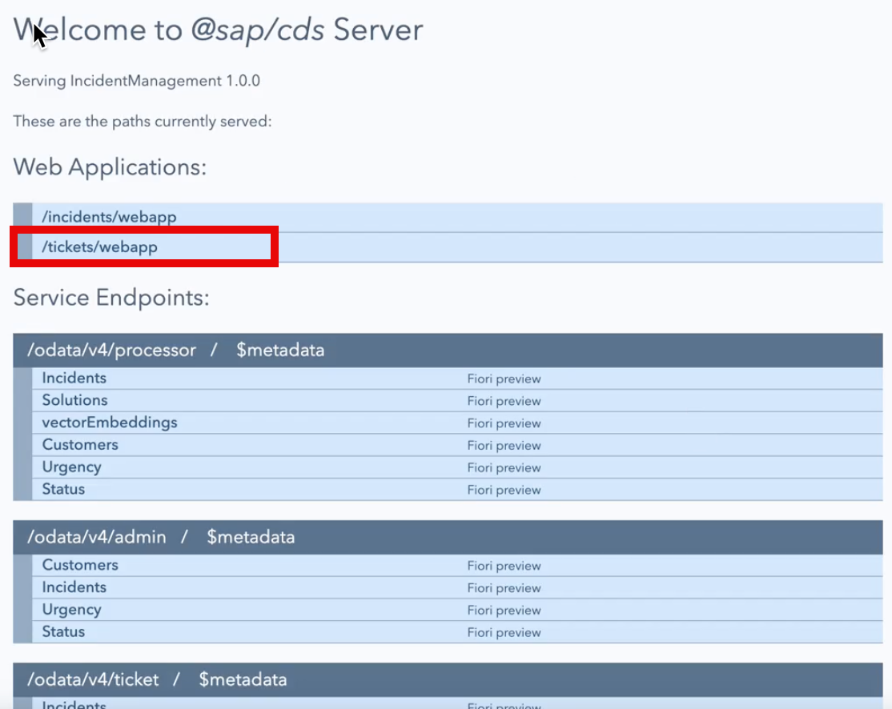
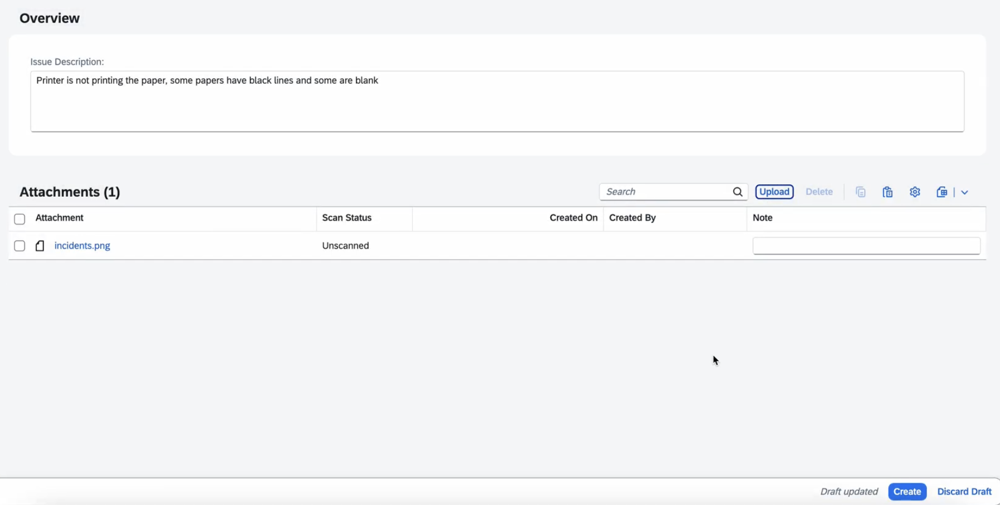
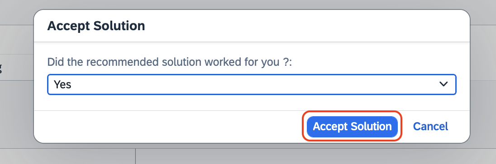
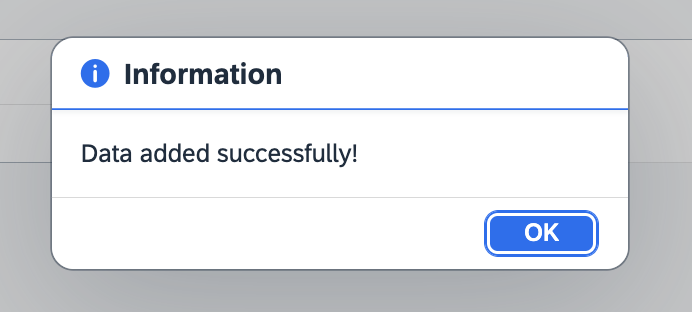

## Test the Incident Management Application

## Prerequisite

[Extend the Incident Management Application](./extend-service.md)

## Feed Data to the Application

1. Open the terminal, and start the application:

```sh
cds watch --profile hybrid
```

2. Open the `request.http` file and click **Send Request**.

    

> In the terminal, you can see the data from Incidents.csv file is getting trained. Please wait until the training is ready. Then, you will see the Response status 200. 

3. Once completed, you will see the Response as 200.

    to be updated.

4. Go back to the terminal where the application is running, click the URL where the localhost is running.

    

> [!Tip]
> Open the URL in the browser:
>
> For windows, Ctrl + click on the URL
>
> For Mac, command + click on the URL

## Testing the Scenario End to End

1. Once you open the application, click the URL under **Web Applications**.

    

2. Fill in the incident details:

    1. In the **Issue Description** field, enter **Printer is not printing papers**.

    2. In the **Attachments** section, choose **Upload**. Then, select your file. You can access the file at [here](../images/teste2e/issueTicket.png)

        

    3. Choose **Create**.

3. Wait for the ticket to be created. Then go to the **Incidents** UI.
4. The new issue can be seen there. Select your new issue.

    

5. Under **Recommended Solutions**, you will be able to see the solutions with the confidence score.

    

6. Choose **Accept Solution**.

7. In the dropdown, choose **Yes**, if the recommended solution worked. Choose **Accept Solution** again.

    

8. You will get the notification: **Data added successfully!**

    
