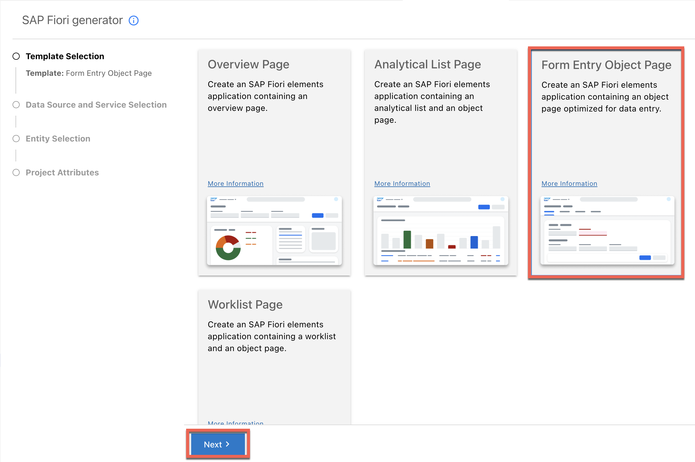
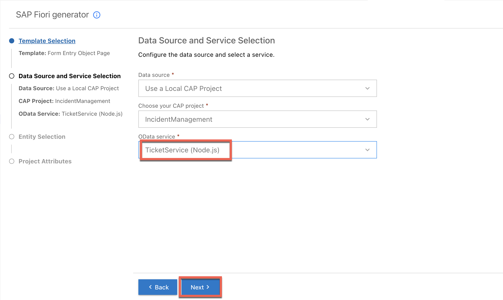
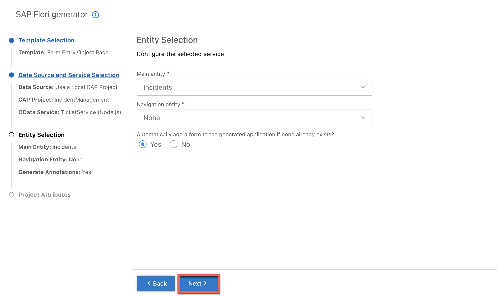
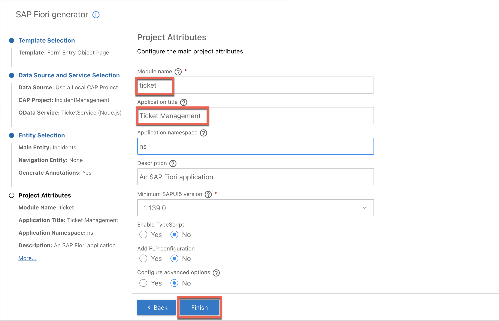

# Add SAP Fiori UI Application with Attachments

## Prerequisites

Make sure you've followed the steps at [Add Dependencies for Attachments and SAP Document AI](./prerequisites-2.md).

# Generate the UI with an SAP Fiori Elements Template

1. Choose **View** &rarr; **Command Palette**.

    > You can also invoke the Command Palette quickly using the following key combination:
    >
    > - For macOS: <kbd>Command</kbd> + <kbd>Shift</kbd> + <kbd>P</kbd>
    > - For Windows: <kbd>Ctrl</kbd> + <kbd>Shift</kbd> + <kbd>P</kbd>

2. Type **Fiori: Open Application Generator** in the field and select this entry from the list.

3. In the **Template Selection**, select the **Form Entry Object Page** template tile. Then Choose **Next**.

    <!-- border; size:540px -->
    

4. In the **Data Source and Service Selection** step:

    - In the **Data source** dropdown menu, select **Use a Local CAP Project**.

    - In the **Choose your CAP project** dropdown menu, select the **incident-management** project.

    - In the **OData service** dropdown menu, select the **TicketService (Node.js)**.
    
    - Choose **Next**.

        <!-- border; size:540px --> 
        

5. In the **Entity Selection** step:

    - In the **Main entity** dropdown menu, select **Incidents**.
    - Leave the **Navigation entity** value as **none**.
    - Leave **Yes** selected to add table columns automatically.
    - Leave the **Table Type** value as **Responsive**.   
    - Choose **Next**.

        <!-- border; size:540px --> 
        

6. In the **Project Attributes** step:

    - In the **Module name** field, enter **tickets**.

    - In the **Application title** field, enter **Ticket Management**.

    - In the **Application namespace** field, enter **ns**.

     :::danger Caution
    Application namespace value should be **unique**. If you're running this section as part of a hands-on session, ensure that you use a unique value to avoid conflicts. For example, you may use your **lowercase initials to the namespace**.
     :::

    - Leave the default values for all the other settings and choose **Finish**.

        <!-- border; size:540px --> 
        

    The application is now generated and in a few seconds you can see the application's **tickets** folder in the **app** folder of your **incident-management** project. It contains a **webapp** folder with a **Component.js** file that is typical for an SAPUI5 application. However, the source code of this application is minimal. It inherits its logic from the **sap/fe/core/AppComponent** class. This class is managed centrally by SAP Fiori elements and provides all the services that are required (routing, edit flow) so that the building blocks and the templates work properly.

## Next Step

[Testing the Scenario End to End](./e2e-testing-ai.md)
