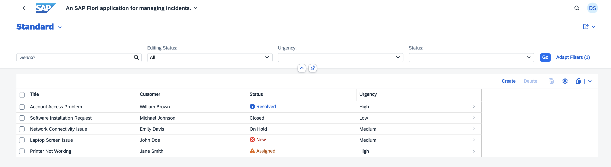

# Integrate Your Application with SAP Build Work Zone, Standard Edition

Follow these steps to subscribe your application to the SAP Build Work Zone, standard edition.

## Prerequisite

Have your application deployed to SAP BTP, Cloud Foundry. See [Deploy in SAP BTP, Cloud Foundry Runtime](deploy-cf.md).

#### Update content

1. Open SAP Build Work Zone.

2. Choose **Channel Manager** from the left navigation bar. 

3. Choose the refresh icon to fetch the updated content.

    

#### Add the Application to the Content Explorer

1. Choose the **Content Manager** icon in the menu on the left and choose the **Content Explorer** button.

    

2. Choose the HTML5 Apps tile.

    

3. In the items table, select the application and choose **Add**.

#### Create a Group

1. Go back to the **Content Manager**, choose **Create** → **Group**.

    

2. Add a title using the pattern: `Incident Management Group <your-initials><unique-random-number>`. For example, the title is **Incident Management Group JD12**.

3. In the **Assignment Status** column, switch the slider on to assign the Incident-Management app to the group.

>[!Note]
> While switching the slider on, make sure you are selecting the application with the ID you have created.

4. Choose **Save**.
    
    

#### Add Application to the Role Everyone

1. Back in the **Content Manager**, choose the **Everyone** role and then choose **Edit**.

    

2. In the **Assignment Status** column, switch the slider on to assign the Incident-Management app to the role.

3. Choose **Save**.

    

#### Create a Site

1. Navigate to **Site Directory** and choose **Create Site**.

    

2. Enter the site name folling the pattern: `Incident Management Site <your-initials><unique-random-number>` and choose **Create**.

    

3. Now, you are forwarded to your site.

#### Test Your Site

1. Navigate to the **Site Directory** and find your site.

    

2. Choose **Go to site**.

    

3. Choose the Incident Management application from the launch page.

    

    You should be able to see the list report page.

    

## Next Step

Test the flow end to end by following the steps at [Test the Application End to End](e2e-testing-cf.md).

