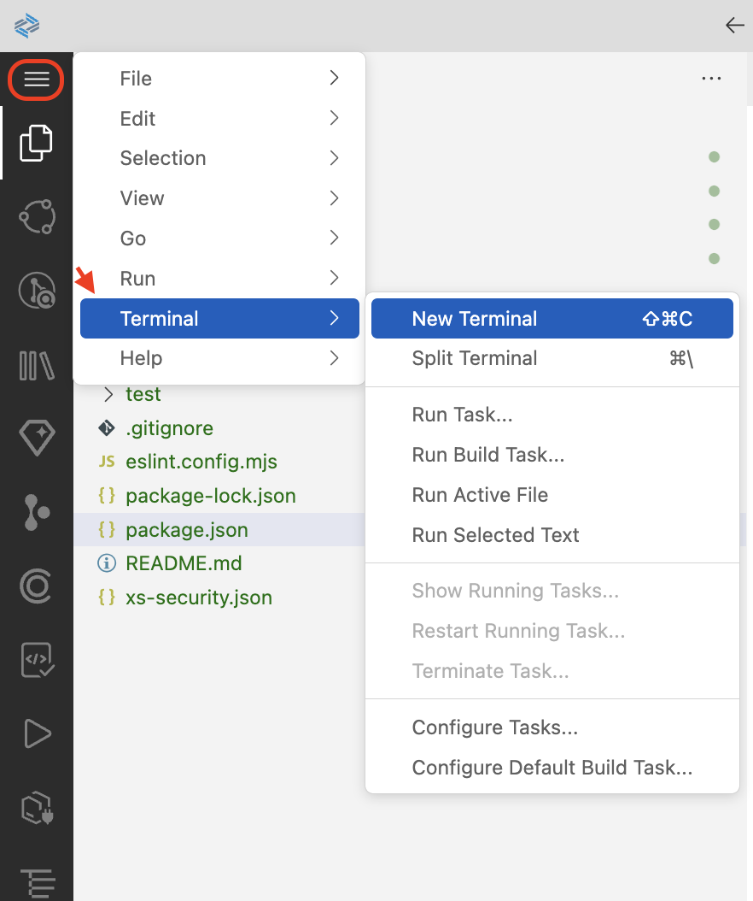
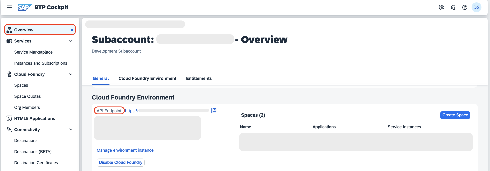
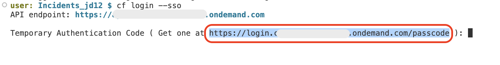
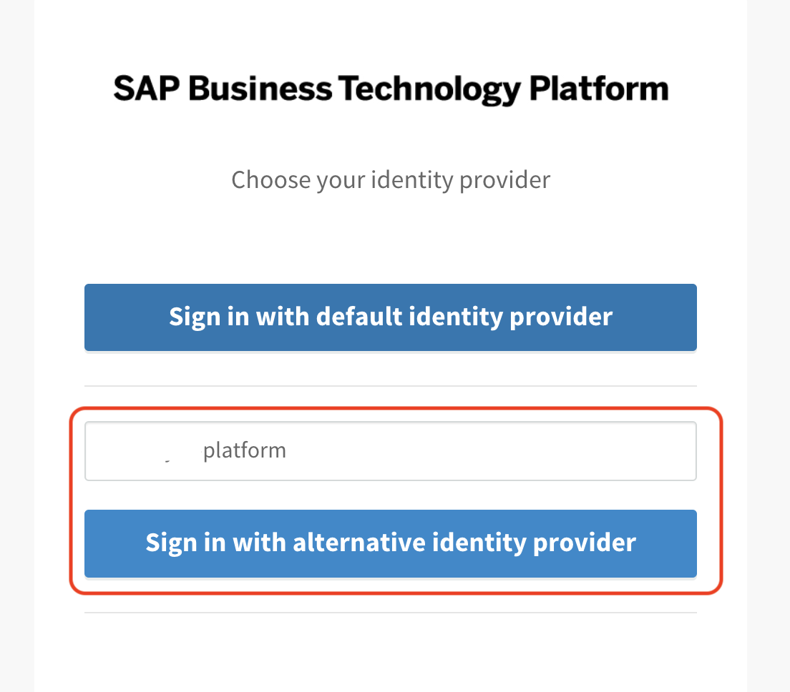
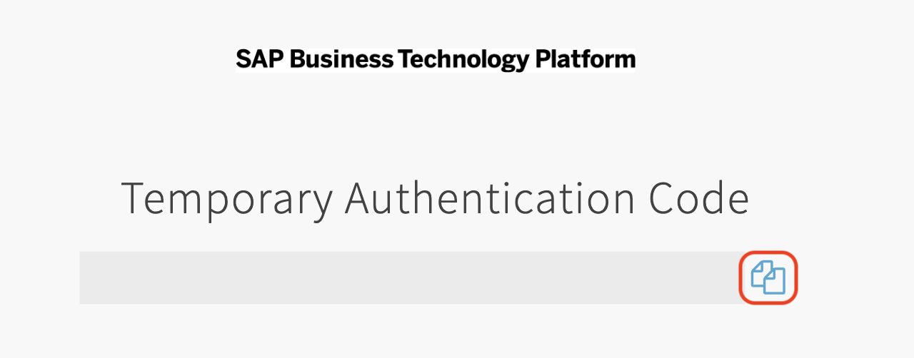

# Integrate Attachments and SAP Document AI into the Incident Management Application

## Add and Install the Required Packages

1. Open the **package.json** file and add the following dependencies:

```json
"dependencies": {
    ...
    "@sap-cloud-sdk/http-client": "^4.0.2",
     "form-data": "^4.0.3",
     "@cap-js/attachments": "^2.2.0"
},
```

> [!Note]
> These packages are required to enable attachment handling and to integrate with SAP Document AI.

2. From the root of the project, choose the hamburger menu, and then choose **Terminal** → **New Terminal**.

     

3. Run `npm install` to install the required dependencies.

## Log In to SAP BTP, Cloud Foundry Runtime

1. In the terminal, log in to your subaccount in SAP BTP:

```sh
cf api <API-ENDPOINT>
cf login --sso
```

> [!Note]
> You can find the API endpoint in the **Overview** section of your subaccount in the SAP BTP cockpit.
 

2. Copy the URL to get the **Temporary Authentication Code** and paste it in a new tab.

    

3. Find the **Enter the origin key** text box and click **Sign in with alternative identity provider**.

    > Note: Ask the instructor for the origin key

    

    > Note: When choosing **Sign in with alternative identity provider**, if your are prompted to sign in, enter your username and password.
    > If you are signed in with Default Identity, you can choose to sign in with default identity provider.

4. Choose the **Copy** icon to get a temporary authentication code.

    

5. Paste the copied code in the terminal and click **Enter**.

6. Select the relevant org and click **Enter**.

7. Select the created space and click **Enter**.

## Enhance the Schema of Incident Management Application for Attachements

1. Open `schema.cds` and add the following code snippets:

    1. Inside the `Incidents` entity, add the `attachments` property:

        ```sh
        attachments: Composition of many Attachments;
        ```

    2. Import the `Attachments` entity:

        ```sh
        using { Attachments } from '@cap-js/attachments';
        ```


## Next Step

[Extend the Incident Management Application with SAP document AI](./extend-doc-ai.md)
