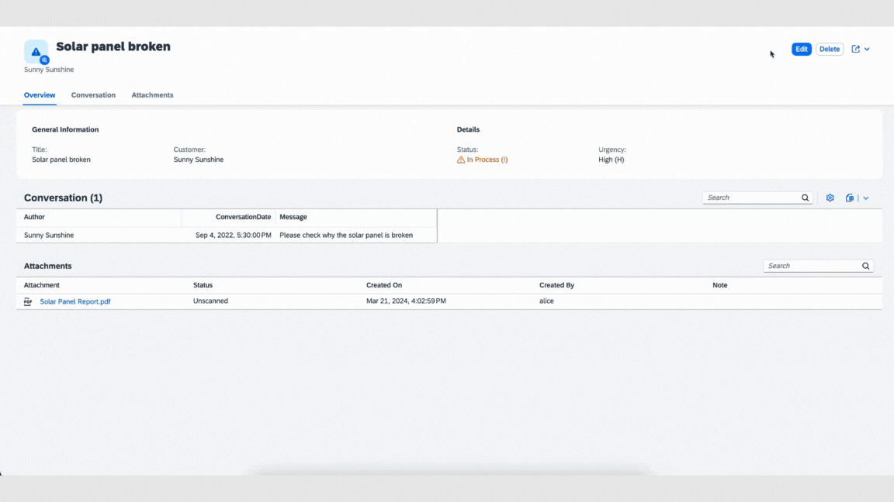

# Test the flow end-to-end

## Prerequisites

- You have sucessfully deployed the application to your SAP BTP Runtime.
- You have assigned application roles before accessing the application. See [User Role Assignment](https://developers.sap.com/tutorials/user-role-assignment.html).
- You have integrated your application with SAP Build Work Zone and accessed it via launchpad. See [Integrate Your Application with SAP Build Workzone](https://developers.sap.com/tutorials/integrate-with-work-zone.html).

## Run and Test the Applicaion

1. Access your application via launchpad.
   
   

2. Navigate to the object page of the incident `Solar panel broken`:

3. The `Attachments` type will have generated an Attachments table at the bottom of the Object page:

4. Go into Edit mode and **Upload a file** (use the PDF file [Solar Panel Report.pdf](./Solar_Panel_Report.pdf)) by either using the **Upload** button on the Attachments table or by using drag and drop. Click the **Save** button to store the file:

6. **Delete a file** by going into Edit mode and selecting the file(s) and by clicking on **Delete** in the Attachments table header. Then choose **Save** to have that file deleted from the resource. We demonstrate this by deleting the previously uploaded PDF file: `Solar Panel Report.pdf`

## Summary

Congratulations! You have successfully developed, configured and deployed the Incidenent Management application with Attachments Service.
