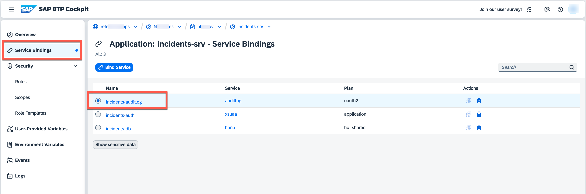
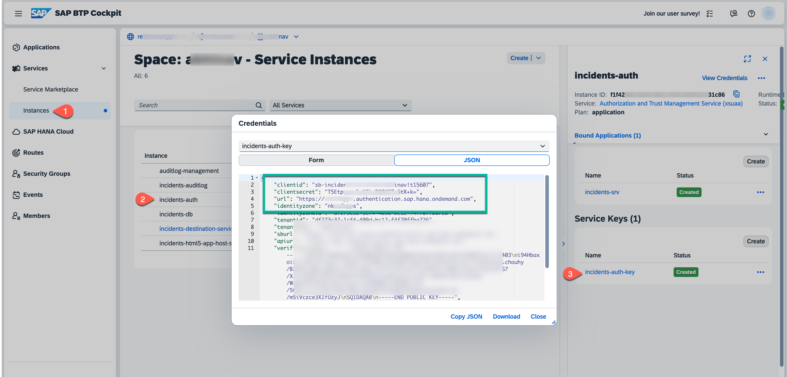
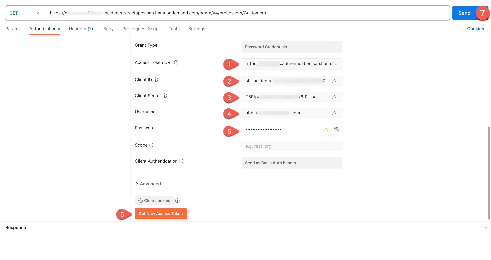

# Deploy and Run the Application on Cloud Foundry

## Use SAP Audit Log Service

While we simply dumped audit log messages to *stdout* in local development, we'll be using the **SAP Audit Log Service** on SAP BTP in **production**.

### Set up Instance and Deploy Application

To integrate with SAP Audit Log Service, you need to:

1. Add the service instance as an existing resource to your **mta.yml**. 
    ```yaml
    resources:
    - name: incidents-auditlog
      parameters:
        service-plan: premium
        service: auditlog
      type: org.cloudfoundry.managed-service
    ```
2. Bind the service to `incident-management-srv` in its **requires** section.
    ```yaml
      requires:
      - name: incidents-auditlog
    ```
3. Update `xs-security.json` and add `admin` role. The final `xs-security.json` will look like below:
    ```json
            {
        "scopes": [
            {
            "name": "$XSAPPNAME.support",
            "description": "support"
            },
            {
            "name": "$XSAPPNAME.admin",
            "description": "admin"
            }
        ],
        "attributes": [],
        "role-templates": [
            {
            "name": "support",
            "description": "generated",
            "scope-references": ["$XSAPPNAME.support"],
            "attribute-references": []
            },
            {
            "name": "admin",
            "description": "generated",
            "scope-references": ["$XSAPPNAME.admin"],
            "attribute-references": []
            },
            {
            "name": "Token_Exchange",
            "description": "UAA",
            "scope-references": [
                "uaa.user"
            ]
            }
        ]
        }
    ```
3. Build the *mtar* and deploy your application.
```bash
mbt build
```
4. Check if the *mtar* has been created in the *mta_archives* folder and run: 

```bash
cf deploy mta_archives/< mtar_name >.mtar
```
 
5. After successful deployment, you go to the **SAP BTP cockpit**. In **Subaccount-> Spaces -> Your Space**, check if the application is up and running.
6. In **Service Bindings**, see the services that bind to your application. Here audit log is one of them.


7. To be able to access the application via the URL, you need to assign roles to users. See [Assign Application Roles](https://developers.sap.com/tutorials/user-role-assignment.html).
8. Edit the role-collection `Incident Management Support` created in the above step and add `admin` role to it. Make sure the role-collection `Incident Management Support` is assigned to your user. 

### Test Your Application

To test and generate audit log, we will be using one of these API Testing tools:

[Postman](https://www.postman.com/)

[Insomnia](https://insomnia.rest/)

1. To access the below endpoint, the user needs `support` role and `xsuaa token` has to be passed in the header.

2. To generate the token, use the following credentials from your XSUAA Instance Service Key: `clientId`, `clientsecret`, `<url>/oauth/token`.
   


3. Use Postman and generate access token.
   Set authorization type as `OAuth 2.0` , `cf username` ,`cf password` and generate access token.
   


4. Use `https://<org>-<space>-incidents-srv.cfapps.sap.hana.ondemand.com/odata/v4/processor/Customers` and send the request (Step 7 in the above screenshot). If successful, you will get the list of customers as a response:
```
{
    "@odata.context": "$metadata#Customers",
    "value": [
        {
            "ID": "2b87f6ca-28a2-41d6-8c69-ccf16aa6389d",
            "createdAt": null,
            "createdBy": null,
            "modifiedAt": null,
            "modifiedBy": null,
            "firstName": "Sunny",
            "lastName": "Sunshine",
            "email": "sunny.sunshine@demo.com",
            "phone": "+01-555-789",
            "creditCardNo": null,
            "name": "Sunny Sunshine"
        },
        {
            "ID": "8fc8231b-f6d7-43d1-a7e1-725c8e988d18",
            "createdAt": null,
            "createdBy": null,
            "modifiedAt": null,
            "modifiedBy": null,
            "firstName": "Daniel",
            "lastName": "Watts",
            "email": "daniel.watts@demo.com",
            "phone": "+44-555-123",
            "creditCardNo": null,
            "name": "Daniel Watts"
        },
        {
            "ID": "feb04eac-f84f-4232-bd4f-80a178f24a17",
            "createdAt": null,
            "createdBy": null,
            "modifiedAt": null,
            "modifiedBy": null,
            "firstName": "Stormy",
            "lastName": "Weathers",
            "email": "stormy.weathers@demo.com",
            "phone": null,
            "creditCardNo": null,
            "name": "Stormy Weathers"
        }
    ]
}
```
5. On reading the customer data which we have annotated with @PersonalData, there will be an audit log entry in Cloud Foundry, which you will be retrieving in the next step. 

