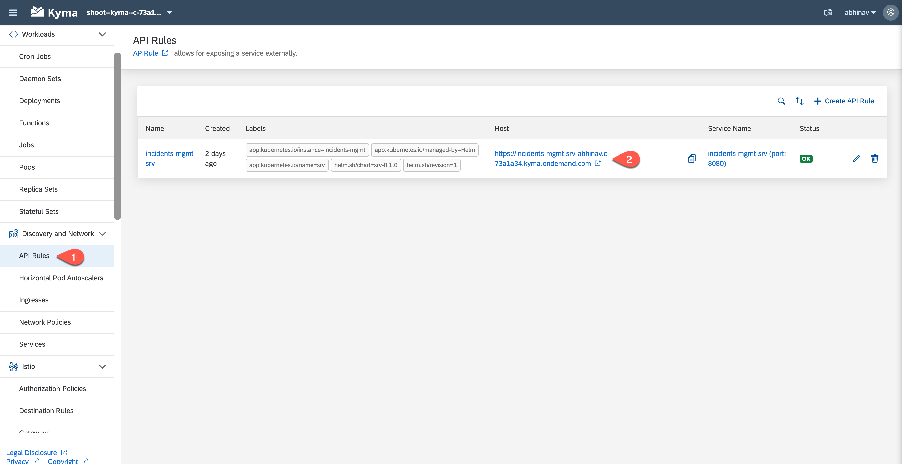
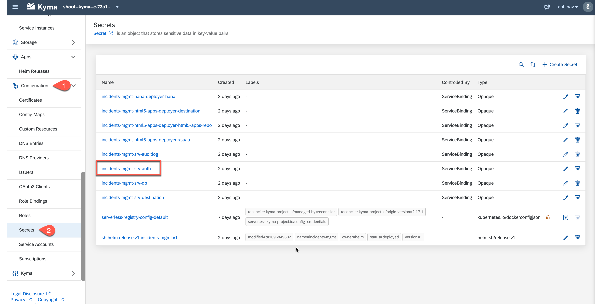
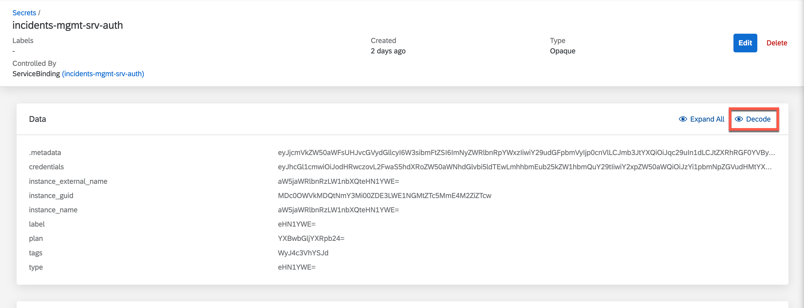
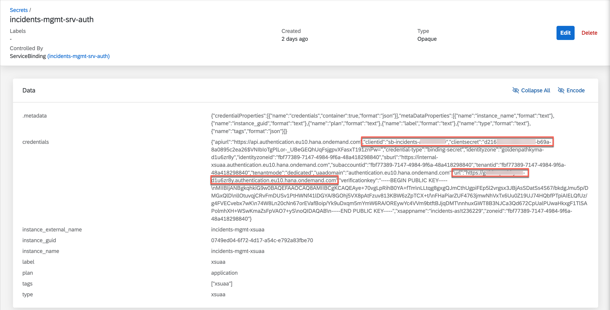

# Deploy and Run the Application on Kyma

## Build the Images

To transform source code (or artifacts) into container images, we recommend using [Cloud Native Buildpacks](https://buildpacks.io/).

For local development scenarios, you can use the [pack](https://buildpacks.io/docs/tools/pack/) CLI to consume Cloud Native Buildpacks. 

For more information, see [About Cloud Native Buildpacks](https://cap.cloud.sap/docs/guides/deployment/deploy-to-kyma?impl-variant=node#about-cloud-native-buildpacks).

Log in to your container registry:

```sh
docker login docker.io -u <your-user>

```
**Before You Begin**


Please note:

If you're using any device with a non-x86 processor (e.g. MacBook M1/M2), you need to instruct the Docker to use x86 images by setting the **DOCKER_DEFAULT_PLATFORM** environment variable: *export DOCKER_DEFAULT_PLATFORM=linux/amd64*.
See [Environment variables](https://docs.docker.com/engine/reference/commandline/cli/#environment-variables).


1. Do the productive build for your application, which writes into the `gen` folder.

```sh
cds build --production
```

2. Build the `incident-management-srv` image after updating version `<image-version>` to reflect the change in incident-management-srv app.:

```sh
pack build <your-container-registry>/incident-management-srv:<image-version> \
     --path gen/srv \
     --builder paketobuildpacks/builder-jammy-base \
     --publish
```

3. Build the database image after updating version `<image-version>` to reflect the change in incident-management-hana-deployer app.:

```sh
pack build <your-container-registry>/incident-management-hana-deployer:<image-version> \
     --path gen/db \
     --builder paketobuildpacks/builder-jammy-base \
     --publish
```

4. Build the HTML5 Deployer image after updating version `<image-version>` to reflect the change in incident-management-html5-deploye app.

```sh
pack build <your-container-registry>/incident-management-html5-deployer:<image-version> \
     --path app/incidents \
     --builder paketobuildpacks/builder-jammy-base \
     --publish
```

5. Add your container image settings to your `chart/values.yaml`.

```yaml{4,7,8,9,13,14,18,19,23,24}
...
global:
  imagePullSecret:
    name: [<image pull secret name>] 
...
srv:
  image:
    repository: <your-container-registry>/incident-management-srv
    tag: <srv-image-version>
...
hana-deployer:
  image:
    repository: <your-container-registry>/incident-management-hana-deployer
    tag: <db-deployer-image-version>
...
html5-apps-deployer:
  image:
    repository: <your-container-registry>/incident-management-html5-deployer
    tag: <html5apps-deployer-image-version>
```
6. Change the value for `SAP_CLOUD_SERVICE` to `incidents`.
   
```yaml{3}
html5-apps-deployer:
  env:
    SAP_CLOUD_SERVICE: incidents
```
7. Add audit log service configurations to your `charts/values.yaml`:

```
auditlog:
  serviceOfferingName: auditlog
  servicePlanName: premium
```
In `srv/bindings` add:
```
auditlog:
    serviceInstanceName: auditlog
```
8. Navigate to  `chart/Charts.yaml` and update dependencies section with the following code:
   
```
  - name: service-instance
    alias: auditlog
    version: ">0.0.0"
```

## Deploy CAP Helm Chart to Kyma

1. Log in to your Kyma cluster.

2. Create a namespace.
   
```sh
kubectl create namespace incidents-namespace
kubectl label namespace incidents-namespace istio-injection=enabled
```

3. Deploy using Helm command:
   
```sh
helm upgrade --install incident-management --namespace incidents-namespace ./chart \
--set-file xsuaa.jsonParameters=xs-security.json
```
This installs the Helm chart from the chart folder with the release name ***incident-management*** in the namespace ***incidents-namespace***.

::: tip

With the ***helm upgrade --install*** command you can install a new chart as well as upgrade an existing chart.
:::

## Test Your Application

To test and generate audit log, we will be using one of these API Testing tools:

[Postman](https://www.postman.com/)

[Insomnia](https://insomnia.rest/)

1. To be able to access the application via the URL, you need to assign roles to users. See [Assign Application Roles](https://developers.sap.com/tutorials/user-role-assignment.html).
2. Edit the role-collection `Incident Management Support` created in the above step and add `admin` role to it. Make sure the role-collection Incident Management Support is assigned to your user.

3. Go to your Kyma cluster. Get the application endpoint from *your-namespace* -> **Discovery and Networks -> API Rules -> incident-management-srv**.
   


4. To access the below endpoint, the user needs `support` and `admin` roles and `xsuaa token` has to be passed in the header.
   
5. To generate the token, use the following credentials from your XSUAA Instance: `clientId`, `clientsecret`, `<url>/oauth/token`.

6. To acess the xsuaa credentials follow the steps:
  -  Go to *your namespace* -> **Configuration -> Secrets**, and select your XSUAA application.
    
  <br/> 
  
  -  To decrypt the Data, choose **Decode**
     
    
  -  Use the following credentials: `clientId`, `clientsecret`, `url` to generate access token.
  - 

7. Use Postman to generate access token. Set authorization type as `OAuth 2.0` , `cf username` ,`cf password` and generate access token.


8. Use `<your application end point>/odata/v4/processor/Customers` and send the request (Step 7 in the above screenshot). If successful, you will get the list of customers as a response:
```
{
    "@odata.context": "$metadata#Customers",
    "value": [
        {
            "ID": "2b87f6ca-28a2-41d6-8c69-ccf16aa6389d",
            "createdAt": null,
            "createdBy": null,
            "modifiedAt": null,
            "modifiedBy": null,
            "firstName": "Sunny",
            "lastName": "Sunshine",
            "email": "sunny.sunshine@demo.com",
            "phone": "+01-555-789",
            "creditCardNo": null,
            "name": "Sunny Sunshine"
        },
        {
            "ID": "8fc8231b-f6d7-43d1-a7e1-725c8e988d18",
            "createdAt": null,
            "createdBy": null,
            "modifiedAt": null,
            "modifiedBy": null,
            "firstName": "Daniel",
            "lastName": "Watts",
            "email": "daniel.watts@demo.com",
            "phone": "+44-555-123",
            "creditCardNo": null,
            "name": "Daniel Watts"
        },
        {
            "ID": "feb04eac-f84f-4232-bd4f-80a178f24a17",
            "createdAt": null,
            "createdBy": null,
            "modifiedAt": null,
            "modifiedBy": null,
            "firstName": "Stormy",
            "lastName": "Weathers",
            "email": "stormy.weathers@demo.com",
            "phone": null,
            "creditCardNo": null,
            "name": "Stormy Weathers"
        }
    ]
}
```
9. On reading the customer data which we have annotated with @PersonalData, there will be an audit log entry in Cloud Foundry, which you will be retrieving in the next step. 


