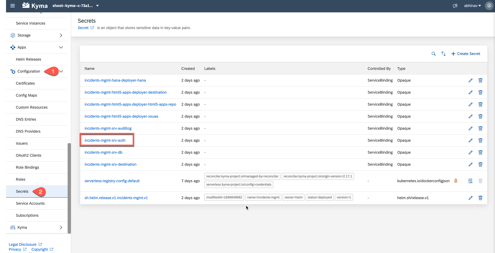
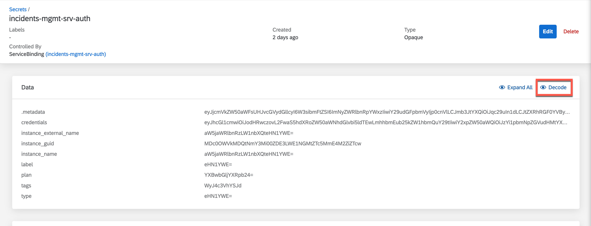
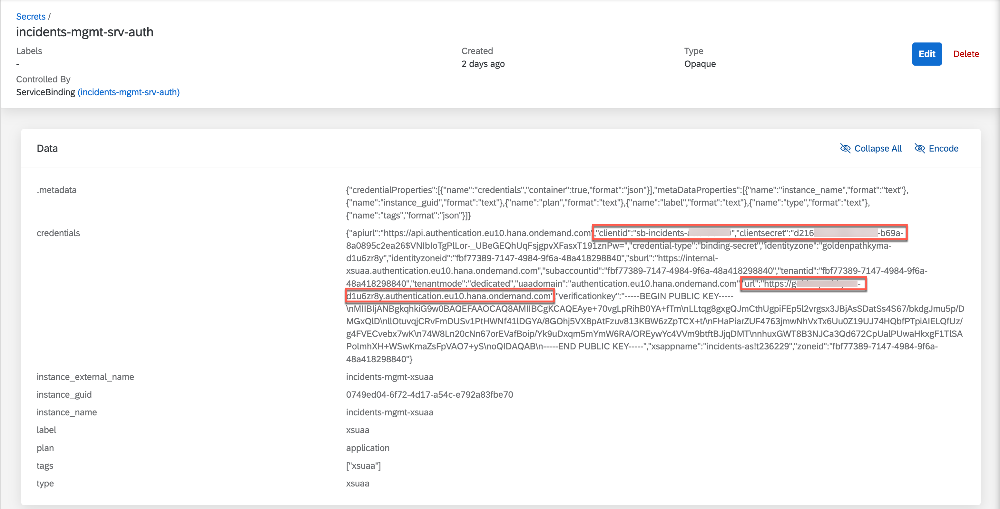
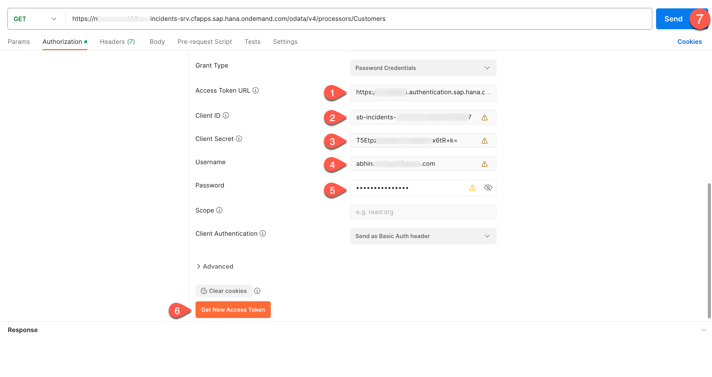

# Deploy and Run the Application on Kyma

## Configure the Build

To transform source code into container images, CAP uses [Cloud Native Buildpacks](https://buildpacks.io/) configured via a `containerize.yaml` file.

For more information, see [About Cloud Native Buildpacks](https://cap.cloud.sap/docs/guides/deployment/deploy-to-kyma?impl-variant=node#about-cloud-native-buildpacks).

Log in to your container registry:

```sh
docker login docker.io -u <your-user>
```

**Before You Begin**

If you're using any device with a non-x86 processor (e.g. MacBook M1/M2), you need to instruct Docker to use x86 images by setting the **DOCKER_DEFAULT_PLATFORM** environment variable: *export DOCKER_DEFAULT_PLATFORM=linux/amd64*.
See [Environment variables](https://docs.docker.com/engine/reference/commandline/cli/#environment-variables).

1. If the `ui-resources` folder does not exist in your project, run:

```sh
cds add html5-repo
```

2. Do the productive build for your application, which writes into the `gen` folder:

```sh
cds build --production
```

3. Configure `containerize.yaml` at the root of your project:

> **Note:** Set `BP_NODE_VERSION: "20"` to pin Node.js to version 20 LTS. Without it, the Paketo buildpack selects Node.js 26, which requires `libatomic.so.1` — a library not present in the `paketobuildpacks/run-jammy-base` runtime image, causing the container to crash on startup.

```yaml
_schema-version: '1.0'
repository: <your-dockerhub-username>
tag: <image-version>
modules:
  - name: incident-management-srv
    build-parameters:
      buildpack:
        type: nodejs
        builder: builder-jammy-base
        path: gen/srv
        env:
          BP_NODE_VERSION: "20"
  - name: incident-management-hana-deployer
    build-parameters:
      buildpack:
        type: nodejs
        builder: builder-jammy-base
        path: gen/db
        env:
          BP_NODE_VERSION: "20"
  - name: incident-management-html5-deployer
    build-parameters:
      buildpack:
        type: nodejs
        builder: builder-jammy-base
        path: ui-resources
```

3. Add your container image settings to your `chart/values.yaml`.

> **Note:** The `global.image.registry` field must be a valid registry domain (e.g. `docker.io`). A bare Docker Hub username is not valid and will cause `cds up` to fail with a registry validation error.

```yaml
global:
  domain: <your-kyma-cluster-domain>
  imagePullSecret:
    name: <image-pull-secret-name>
  imagePullPolicy: Always
  image:
    registry: docker.io
    tag: <image-version>
srv:
  image:
    repository: <your-dockerhub-username>/incident-management-srv
hana-deployer:
  image:
    repository: <your-dockerhub-username>/incident-management-hana-deployer
html5-apps-deployer:
  image:
    repository: <your-dockerhub-username>/incident-management-html5-deployer
```

4. Update `srv` in `values.yaml` to expose the `incident-management-srv` API endpoint:

```yaml
srv:
  expose:
    enabled: true
```

5. Change the value for `SAP_CLOUD_SERVICE` to `incidents`:

```yaml
html5-apps-deployer:
  env:
    SAP_CLOUD_SERVICE: incidents
```

6. Add audit log service configurations to your `chart/values.yaml`:

```yaml
auditlog:
  serviceOfferingName: auditlog
  servicePlanName: premium
```

In `srv/bindings`, add:

```yaml
auditlog:
    serviceInstanceName: auditlog
```

7. Navigate to `chart/Chart.yaml` and update the dependencies section:

```yaml
  - name: service-instance
    alias: auditlog
    version: ">0.0.0"
```

8. Update `xs-security.json` and add the `admin` role. The final `xs-security.json` will look like below:

```json
{
  "scopes": [
    {
      "name": "$XSAPPNAME.support",
      "description": "support"
    },
    {
      "name": "$XSAPPNAME.admin",
      "description": "admin"
    }
  ],
  "attributes": [],
  "role-templates": [
    {
      "name": "support",
      "description": "generated",
      "scope-references": [
        "$XSAPPNAME.support"
      ],
      "attribute-references": []
    },
    {
      "name": "admin",
      "description": "generated",
      "scope-references": [
        "$XSAPPNAME.admin"
      ],
      "attribute-references": []
    },
    {
      "name": "Token_Exchange",
      "description": "UAA",
      "scope-references": [
        "uaa.user"
      ]
    }
  ]
}
```

## Deploy CAP Helm Chart to Kyma

1. Log in to your Kyma cluster.

2. Deploy using the following command:

```sh
cds up --to k8s --namespace incidents-namespace
```

This single command builds all container images using Cloud Native Buildpacks, pushes them to your registry, and deploys the Helm chart to your Kyma cluster. The namespace is created automatically if it does not exist.

> **Tip:** With `cds up --to k8s`, you can deploy a new application as well as update an existing deployment.

## Test Your Application

To test and generate audit log entries, use one of these API testing tools:

[Postman](https://www.postman.com/)

[Insomnia](https://insomnia.rest/)

1. To be able to access the application via the URL, you need to assign roles to users. See [Assign Application Roles](https://developers.sap.com/tutorials/user-role-assignment.html).
2. Edit the role-collection `Incident Management Support` created in the above step and add the `admin` role to it. Make sure the role-collection Incident Management Support is assigned to your user.

3. Go to your Kyma cluster. Get the application endpoint from *your-namespace* -> **Discovery and Networks -> API Rules V1 beta1 -> incident-management-srv**.

4. To access the endpoint below, the user needs `support` and `admin` roles and an `xsuaa token` must be passed in the header.

5. To generate the token, use the following credentials from your XSUAA Instance: `clientId`, `clientsecret`, `<url>/oauth/token`.

6. To access the xsuaa credentials, follow these steps:
  - Go to *your namespace* -> **Configuration -> Secrets**, and select your XSUAA application.

  <br/> 

  - To decrypt the data, choose **Decode**.
    

  - Use the following credentials: `clientId`, `clientsecret`, `url` to generate the access token.
  - 

7. Use Postman to generate the access token. Set authorization type as `OAuth 2.0`, `cf username`, `cf password` and generate the access token.


8. Use `<your application endpoint>/odata/v4/processor/Customers` and send the request (Step 7 in the above screenshot). If successful, you will get the list of customers as a response:

```json
{
    "@odata.context": "$metadata#Customers",
    "value": [
        {
            "ID": "2b87f6ca-28a2-41d6-8c69-ccf16aa6389d",
            "createdAt": null,
            "createdBy": null,
            "modifiedAt": null,
            "modifiedBy": null,
            "firstName": "Sunny",
            "lastName": "Sunshine",
            "email": "sunny.sunshine@demo.com",
            "phone": "+01-555-789",
            "creditCardNo": null,
            "name": "Sunny Sunshine"
        }
    ]
}
```

9. On reading the customer data annotated with `@PersonalData`, an audit log entry will be created, which you will retrieve in the next step.
