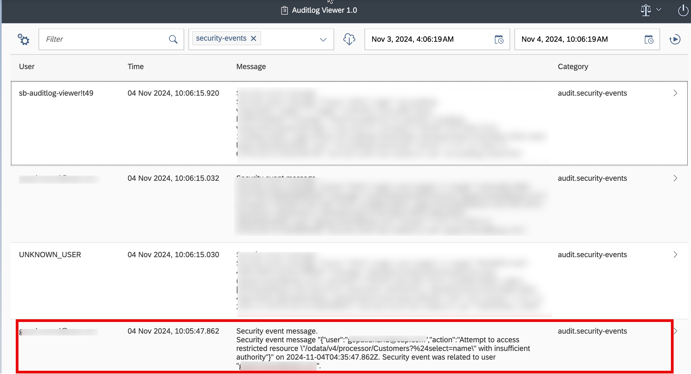

### Accessing Audit Logs Using SAP Audit Log Viewer Service

1. The SAP Audit Log Viewer service displays the audit logs for your Cloud Foundry account produced by SAP applications and services you’ve subscribed to.
   See [Audit Log Viewer for the Cloud Foundry Environment](https://help.sap.com/docs/btp/sap-business-technology-platform/audit-log-viewer-for-cloud-foundry-environment).

2. To use the SAP Audit Log Viewer service, subscribe to it using the SAP BTP cockpit.
   In **your subaccount -> Services-> Instances and Subscriptions -> Subscriptions**, choose `default` or `free` service plan. 
   
 Once you've subscribed, choose **Go to Application** to open the SAP Audit Log Viewer service and log in there.

3. To retrieve the audit logs for your subaccount using the SAP Audit Log Viewer service, you need to have proper authorizations.
    - Create a role-collection `auditlog-viewer`. In **your subaccount-> Role Collections**, Choose **Create**.
      
    - Add the following roles and save:
      
    - Assign this role-collection to your user.
      
4. Access the Audit Log Viewer Service and you will see the list of audit logs.
    - Filter out the logs by `data-access`, adjust the time range and you will see similar logs entries:
    - 
    If you see the logs as shown above, that means you have successfully integrated the Audit Logging Service.

## Accessing Custom Audit Logs Using SAP Audit Log Viewer Service
As part of the custom implementation of Audit logs in the [previous section](../../develop/audit-logging/add-custom-auditlogs.md) you have added steps to generate custom audit logs.
To access these logs you need to follow these steps:

1. Remote the `Support` role from your user. You can add it back later.
2. From Postman/Insomania or any other tool of your choice, make a request to `https://<org>-<space>-incidents-srv.cfapps.sap.hana.ondemand.com/odata/v4/admin/Customers` as done in the previous section.
3. Now in the `Audit Log Viewer` application, filter logs by `security-events`.
4. Now you can see the custom audit logs.
   