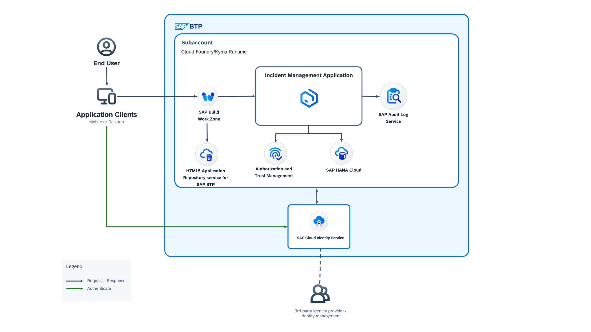

# Introduction

Audit logs are security relevant chronological records that provide evidence for system activities, such as system accesses and operations performed in a given period. 

## SAP Audit Log Service

The SAP Audit Log service stores audit logs written by SAP BTP services that represent different actions taken over your account and data.
There are predefined audit categories, which represent the kinds of actions:

- Data protection and privacy related
    - **audit.data-access:** read-access logging records for access to sensitive personal data;

    - **audit.data-modification:** data modification logging records for sensitive personal data.

- Security related
    - **audit.security-events:** logging of general security events like login, logout, and others;

    - **audit.configuration:** logging of security critical configuration changes.

## Solution Diagram

# Options

- [Implement Audit Logging Using the SAP Audit Log Service and Deploy to the SAP BTP Cloud Foundry Runtime](./audit-logging-cf.md)
- [Implement Audit Logging Using the SAP Audit Log Service and Deploy to the SAP BTP Kyma Runtime](./audit-logging-kyma.md)

