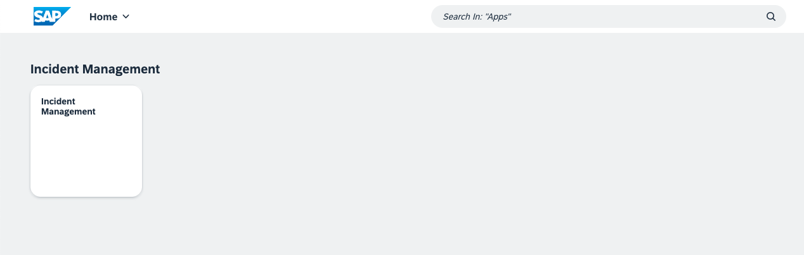
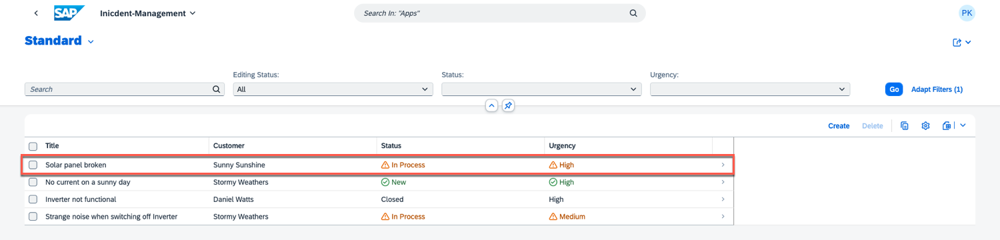
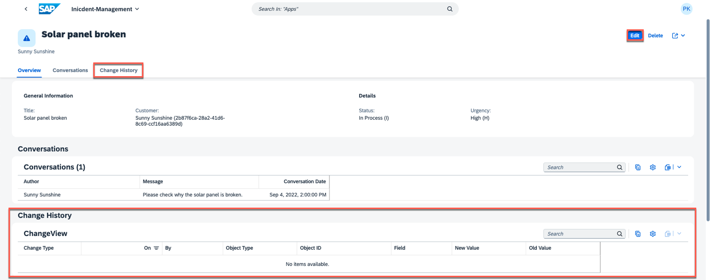
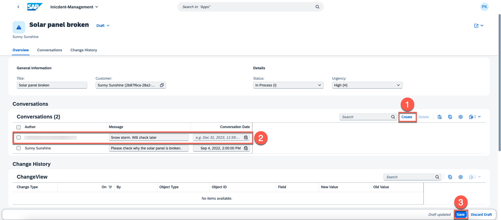
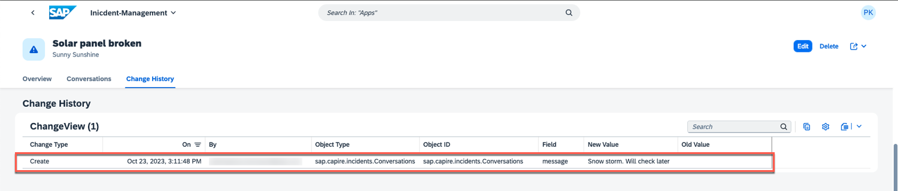
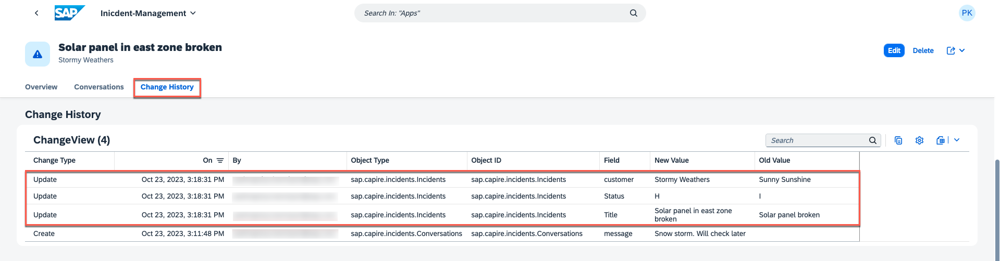

# Implement Change Tracking

In this tutorial, you will learn how to incorporate the change tracking feature into an existing Incident Management application.

## Set Up

Since you already have the Incident Mnagement application set up in your preferred IDE, let's include the following *npm* dependency.

1. Open **Terminal** -> **New Terminal**
2. Run the following command

```sh
npm add @cap-js/change-tracking
```

The package is a *cds-plugin*, which means it automatically handles many aspects, reducing the need for extensive configurations and annotations.

## Annotate the Models

Once you've included the *cds-plugin*, proceed to insert the `@changelog` annotations into the entities that you want to track changes for in the `services.cds` file.

Add the below annotations into `services.cds` file.

```cds
annotate ProcessorService.Incidents with @changelog: {
  keys: [ customer.name, createdAt ]
} {
  title    @changelog;
  status   @changelog;
  customer @changelog: [ customer.name ];
};

annotate ProcessorService.Incidents.conversation with @changelog: {
  keys: [ author, timestamp ]
} {
  message  @changelog;
}
```

In this context, the entities **Incidents** and **Conversations** have been annotated to monitor changes, specifying key fields and attributes to be tracked selectively. For instance, we have chosen to track modifications for the **title**, **status**, and **customer** attributes specifically, rather than monitoring all fields.

## Test Locally

1. Take care that your server is up and running. If not, start the server via:

   ```bash
   cds watch
   ```
2. Open the Incident Management application.



3. It displays a list of incidents. Open an incident and modify its details.



4. Upon opening an incident, you can see an additional tab called **Change History**. This tab displays details about modifications made to the fields marked for change tracking during the **implementation** phase. To add a new conversation, choose **Edit**.



5. Create a new conversation and choose **Save**.



6. Since the **message** field of the **conversation** entity has been marked for change tracking, it should be visible in **Change History**.



Both the old and updated values of the message field are shown, along with the type of the change, user ID and the timestamp of the modification.

7. We have configured changelog for **title**, **status** and **customer** and you can modify these fields to track the changes.



# Summary

The essential changes have been successfully implemented, and now it's time to deploy the application to utilize its capabilities.
