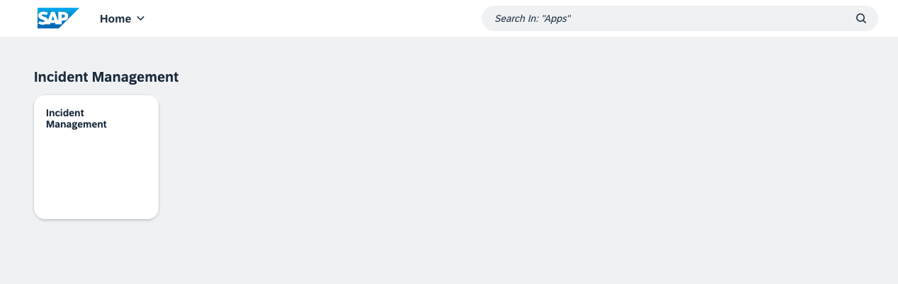
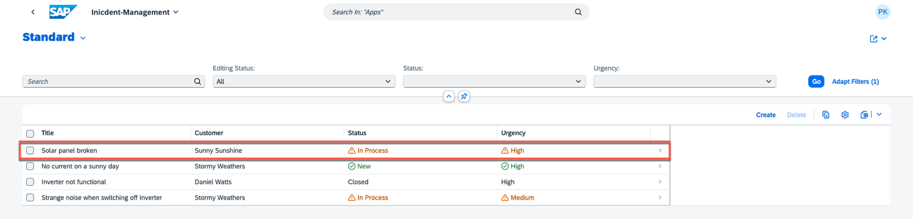
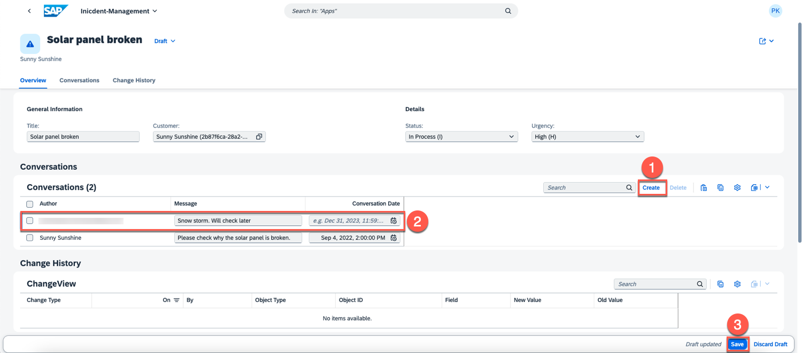
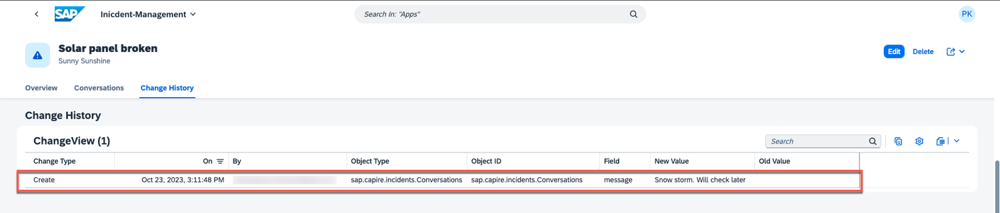
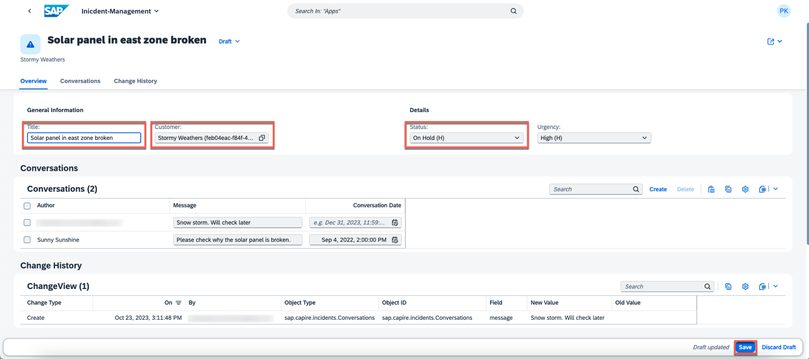
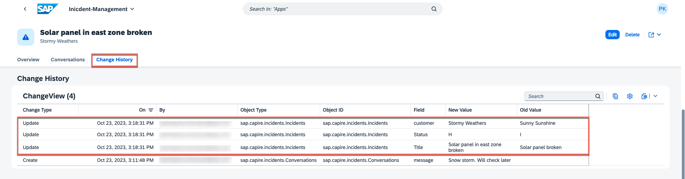

# View Change History

To test the functionality and flow of our change tracking feature, we will go through a simple scenario. In this section, we will make changes to a sample dataset, track those changes using the feature, and then explore the change history to observe how it captures and records modifications. 
Let's get started!

1. Open the Incident Management application from SAP Build Workzone.

2. It displays a list of incidents. Open an incident and modify its details.

3. Upon opening an incident, you can see an additional tab called **Change History**. This tab displays details about modifications made to the fields marked for change tracking during the **implementation** phase. To add a new conversation, choose **Edit**.

4. Create a new conversation and choose **Save**.

5. Since the **message** field of the **conversation** entity has been marked for change tracking, it should be visible in **Change History**. 

Both the old and updated values of the message field are shown, along with the type of the change, user ID and the timestamp of the modification.

6. In **Change History**, you have the option to modify the incident's title, status, or customer, and view the changes.

# Summary

Congratulations, you have successfully implemented and tested the change tracking feature in your application.
