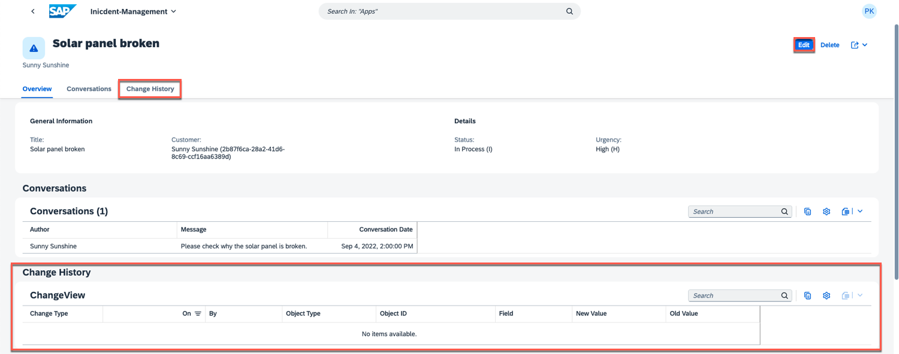

# View Change History

To test the functionality and flow of our change tracking feature, we will walk through a simple scenario. In this demonstration, we will make changes to a sample dataset, track those changes using the feature, and then explore the change history to observe how it captures and records modifications. Let's get started!

1. Open the Incident Management Application from SAP Build Workzone.

2. It displays a list of incidents. Lets open an incident and modify its details.

3. Upon opening an incident, you'll observe the presence of an additional facet called **Change History**. This facet is designed to display details about modifications made to the fields marked for change tracking during the **implementation** phase. To add a new conversation, simply select the **Edit** option.

4. Create a new conversation and Choose **Save**

5. Since the **message** field of the **conversation** entity has been marked for change tracking, it should be visible in the new facet **Change History**. 

Both the previous and updated values of the message field are presented, along with the type of the change, user ID and the timestamp of the modification.

6. Likewise, you have the option to modify the incident's title, status, or customer and view the changes in **Change History**.

# Summary

Congratulations, you have successfully implemented and tested the change tracking feature in your application.