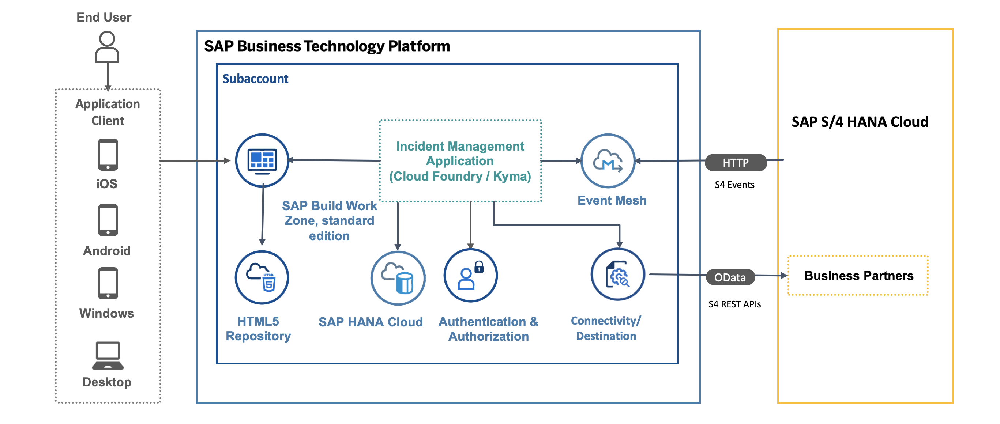

<!-- # Set Up Eventing Using the SAP Event Mesh Service

1. [Introduction](./prepare/introduction.md)
2. [Prerequisites](./prepare/prerequisites.md)
3. [Extend Incident Management Application with Eventing](./develop/extend-app.md)
4. [Running the application locally](./develop/run-app-locally.md)
5. [Option 1 - Deploy Incident Management Application to SAP BTP Cloud Foundry Runtime](./deploy/cf/deploy-to-cf.md)
6. [Option 2 - Deploy Incident Management Application to SAP BTP Kyma Runtime](./deploy/kyma/deploy-app-to-kyma.md)
7. [Test the end to end flow](./run-application/run-app-s4.md)

 -->
# Introduction
To create event-based extensions for SAP S/4HANA Cloud, you need to set up the messaging between the SAP S/4HANA Cloud system and [SAP Event Mesh](https://discovery-center.cloud.sap/serviceCatalog/event-mesh?region=all). To do so, you need to create and configure service instances for both SAP S/4HANA Cloud Extensibility service and SAP Event Mesh.

# Business Scenario

This tutorial shows you how to configure your CAP service to listen for upcoming events and deploy it to the SAP BTP. CAP offers native support for both emitting and receiving events, enabling CAP applications to effectively receive event notifications concerning changes in remote systems.

# Solution Diagram

# Set Up Eventing Using the SAP Event Mesh Service

|                      | SAP BTP, Cloud Foundry Runtime                  | SAP BTP, Kyma Runtime                           |
|----------------------|-------------------------------------------------|-------------------------------------------------|
| Deployment      |  [Deploy Incident Management Application to SAP BTP Cloud Foundry Runtime](eventing-cf.md)              | [Deploy Incident Management Application to SAP BTP Kyma Runtime](eventing-kyma.md)             |
