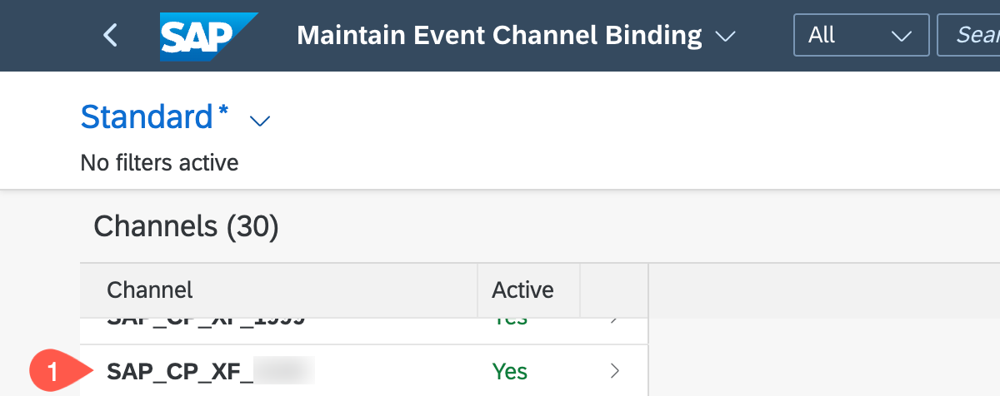

# Manage Your Application for Event Handling in SAP S/4HANA Cloud System

## Introduction

You need to enable the events that are to be sent from your SAP S/4HANA Cloud system to SAP Business Technology Platform. For this enablement step, go to your SAP S/4HANA system.

## Content

1. Log onto your SAP S/4HANA Cloud system

2. Search for **Enterprise Event Enablement - Configure Channel Binding** and choose the name to open the applicaton

 

3. Choose **Go** to refresh the content

 

4. In the Channel list select your event

> Hint: Look for your emClientId that you had provided in an earlier step. 

 

5. Find entry **Outbound Topics** and choose **Create**

 

6. Choose the topic selector to open a popup to select topics

7. Enter \*BusinessPartner\* into the topic filter

8. Choose **Go**

9. Select **sap/s4/beh/businesspartner/v1/BusinessPartner/***

 

10. Choose **Create**.

 