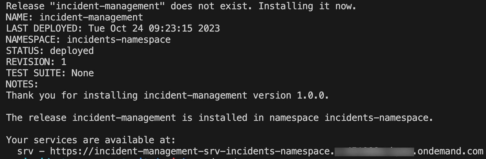

# Deploy and Run the Application on Kyma with SAP S/4HANA Cloud Backend

## Usage Scenario

Deploy the project to SAP BTP Kyma runtime using Helm configurations. See [Helm](https://helm.sh/).

## Prepare for Production

1. Navigate to `package.json` file in the root folder of your application.

2. Add `"@sap/xb-msg-amqp-v100": "^0"` to the **dependencies** section of `package.json` file.

3. Execute the following command to install the dependencies:

    ```sh
    npm i
    ```

4. Create a new file called `event-mesh.json` at the root folder of the project and copy the content below.

     - As **EM_NAME**, enter a speaking name for your client (e.g. inci).
       > The value of the EM_NAME property should have maximum length of 4 characters.

        ```json
        {
        "emname": "<EM_NAME>",
        "version": "1.1.0",
        "namespace": "default/incidents/1",
        "options": {
            "management": true,
            "messagingrest": true,
            "messaging": true
        },
        "rules": {
            "topicRules": {
            "publishFilter": [
                "${namespace}/*"
            ],
            "subscribeFilter": [
                "*"
            ]
            },
            "queueRules": {
            "publishFilter": [
                "${namespace}/*"
            ],
            "subscribeFilter": [
                "${namespace}/*"
            ]
            }
        },
        "authorities": [
            "$ACCEPT_GRANTED_AUTHORITIES"
        ]
        }
        ```

## Configure the Build

To transform source code into container images, CAP uses [Cloud Native Buildpacks](https://buildpacks.io/) configured via a `containerize.yaml` file.

For more information, see [About Cloud Native Buildpacks](https://cap.cloud.sap/docs/guides/deployment/deploy-to-kyma?impl-variant=node#about-cloud-native-buildpacks).

Log in to your container registry:

```sh
docker login docker.io -u <your-user>
```

**Before You Begin**

If you're using any device with a non-x86 processor (e.g. MacBook M1/M2), you need to instruct Docker to use x86 images by setting the **DOCKER_DEFAULT_PLATFORM** environment variable: *export DOCKER_DEFAULT_PLATFORM=linux/amd64*.
See [Environment variables](https://docs.docker.com/engine/reference/commandline/cli/#environment-variables).

1. Do the productive build for your application, which writes into the `gen` folder:

    ```sh
    cds build --production
    ```

2. Configure `containerize.yaml` at the root of your project:

    > **Note:** Set `BP_NODE_VERSION: "20"` to pin Node.js to version 20 LTS. Without it, the Paketo buildpack selects Node.js 26, which requires `libatomic.so.1` — a library not present in the `paketobuildpacks/run-jammy-base` runtime image, causing the container to crash on startup.

    ```yaml
    _schema-version: '1.0'
    repository: <your-dockerhub-username>
    tag: <image-version>
    modules:
      - name: incident-management-srv
        build-parameters:
          buildpack:
            type: nodejs
            builder: builder-jammy-base
            path: gen/srv
            env:
              BP_NODE_VERSION: "20"
      - name: incident-management-hana-deployer
        build-parameters:
          buildpack:
            type: nodejs
            builder: builder-jammy-base
            path: gen/db
            env:
              BP_NODE_VERSION: "20"
      - name: incident-management-html5-deployer
        build-parameters:
          buildpack:
            type: nodejs
            builder: builder-jammy-base
            path: ui-resources
    ```

**Info**
The `cds up` command builds images using the [Paketo Jammy Base Builder](https://github.com/paketo-buildpacks/builder-jammy-base), which contains the build result from the configured `path` and the required npm packages.

## Configuration to Use SAP S/4HANA Cloud System

> This section is relevant only if you are going to use SAP S/4HANA Cloud system as your remote service.

Create a new file called `s4cems.json` at the root folder of the project and copy the content below.

 - As **emClientId**, enter a speaking name for your client (e.g. INCI).
 - As **systemName**, enter the name of your registered SAP S/4HANA Cloud system.

    ```json
        {
        "emClientId": "<EMID>",
        "systemName": "<SYSTEM_NAME>"
        }
    ```

1. Navigate to `chart/Chart.yaml` file from the project root folder.

2. Add the following code snippet to `Chart.yaml` to create an SAP S/4HANA Cloud extensibility service instance with messaging plan:

    ```yaml
    - name: service-instance
        alias: s4-hana-cloud-messaging
        version: ">0.0.0"
    ```

3. Add the below configurations for `s4-hana-cloud` to `values.yaml`:

    ```yaml
    s4-hana-cloud-messaging:
        serviceOfferingName: s4-hana-cloud
        servicePlanName: messaging
    ```

## Eventing Configuration

1. Add a configuration to create an SAP Event Mesh service instance in `values.yaml`:

  ```yaml
  event-mesh:
    serviceOfferingName: enterprise-messaging
    servicePlanName: default
  ```

2. Find `srv/bindings` in `values.yaml` and add the SAP Event Mesh instance:

  ```yaml
  srv:
    bindings:
      event-mesh:
        serviceInstanceName: event-mesh
  ```

3. Add the following configuration to `chart/Chart.yaml` for SAP Event Mesh instance creation:

  ```yaml
  - name: service-instance
    alias: event-mesh
    version: ">0.0.0"
  ```

For more information about Helm and CAP, see [About CAP Helm chart](https://cap.cloud.sap/docs/guides/deployment/deploy-to-kyma?impl-variant=node#about-cap-helm).

## Deploy Helm Chart

Once all configurations are done, configure access to your container images and deploy.

### Configure Access to Your Container Images

Add your container image settings to your `chart/values.yaml`:

> **Note:** The `global.image.registry` field must be a valid registry domain (e.g. `docker.io`). A bare Docker Hub username is not valid and will cause `cds up` to fail with a registry validation error. The Helm template assembles the full image reference as `{registry}/{repository}:{tag}`.

```yaml
global:
  domain: <your-kyma-cluster-domain>
  imagePullSecret:
    name: <image-pull-secret-name>
  imagePullPolicy: Always
  image:
    registry: docker.io
    tag: <image-version>
srv:
  image:
    repository: <your-dockerhub-username>/incident-management-srv
hana-deployer:
  image:
    repository: <your-dockerhub-username>/incident-management-hana-deployer
html5-apps-deployer:
  image:
    repository: <your-dockerhub-username>/incident-management-html5-deployer
```

## Deploy CAP Helm Chart

1. Log in to your Kyma cluster.

2. Execute one of the commands below based on your integration scenario:

  a. For deploying the Incident Management Application together with SAP S/4HANA Cloud:

    ```sh
    cds up --to k8s --namespace incidents-namespace
    ```

    > After deploying, apply S/4HANA Cloud and Event Mesh bindings:
    >
    > ```sh
    > helm upgrade incident-management --namespace incidents-namespace ./gen/chart \
    >   --set-file xsuaa.jsonParameters=xs-security.json \
    >   --set-file s4-hana-cloud.jsonParameters=bupa.json \
    >   --set-file s4-hana-cloud-messaging.jsonParameters=s4cems.json \
    >   --set-file event-mesh.jsonParameters=event-mesh.json
    > ```

  b. For deploying the Incident Management Application together with Mock Server:

    ```sh
    cds up --to k8s --namespace incidents-namespace
    ```

    > After deploying, apply Event Mesh binding:
    >
    > ```sh
    > helm upgrade incident-management --namespace incidents-namespace ./gen/chart \
    >   --set-file xsuaa.jsonParameters=xs-security.json \
    >   --set-file event-mesh.jsonParameters=event-mesh.json
    > ```

This installs the Helm chart from the chart folder with the release name ***incident-management*** in the namespace ***incidents-namespace***. The namespace is created automatically if it does not exist.

> **Tip:** With `cds up --to k8s`, you can deploy a new application as well as update an existing deployment.

The outcome of installation will look something like this:



To be able to access the application via the URL, you have to [Assign Application Roles](https://developers.sap.com/tutorials/user-role-assignment.html).

As a next step, to access the application in launchpad, proceed to [Integrate with SAP Build Workzone](https://developers.sap.com/tutorials/integrate-with-work-zone.html).
