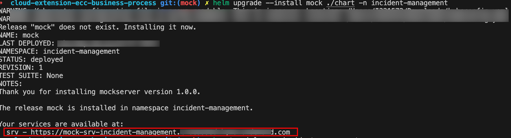

# Install Mock Server in SAP BTP Kyma Runtime

## Pre requisite
The Remote Service Integration tutorial was executed and mock server was deployed on Kyma and destination was created following steps [here](../../../remote-service/install-mock-server/install-mock-server-kyma.md)


## Re-Deploy the Mock Server Application

1. Navigate to the folder cloud-extension-ecc-business-process which contains the mock server.

2. We will be using an existing SAP Event Mesh service instance which got created while deploying the incident-management application to Kyma Runtime. So, as of now lets do the following to bind mock server to SAP Event Mesh service

   In Values.yaml file:
   
   - Modify `srv/bindings` to use the event mesh service instance secret. This secret will be the same as that of the deployed CAP application
   
        ```yaml
        messaging:
            fromSecret: incident-management-srv-event-mesh
        ```

   - Remove event-mesh service instance creation from `values.yaml`

        ```yaml
        event-mesh:
            serviceOfferingName: enterprise-messaging
            servicePlanName: default
        ```

    - From `Chart.yaml` file remove
        
        ```yaml
        - name: service-instance
            alias: event-mesh
            version: ">0.0.0"

3. Now, lets configure the created Helm Charts.

    - Specify the domain of your cluster in the `chart/values.yaml` file so that the URL of your CAP service can be generated:

    ```yaml
    ...
    domain: <cluster domain>
    ```

    You can use the following command to get the domain name for your Kyma cluster:

    ```yaml
    kubectl get gateway -n kyma-system kyma-gateway \
        -o jsonpath='{.spec.servers[0].hosts[0]}'
    ```

    - Add your container image settings `<your-container-registry>` and `tag` to your `chart/values.yaml`

4. Do the productive build for your application from the project's root directory, which writes into the `gen` folder using the below command:

    ```sh
    cds build --production
    ```

5. Deploy mock server using

    ```yaml
    helm upgrade --install mock ./gen/chart -n <namespace>
    ```   

    

6.  As shown in the above screenshot, api url for the installed mock server can be taken from the output of mock server deployment.

