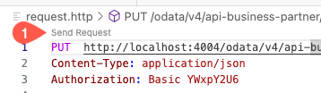

# Run the Application Locally

## Introduction

Before you deploy the application on SAP BTP, you can run the CAP application locally to test and ensure that your code changes are working.

## Procedure

1. To open a new terminal in your development environment, choose **Terminal** &rarr; **New Terminal**.

2. To start the CAP server, run the `cds watch` command.

3. Make sure you have installed the extension REST Client. Go to **Extensions** and search for **REST Client**. If this extension is not installed yet, choose **Install**.

4. Navigate back to the root folder of your application and create a new file called **request.http**.

5. Copy the following code snippet to the **request.http** file:

```
PATCH  http://localhost:4004/odata/v4/api-business-partner/A_BusinessPartner('1004100') HTTP/1.1
Content-Type: application/json
Authorization: Basic YWxpY2U6

{
     "to_BusinessPartnerAddress": [{
        "AddressID": "456",
        "to_EmailAddress":[{
            "AddressID": "456",
            "Person": "johnson",
            "OrdinalNumber": "334",
            "EmailAddress": "sunny@test.com"
        }]
    }]
}
```
>Hint: The file is auto saved in SAP Business Application Studio.

4. Choose **Send Request** at the top of the file. Check if you see the following message in the terminal:

    

```sh
>> BusinessPartner.Changed
<< received BusinessPartner.Changed { BusinessPartner: '1004100' }
```

> If API_BUSINESS_PARTNER doesn't show up, remove the **.cds-services.json** file. You can find it in the user's root folder (for example, /home/user/.cds-services.json)
