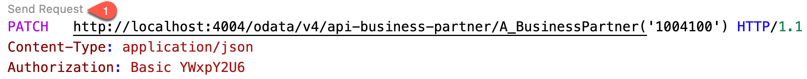

# Run application locally

## Introduction

Before you deploy the application you can do a test run locally to ensure your code is working

  
## Content


1. Open a new terminal in your development environment, by navigating **Terminal&rarr; New Terminal**

2. Run command `cds watch` to start the CAP server

3. Make sure you have installed the extension REST Client. Go to **Extensions** and search for 'REST Client'. In case it is not installed yet, choose **Install**

4. Navigate back to the root folder of you applicaton and create a new file called `request.http` .

5. Copy the code snippet to the file:

```
PATCH  http://localhost:4004/odata/v4/api-business-partner/A_BusinessPartner('1004100') HTTP/1.1
Content-Type: application/json
Authorization: Basic YWxpY2U6

{
     "to_BusinessPartnerAddress": [{
        "AddressID": "456",
        "to_EmailAddress":[{
            "AddressID": "456",
            "Person": "johnson",
            "OrdinalNumber": "334",
            "EmailAddress": "sunny@test.com"
        }]
    }]
}
```
>Hint: The file is auto saved in SAP Business Application Studio

4. Click on **Send request** on the top of the file. Confirm that you see the below message in the terminal

    

```sh
>> BusinessPartner.Changed
<< received BusinessPartner.Changed { BusinessPartner: '1004100' }
```

> If the API_BUSINESS_PARTNER doesn't show up, remove the .cds-services.json file - you find it in the user root folder (e.g.: /home/user/.cds-services.json)