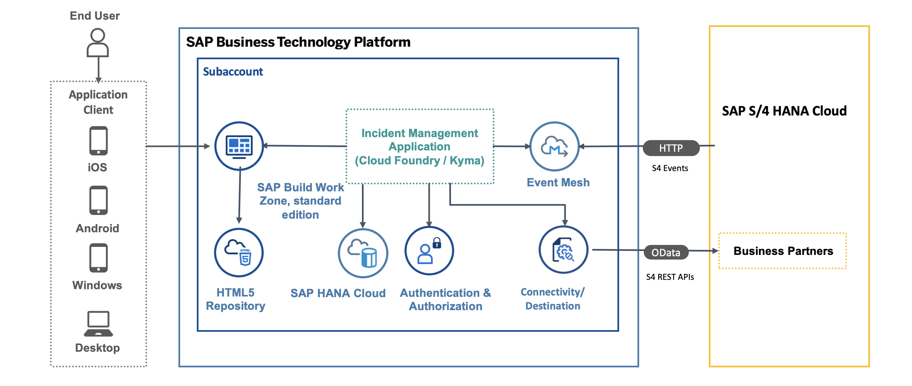

## Business Scenario

This tutorial shows you how to configure your CAP service to listen for upcoming events and deploy it to the SAP BTP cockpit. CAP offers native support for both emitting and receiving events, enabling CAP applications to effectively receive event notifications concerning changes in remote systems.

## Solution Diagram

