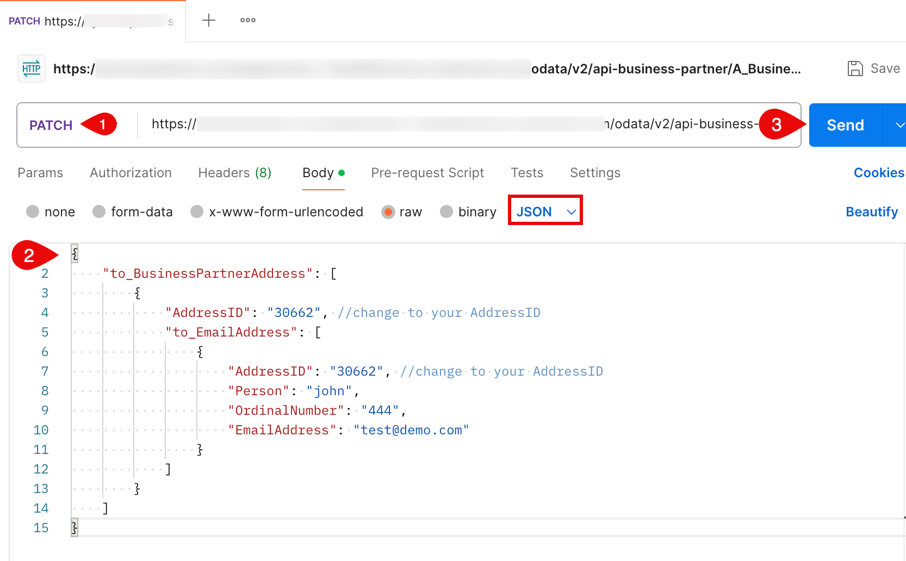

# Run the application

## Introduction

The application development and deployment is completed and now it can be tested. The mock S/4HANA will be used to simulate sending of events which will be processed by the eventing implementation in the Incident Management application.

  
## Content

1. Access your Incident Management application.

2. In the new window, choose **Create** to create a new incident in your application

3. Enter the values for a new incident:
    - Title: <enter title name>
    - Customer: <enter your BusinessPartner>
    - Urgency: Low(L)
    - Status: New(N)

    Choose **Save** to finish

 

4. Check the email address of your incident

 

5. Test your applicaton by executing below request in Postman. Choose **Patch** and copy URL to the field:

```
<The application route of the mock server\>/A_BusinessPartner('<the-business-partner-id-of-your-created-incident\>') 
```

6. Copy below code to body

```json
{
    "to_BusinessPartnerAddress": [
        {
            "AddressID": "30662", //change to your AddressID
            "to_EmailAddress": [
                {
                    "AddressID": "30662", //change to your AddressID
                    "Person": "john",
                    "OrdinalNumber": "444",
                    "EmailAddress": "test@demo.com"
                }
            ]
        }
    ]
}
```

7. Choose **Send**

 

8. Go back to your Incident Management Application and refresh the page. Find the updated e-mail address displayed in the incident.

 