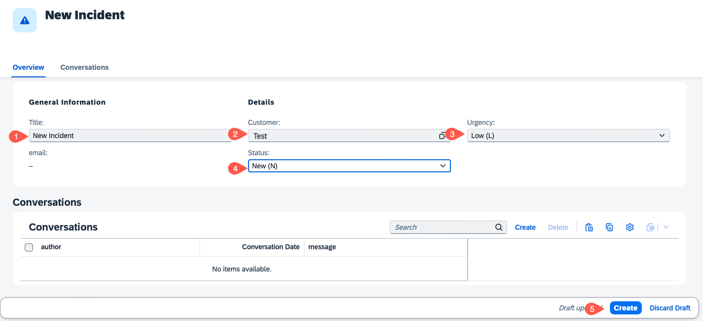
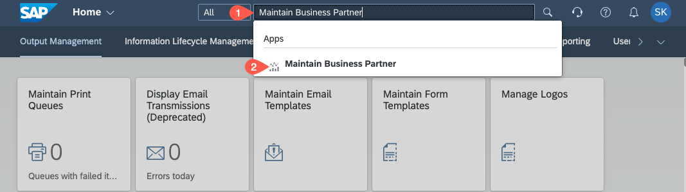
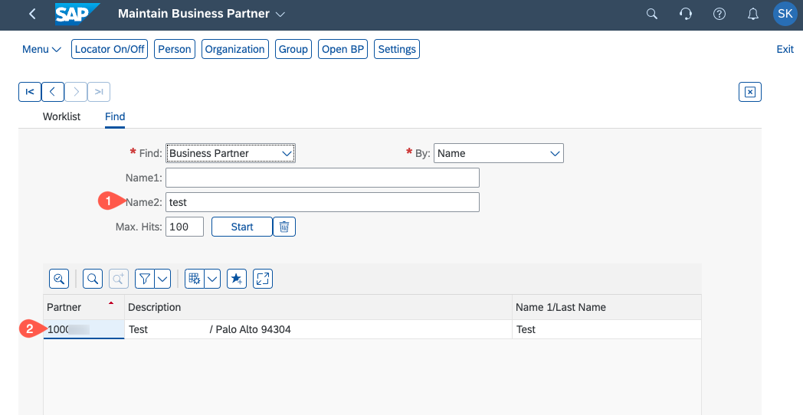
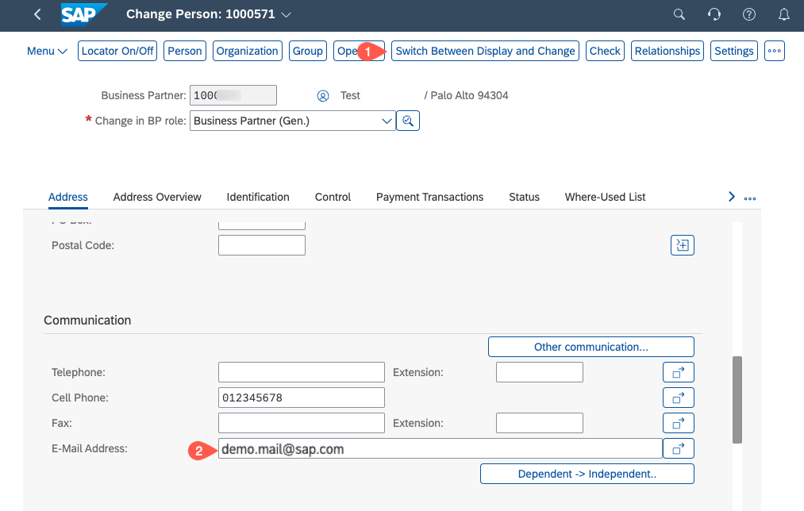
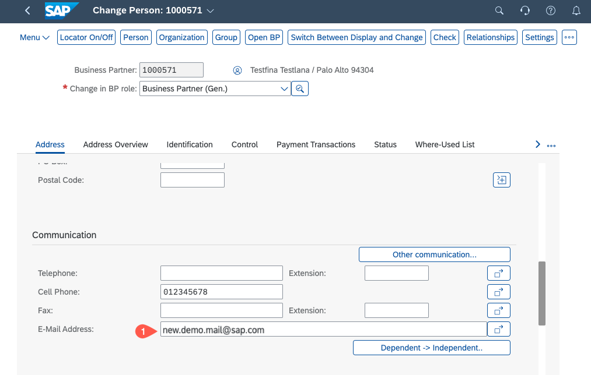
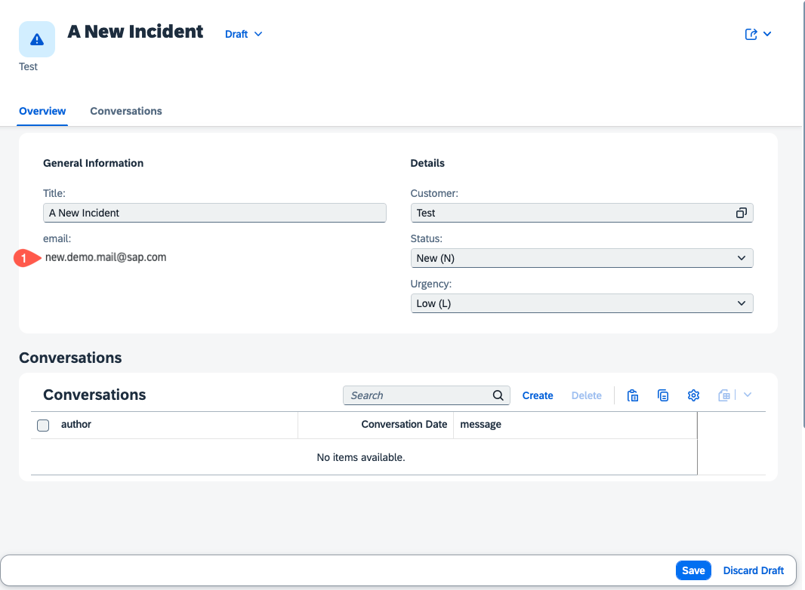

# Run the application

## Introduction

The application development and deployment is completed and now it can be tested. SAP S/4HANA Cloud system will be used to send events which will be processed by the eventing implementation in the Incident Management application.
  
## Content

1. Access your Incident Management application.

3. In the new window, choose **Create** to create a new incident in your application

4. Enter the values for a new incident:
    - Title: <enter title name>
    - Customer: <enter your BusinessPartner>
    - Urgency: Low(L)
    - Status: New(N)

    Choose **Create** to finish

 

5. Now, we want to change the e-mail in the SAP S/4HANA Cloud back end and see the change reflected in incident application. Open your SAP S/4HANA Cloud system and search for **Maintain Business Partner**. Choose the app to open.

 

6. Search for the Business Partner you have entered in Incident Management Application. Choose the name to open

 

6. Choose **Switch Between Display and Change** to edit the Business Partner. In the communication section, find the e-mail address.

 

7. Change the **e-mail address** and save Business Partner

 

8. Go back to your Incident Management Application and refresh the page. Find the updated e-mail address displayed in the incident.

 