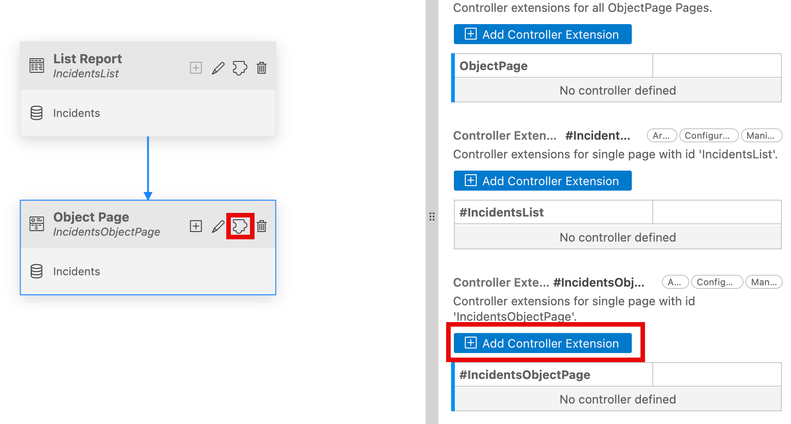
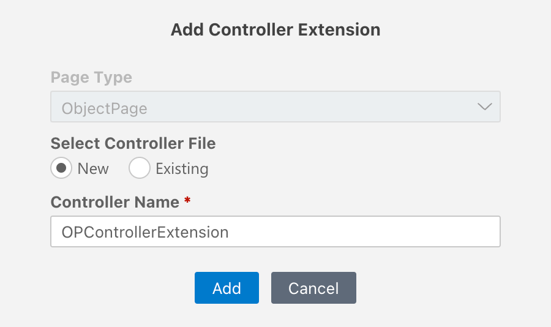
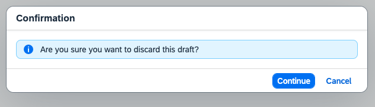
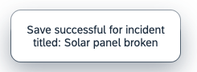

# Add Controller Extension

In this section, we add a controller extension to showcase how we can extend the Fiori Elements Object Page controller and override the edit flow using the **Flexible Programming Model**. In addition, the same controller extension file can be used to include the event methods for other controls in the page.

## Add Extension Controller File

1. In the **Application Info - incidents** tab, click the **Open Page Map** tile. 

    <!-- border; size:540px --> 
    

    > In case the **Application Info - incidents** tab is closed: 
    >
    >1. Invoke the Command Palette - **View** &rarr; **Command Palette** or <kbd>Command</kbd> + <kbd>Shift</kbd> + <kbd>P</kbd> for macOS / <kbd>Ctrl</kbd> + <kbd>Shift</kbd> + <kbd>P</kbd> for Windows. 
    >2. Choose **Fiori: Open Application Info**.

2. In the **Incident Object Page** tile, click the icon next to the **Pencil** icon as mentioned in the below image and scroll to the end to find the `Controller Extension: #IncidentsObjectPage` and click on the **Add Controller Extension** button in the `Controller Extensions: Object Page` section.

    

3. In the popup, enter the following details

    - **Select Controller File**: `New`
    - **Controller Name**: `OPControllerExtension`

    

4. Click on **Add**. This will generate the controller extension file `OPControllerExtension.controller.js`.

## Override Edit Flow

In this section you will use the controller extension to extend lifecycle hooks and override public methods of Edit Flow in the base controller.

1. Open the `OPControllerExtension.controller.js` file located in `app/incidents/webapp/ext/controller` and replace with the following content into it.

```js

sap.ui.define([
	'sap/ui/core/mvc/ControllerExtension', 
	"sap/m/MessageToast",
	"sap/ui/model/json/JSONModel",
], 
function (ControllerExtension, MessageToast, JSONModel) {
	'use strict';

	return ControllerExtension.extend('ns.incidents.ext.controller.OPControllerExtension', {
		// this section allows to extend lifecycle hooks or hooks provided by Fiori elements
		override: {
			/**
             * Called when a controller is instantiated and its View controls (if available) are already created.
             * Can be used to modify the View before it is displayed, to bind event handlers and do other one-time initialization.
             * @memberOf ns.incidents.ext.controller.OPControllerExtension
             */
			onInit: function () {

				const data = {
					text: ""
				};
				const dialogModel = new JSONModel(data);
				this.getView().setModel(dialogModel, "dialog");
					
			},

			editFlow: {
				onBeforeEdit: function (mParameters) {
					const priority = mParameters?.context.getProperty("urgency/descr")
					return this.openDialog("You're about to edit the incident with Priority: <strong>" + priority + "</strong>")

				},

				onAfterSave: function (mParameters) {
					//
					mParameters.context.refresh();
					//asynchronous access to complete data the context points to
					mParameters.context.requestObject().then((contextData) => {
						return MessageToast.show(
							`Save successful for incident titled: ${contextData.title}`
						);
					});
				},

				onBeforeDiscard: function () {
					return this.openDialog("Are you sure you want to discard this draft?");
				}
			},
			
		},
		openDialog: function (text) {
			return new Promise(
				function (resolve, reject) {
					let dialogModel = this.getView().getModel("dialog"),
						data = dialogModel.getData();
					data.text = text;
					dialogModel.setData(data);
					//use building blocks in an XML fragment using the loadFragment method from the SAP Fiori elements ExtensionAPI
					this.base
						.getExtensionAPI()
						.loadFragment({
							name: "ns.incidents.ext.fragment.Dialog",
							controller: this
						})
						.then(function (approveDialog) {
							//Dialog Continue button
							approveDialog.getBeginButton().attachPress(function () {
								approveDialog.close();
								resolve(null);
							});
							//Dialog Cancel button
							approveDialog.getEndButton().attachPress(function () {
								approveDialog.close().destroy();
								reject(null);
							});
							//consider dialog closing with Escape
							approveDialog.attachAfterClose(function () {
								approveDialog.destroy();
								reject(null);
							});
							approveDialog.open();
						});
				}.bind(this)
			);
		},
		closeDialog: function (closeBtn) {
			closeBtn.getSource().getParent().close();
		}
	});
});

```

:::details

`Edit Flow` - Allows to override the lifecycle hooks of the Fiori Elements Object page base controller.

`onBeforeEdit` - We extend the before Edit hook to show a confirmation dialog before editing the incident details.

`onAfterSave` - We extend the after Save hook to show the title of the incident which is edit and saved.

`onBeforeDiscard` - We extend the before Discard hook to show a confirmation dialog.

`Open Dialog` - To open the confirmation Dialog.

`Close Dialog` - To close the dialog.

:::

2. Create a new file `Dialog.fragment.xml` in the location `app/incidents/webapp/ext/fragment` and add the following content.

```xml

<core:FragmentDefinition
	xmlns="sap.m"
	xmlns:macros="sap.fe.macros"
	xmlns:l="sap.ui.layout"
	xmlns:f="sap.ui.layout.form"
	xmlns:core="sap.ui.core"
>
	<Dialog title="Confirmation" id="confirmationDialog" contentWidth="38rem">
		<content>
			<MessageStrip
				id="message"
				text="{dialog>/text}"
				type="Information"
				showIcon="true"
                enableFormattedText="true"
				class="sapUiSmallMarginTop sapUiSmallMarginBottom sapUiSmallMarginBeginEnd"
			/>
			
		</content>
		<beginButton>
			<Button id="continue" text="Continue" press="onConfirm" type="Emphasized" />
		</beginButton>
		<endButton>
			<Button id="cancel" press="onCancel" text="Cancel" />
		</endButton>
	</Dialog>
</core:FragmentDefinition>


```

:::details

The above fragment includes the confirmation dialog with the message strip and the buttons which is used for the edit flow.
:::

## Check the result

1. Open the object page of the incident and click on the **Edit** button.

    

Use the **Continue** or **Cancel** button to see the behavior.

2. Once you **Continue**, click on the **Discard Draft** button to notice the **Confirmation**.

    

Use the **Continue** or **Cancel** button to see the behavior.

3. Similarly, click on the **Save** button in the Edit mode and notice the **Message Toast** with the Incident title.

    