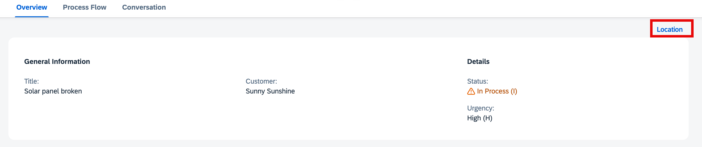
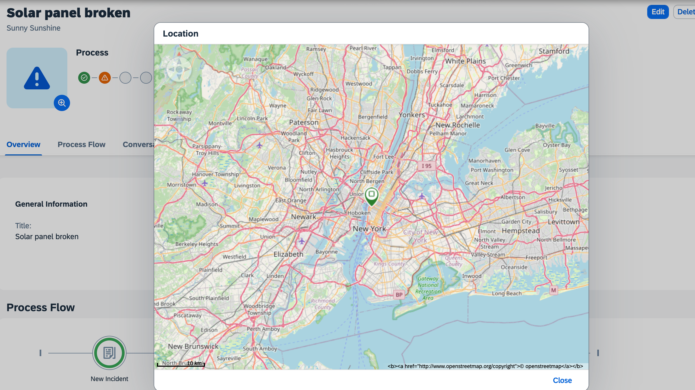

# Add Custom Action

In this section, you will edit the Object Page with the SAP Fiori Tools page editor and add a custom action **Location** using the **Flexible Programming Model**. This custom action is to showcase the  location of the customer in a dialog using the [GeoMap](https://sapui5.hana.ondemand.com/#/api/sap.ui.vbm.GeoMap) control.

Before you start with the next steps, make sure the steps in [Add Controller Extension](./controller-extension.md) are completed.

## Edit the Object Page

1. In the **Application Info - incidents** tab, click the **Open Page Map** tile. 

    <!-- border; size:540px --> 
    

    > In case the **Application Info - incidents** tab is closed: 
    >
    >1. Invoke the Command Palette - **View** &rarr; **Command Palette** or <kbd>Command</kbd> + <kbd>Shift</kbd> + <kbd>P</kbd> for macOS / <kbd>Ctrl</kbd> + <kbd>Shift</kbd> + <kbd>P</kbd> for Windows. 
    >2. Choose **Fiori: Open Application Info**.

2. In the **IncidentObjectPage** tile, click the **Pencil** icon next to the title.

    <!-- border; size:540px --> 
    

3. In the **Sections** &rarr; **Overview** &rarr; **Subsections** &rarr; **General Information** &rarr; **Form** &rarr; **Actions**, click the **+** icon and choose **Add Custom Action**.

4. In the popup, enter the following details

    | Key  | Value  |
    |---|---|
    | **Action ID**  | `Location`  |
    | **Button Text**  | `Location`. Click the **Globe** icon to generate a translatable text key.  |
    | **Select Action Handler File**  | `Use Existing File`  |
    | **Handler File**  | `OPControllerExtension.controller (ns.incidents.ext.controller.OPControllerExtension.controller, JS)`  |
    | **Select Action Handler Method** | `Create New Function` |
    | **Handler Method** | `viewLocation` |

5. Choose **Add**. 

This will generate the new method `viewLocation` in the file `OPControllerExtension.controller.js` location in `app/incidents/webapp/ext/controller`.

6. Open the `OPControllerExtension.controller.js` file located in `app/incidents/webapp/ext/controller` and add the following code in the `viewLocation` method.

```js
    viewLocation: function() {

			this.base.getExtensionAPI()
				.loadFragment({
					name: "ns.incidents.ext.fragment.GeoMap",
					controller: this
				})
				.then(function (dialog) {
					dialog.attachEventOnce("afterClose", function () {
						dialog.destroy();
					});

					dialog.open();
				});
		}
```
:::details
The above code will open the GeoMap fragment in a dialog.
:::

7. Create a new file `GeoMap.fragment.xml` in the location `app/incidents/webapp/ext/fragment` and add the following code into it.

```xml
<core:FragmentDefinition
    xmlns:core="sap.ui.core"
    xmlns="sap.m"
    xmlns:macros="sap.fe.macros"
	xmlns:vbm="sap.ui.vbm"
>
<Dialog id="_IDGenDialog" title="Location">
    <VBox id="_IDGenVBox">
        <vbm:GeoMap
            id="Map"
            mapConfiguration='{
			"MapProvider": [{
					"name": "Openstreetmap",
					"copyright": "&lt;b&gt;&lt;a href=\"http://www.openstreetmap.org/copyright\"&gt;© openstreetmap&lt;/a&gt;&lt;/b&gt;",
					"Source": [{
						"id": "s1",
						"url": "http://a.tile.openstreetmap.org/{LOD}/{X}/{Y}.png"
					}, {
						"id": "s2",
						"url": "http://b.tile.openstreetmap.org/{LOD}/{X}/{Y}.png"
					}, {
						"id": "s3",
						"url": "http://c.tile.openstreetmap.org/{LOD}/{X}/{Y}.png"
				}]
			}],
			"MapLayerStacks": [{
				"name": "DEFAULT",
				"MapLayer": {
					"name": "layer1",
					"refMapProvider": "Openstreetmap",
					"opacity": "1",
					"colBkgnd": "RGB(255,255,255)"
				}
			}]
		}'
            refMapLayerStack="DEFAULT"
            initialZoom="10"
            initialPosition="{customer/pos}"
        >
            <vbm:Spots id="_IDGenSpots">
                <vbm:Spot id="_IDGenSpot"
                    position="{customer/pos}"
                    tooltip="{customer/name}"
                    type="Success"
                />
            </vbm:Spots>
        </vbm:GeoMap>
    </VBox>
	<endButton>
		<Button id="_IDGenButton" text="Close" press=".closeDialog" />
	</endButton>
</Dialog>
</core:FragmentDefinition>

```

:::details
The above is a fragment which contains the GeoMap and the marker location based on the customer location.
:::

## Add Dependencies

In addition to the main SAPUI5 library `sap.m`, you will use other control libraries like `sap.ui.vbm` in your application. The central point for configuring your SAPUI5 application is the `manifest.json` file, which is located at `incidents/webapp/manifest.json`

1. Open `manifest.json` file.

2. Go to the section `sap.ui5` and add the following libraries in `dependencies/libs` section

```json
    "dependencies": {
        ... ,
        "libs": {
          ... ,
          "sap.ui.vbm": {}
        }
      },
```


## Add Geo Location Details

In this section, you will extend the Incident Management CAP service to include the Geo location details of the customer.

1. Create a new file `extend.cds` in the location `srv` and add the following code into it.

```cds
using { sap.capire.incidents as my } from '../db/schema';

extend my.Customers {
    pos: String;
}

```

2. Open the `sap.capire.incidents-Customers.csv` file located in `db/data` and replace the code with the following one:

```csv
ID,firstName,lastName,email,phone,pos
1004155,Daniel,Watts,daniel.watts@demo.com,+44-555-123,"8.641622;49.293696;0"
1004161,Stormy,Weathers,stormy.weathers@demo.com,,"77.714421;12.977788;0"
1004100,Sunny,Sunshine,sunny.sunshine@demo.com,+01-555-789,"-74.000380;40.753616;0"

```

## Check the Result

1. In SAP Business Application Studio, you might need to close the session of the **SAP Fiori tools: Application Modeler** in the terminal, if there is an open one.
2. Go to the **Application Info - incidents** tab, and click the **Preview Application** tile.
3. The application opens in a separate tab of the browser.
4. In the Incident Management application, open an incident and choose **Location**.

    

5. This will open the Dialog with the GeoMap location of the customer.

    
