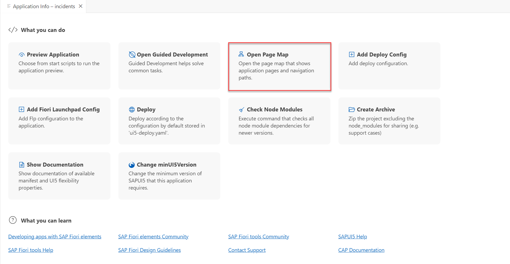
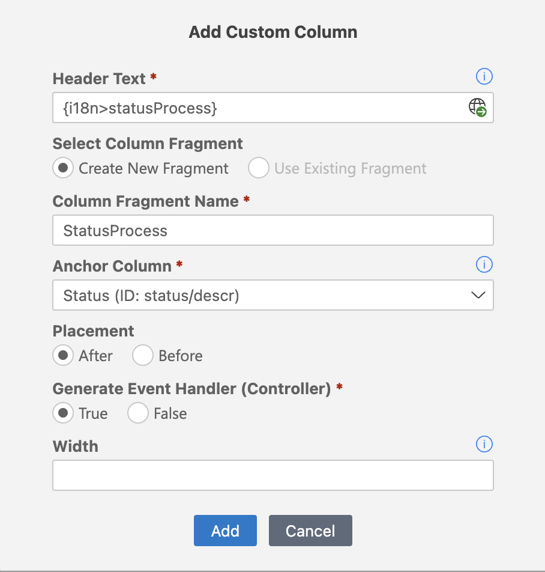

# Extension Points: Add Custom Column

In this section, you will modify the List Report page with the SAP Fiori Tools page editor and add a custom column using the **Flexible Programming Model**. This custom column is used to showcase the process flow of the incident. The processor can use the  [MicroProcessFlow](https://sapui5.hana.ondemand.com/#/api/sap.suite.ui.commons.MicroProcessFlow) control to track the progress of an incident.

## Edit List Report

1. In the **Application Info - incidents** tab, click the **Open Page Map** tile. 

    <!-- border; size:540px --> 
    

    > In case the **Application Info - incidents** tab is closed: 
    >
    >1. Invoke the Command Palette - **View** &rarr; **Command Palette** or <kbd>Command</kbd> + <kbd>Shift</kbd> + <kbd>P</kbd> for macOS / <kbd>Ctrl</kbd> + <kbd>Shift</kbd> + <kbd>P</kbd> for Windows. 
    >2. Choose **Fiori: Open Application Info**.

2. In the **List Report** tile, click the **Pencil** icon next to the title. The page editor is opened.

    <!-- border; size:540px --> 
     

3.  In the **Table** &rarr; **Columns** &rarr;. Click on the **+** icon and choose **Add Custom Column**.

    <!-- border; size:540px --> 
    

4. In the popup, enter the following details.

    - **Header Text**: `Progress` (Click the **Globe** icon to generate a translatable text key).
    - **Column Fragment Name**:  `StatusProcess`
    - **Anchor Column**: `Status (ID: status/descr)`
    - **Placement**: `After`
    
    

5. Click on the **Add** button. This will generate the fragment and handler file.

6. Open the `StatusProcess.fragment.xml` file located in `app/incidents/webapp/ext/fragment` and enter the following code.

```xml
<core:FragmentDefinition xmlns:core="sap.ui.core" xmlns:m="sap.m" xmlns="sap.suite.ui.commons">
	<MicroProcessFlow id="_IDGenMicroProcessFlow1" renderType="NoWrap" core:require="{ handler: 'ns/incidents/ext/fragment/StatusProcess'}">
        <content>
            <MicroProcessFlowItem id="_IDGenMicroProcessFlowItem1" state="{ parts: [
                {path: 'status_code'}, {value: '1'}
                ], formatter: 'handler.formatStatus' }"/>
            <MicroProcessFlowItem id="_IDGenMicroProcessFlowItem2" state="{ parts: [
                {path: 'status_code'}, {value: '2'}
                ], formatter: 'handler.formatStatus' }"/>
            <MicroProcessFlowItem id="_IDGenMicroProcessFlowItem3" state="{ parts: [
                {path: 'status_code'}, {value: '3'}
                ], formatter: 'handler.formatStatus' }"/>
            <MicroProcessFlowItem id="_IDGenMicroProcessFlowItem4" state="{ parts: [
                {path: 'status_code'}, {value: '4'}
                ], formatter: 'handler.formatStatus' }"/>
        </content>
	</MicroProcessFlow>
</core:FragmentDefinition>
```

7. Open the handler file `StatusProcess.js` located in `app/incidents/webapp/ext/fragment` and copy the following code into it.

```js
sap.ui.define([

], function() {
    'use strict';

    const statusMap = {
        "N": 1,
        "A": 2,
        "I": 2,
        "H": 3,
        "R": 3,
        "C": 4
    }

    return {
        formatStatus: function(currentStatus, index) {
            if (typeof currentStatus === "undefined") return "None"
            const statusIndex = statusMap[currentStatus]

            if (currentStatus === "H" && index == "3") {
                return "Warning"
            }
            if (currentStatus === "I" && index == "2") {
                return "Warning"
            }

            return index <= statusIndex ? "Success" : "None"
        }
    }
})
```

## Check the result

8. The list page of the Incident Management application should look like this:


