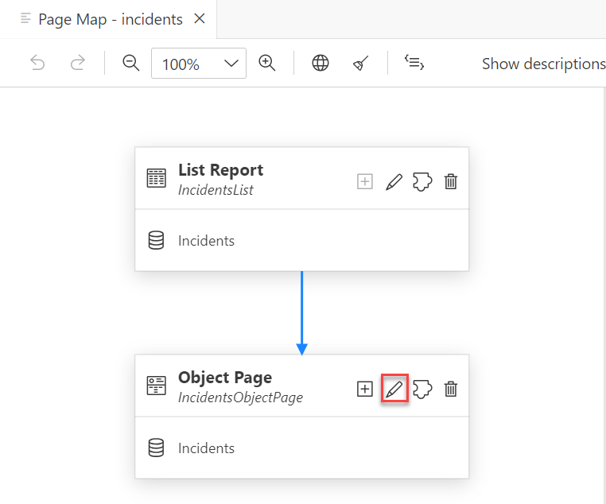

# Add Custom Header Section

In this section, you will edit the Object Page with the SAP Fiori Tools page editor and add the custom header section using the **Flexible Programming Model**. This custom header section is to showcase the Micro Process Flow. The processor can use the  [MicroProcessFlow](https://sapui5.hana.ondemand.com/#/api/sap.suite.ui.commons.MicroProcessFlow) control to track the progress of an incident.

Before you start with the next steps, please ensure the [prerequisites](./prerequisites.md) are completed.

## Edit Object Page

1. In the **Application Info - incidents** tab, click the **Open Page Map** tile. 

    <!-- border; size:540px --> 
    

    > In case the **Application Info - incidents** tab is closed: 
    >
    >1. Invoke the Command Palette - **View** &rarr; **Command Palette** or <kbd>Command</kbd> + <kbd>Shift</kbd> + <kbd>P</kbd> for macOS / <kbd>Ctrl</kbd> + <kbd>Shift</kbd> + <kbd>P</kbd> for Windows. 
    >2. Choose **Fiori: Open Application Info**.

2. In the **Incident Object Page** tile, click the **Pencil** icon next to the title.

    <!-- border; size:540px --> 
    

3. In the **Header** &rarr; **Header Sections**. Click on the **+** icon and choose **Add Custom Section**.

     

4. In the popup, enter the following details.

    | Key  | Value  |
    |---|---|
    | **Header Text**  | `Process` (Click the **Globe** icon to generate a translatable text key).  |
    | **Select View Mode Fragment**  | `Use Existing Fragment`  |
    | **View Mode Fragment Name**  | `StatusProcess (ns.incidents.ext.fragment.StatusProcess)`  |
    
    

5. Click on **Add**.

This will use the existing fragment and handler file that we generated in the [Add Custom Column](./custom-column.md) section.

## Check the result

The header section in the Object page of the Incident Management application should look like this:

