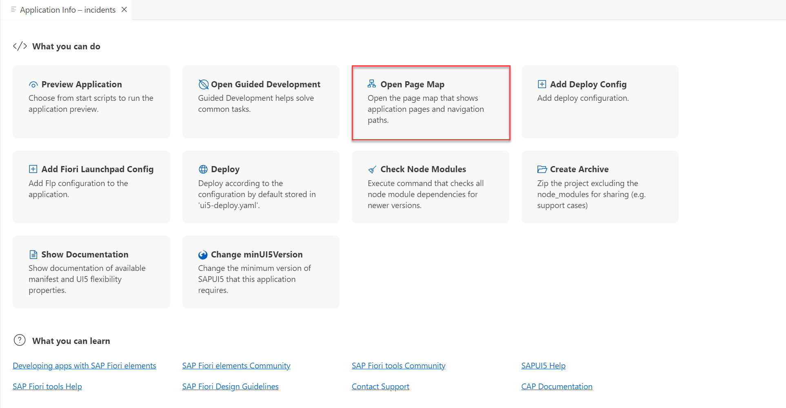
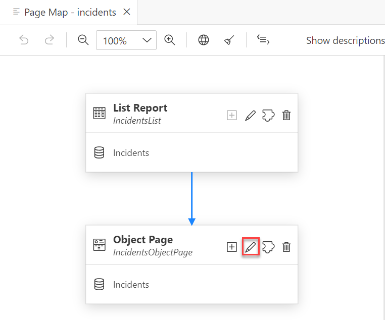
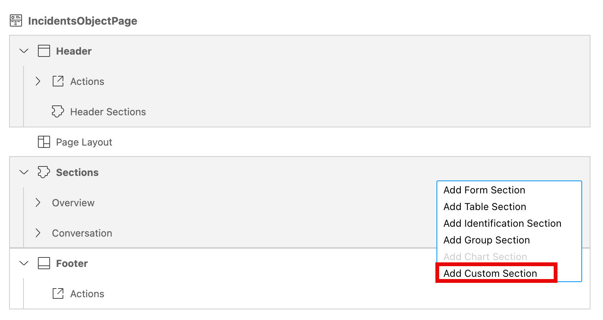
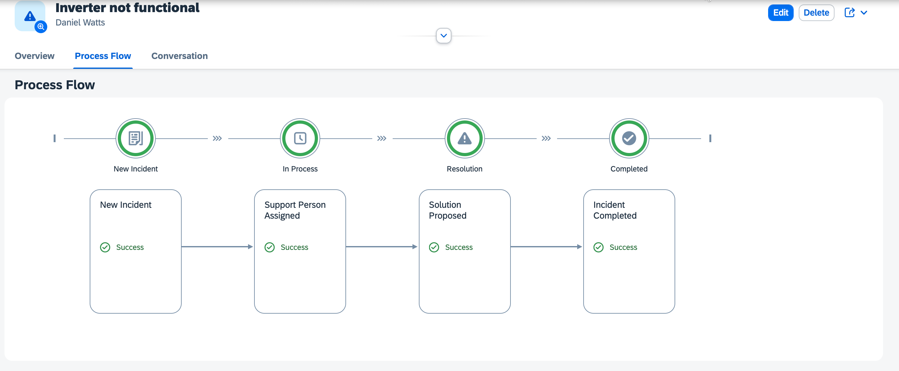

# Add Custom Section

In this chapter, we add a custom section **Process Flow** in the Object page using the **Flexible Programming Model**. This custom section is to showcase the process flow of the incidents using the [ProcessFlow](https://sapui5.hana.ondemand.com/#/api/sap.suite.ui.commons.ProcessFlow) control.

Before you start with the next steps, please ensure the [prerequisites](./prerequisites.md) are completed.

## Edit Object Page

1. In the **Application Info - incidents** tab, click the **Open Page Map** tile. 

    <!-- border; size:540px --> 
    

    > In case the **Application Info - incidents** tab is closed: 
    >
    >1. Invoke the Command Palette - **View** &rarr; **Command Palette** or <kbd>Command</kbd> + <kbd>Shift</kbd> + <kbd>P</kbd> for macOS / <kbd>Ctrl</kbd> + <kbd>Shift</kbd> + <kbd>P</kbd> for Windows. 
    >2. Choose **Fiori: Open Application Info**.

2. In the **Incident Object Page** tile, click the **Pencil** icon next to the title.

    <!-- border; size:540px --> 
    

3. In the **Sections**, click on **+** button and choose **Add Custom Column**.

    

4. In the popup, enter the following details.

    | Key  | Value  |
    |---|---|
    | **Title**  | `Process Flow` (Click the **Globe** icon to generate a translatable text key).  |
    | **View Type**  | `Fragment`   |
    | **Select Your Fragment**  | `Create New Fragment`  |
    | **Fragment Name**  | `ProcessFlow`  |
    | **Anchor Section** | `Overview (ID: i18nOverview)` |
    | **Placement** | `After` |
    | **Generate Event Handler** | `No` |
    
    This will generate the fragment file.

5. Open the `ProcessFlow.fragment.xml` file located in `app/incidents/webapp/ext/fragment` and add the following content into it.

```xml
<core:FragmentDefinition
    xmlns:core="sap.ui.core"
    xmlns="sap.suite.ui.commons"
    xmlns:m="sap.m"
    xmlns:macros="sap.fe.macros"
>
    <ProcessFlow
        id="processflow"
        foldedCorners="false"
        showLabels="true"
        wheelZoomable="false"
        class="PFLayoutSpec"
        nodes="{ path: 'processNodesModel>/nodes'}"
        lanes="{processsFlowModel>/lanes}"
    >
        <nodes>
            <ProcessFlowNode
                id="_IDGenProcessFlowNode"
                laneId="{processNodesModel>laneId}"
                nodeId="{processNodesModel>nodeId}"
                title="{processNodesModel>title}"
                children="{processNodesModel>children}"
                state="{processNodesModel>state}"
                stateText="{processNodesModel>stateText}"
            />
        </nodes>
        <lanes>
            <ProcessFlowLaneHeader
                id="_IDGenProcessFlowLaneHeader"
                laneId="{processsFlowModel>id}"
                iconSrc="{processsFlowModel>icon}"
                text="{processsFlowModel>label}"
                position="{processsFlowModel>position}"
            />
        </lanes>
    </ProcessFlow>
</core:FragmentDefinition>

```

:::details
The above fragment xml includes the [ProcessFlow](https://sapui5.hana.ondemand.com/#/entity/sap.suite.ui.commons.ProcessFlow) control.
:::

## Add data

1. Create a new folder `data` in the location `app/incidents/webapp/ext`.

2. Create a new file `lanes.json` inside the `data` folder that we created in previous step and add the following content into it.

```json
{
    "lanes": [
		{
			"id": "0",
			"icon": "sap-icon://newspaper",
			"label": "New Incident",
			"position": 0
		}, {
			"id": "1",
			"icon": "sap-icon://in-progress",
			"label": "In Process",
			"position": 1
		}, {
			"id": "2",
			"icon": "sap-icon://status-in-process",
			"label": "Resolution",
			"position": 2
		}, {
			"id": "3",
			"icon": "sap-icon://status-completed",
			"label": "Completed",
			"position": 3
		}
    ],

    "nodes": [
        {
			"laneId": "0",
			"nodeId": "0",
			"title": "New Incident",
			"children": ["1"],
			"state": "Positive",
			"stateText": "Success"
		},
		{
			"laneId": "1",
			"nodeId": "1",
			"title": "Support Person Assigned",
			"children": ["3"],
			"state": "Positive",
			"stateText": "Success"
		},
		{
			"laneId": "2",
			"nodeId": "2",
			"title": "Requires attention !",
			"children": [],
			"state": "Negative",
			"stateText": "On-Hold"
		},
		{
			"laneId": "2",
			"nodeId": "3",
			"title": "Solution Proposed",
			"children": ["4"],
			"state": "Positive",
			"stateText": "Success"
		},
		{
			"laneId": "3",
			"nodeId": "4",
			"title": "Incident Completed",
			"children": [],
			"state": "Positive",
			"stateText": "Success"
		}
    ]
}
```

## Configure Data Source

After adding the process flow lanes and nodes data, you'll need to configure the data source.

1. Open `manifest.json` file located in `app/incidents/webapp`.

2. Go to the section `sap.app`. Add a new **processsFlowService** data source to the **dataSources** section as follows:

```json
    "sap.app": {
        ...,
        "dataSources": {
            ...,
            "processsFlowService": {
                "type": "JSON",
                "uri": "./ext/data/lanes.json"
            }
        }
    }
```

3. Go to the section `sap.ui5`. Add a **** model to the **models** section as follows:

```json
    "sap.ui5": {
        ...,
        "models": {
            ...,
            "processsFlowModel": {
                "type": "sap.ui.model.json.JSONModel",
                "dataSource": "processsFlowService",
                "preload": true
            }
        }
    }
```

:::warning
JSON Model is used here in order to keep the custom section example simple.

**For Productive Usage** we recommend to model the `lanes` and `nodes` in the CAP service and consume it using the OData.
:::

## Add Controller Logic

1. Open the `OPControllerExtension.controller.js` file located in the `app/incidents/webapp/ext/controller`.

2. Add the following methods inside the `override` section in addition to the existing methods.

```js

override: {

			routing: {
				onAfterBinding: function (oBindingContext) {
					const oView = this.getView()
					const processNodes = this.getView().getModel("processsFlowModel").getData()
					oBindingContext.requestProperty('status_code').then(function (status_code) {
						// Special case for On-Hold
						if(status_code == "H") processNodes.nodes[1].children = ["2"]
						else  processNodes.nodes.splice(2,1)

						processNodes.nodes = processNodes.nodes.filter(node => node.nodeId <= statusCodeMapping[status_code])
						processNodes.nodes[processNodes.nodes.length - 1].children = []

						let processNodesModel = new JSONModel(processNodes)
						oView.setModel(processNodesModel, "processNodesModel")
					});
						
				}
			},
}

```

:::details
In the above code, we override the `routing` hooks and attach the lifecycle method `onAfterBinding` to load the appropriate models for the process flow.
:::

3. Finally, add the constant `statusCodeMapping`. This is used to map the Incident status code with the process flow node.

```js hl="8-15"
sap.ui.define([
	'sap/ui/core/mvc/ControllerExtension', 
	"sap/m/MessageToast",
	"sap/ui/model/json/JSONModel",
], 
function (ControllerExtension, MessageToast, JSONModel) {
	'use strict';
	const statusCodeMapping = {
		"N": 0,
		"A": 1,
		"I": 1,
		"H": 2,
		"R": 3,
		"C": 4
	};
...
```

:::details OPControllerExtension.controller.js
After adding the above changes, the controller file should look like this

```js
sap.ui.define([
	'sap/ui/core/mvc/ControllerExtension', 
	"sap/m/MessageToast",
	"sap/ui/model/json/JSONModel",
], 
function (ControllerExtension, MessageToast, JSONModel) {
	'use strict';
	const statusCodeMapping = {
		"N": 0,
		"A": 1,
		"I": 1,
		"H": 2,
		"R": 3,
		"C": 4
	};

	return ControllerExtension.extend('ns.incidents.ext.controller.OPControllerExtension', {
		// this section allows to extend lifecycle hooks or hooks provided by Fiori elements
		override: {
			/**
             * Called when a controller is instantiated and its View controls (if available) are already created.
             * Can be used to modify the View before it is displayed, to bind event handlers and do other one-time initialization.
             * @memberOf ns.incidents.ext.controller.OPControllerExtension
             */
			onInit: function () {

				const data = {
					text: ""
				};
				const dialogModel = new JSONModel(data);
				this.getView().setModel(dialogModel, "dialog");
					
			},

			routing: {
				onAfterBinding: function (oBindingContext) {
					const oView = this.getView()
					const processNodes = this.getView().getModel("processsFlowModel").getData()
					oBindingContext.requestProperty('status_code').then(function (status_code) {
						// Special case for On-Hold
						if(status_code == "H") processNodes.nodes[1].children = ["2"]
						else  processNodes.nodes.splice(2,1)

						processNodes.nodes = processNodes.nodes.filter(node => node.nodeId <= statusCodeMapping[status_code])
						processNodes.nodes[processNodes.nodes.length - 1].children = []

						let processNodesModel = new JSONModel(processNodes)
						oView.setModel(processNodesModel, "processNodesModel")
					});
						
				}
			},

			editFlow: {
				onBeforeEdit: function (mParameters) {
					const priority = mParameters?.context.getProperty("urgency/descr")
					return this.openDialog("You're about to edit the incident with Priority: <strong>" + priority + "</strong>")

				},

				onAfterSave: function (mParameters) {
					//
					mParameters.context.refresh();
					//asynchronous access to complete data the context points to
					mParameters.context.requestObject().then((contextData) => {
						return MessageToast.show(
							`Save successful for incident titled: ${contextData.title}`
						);
					});
				},

				onBeforeDiscard: function () {
					return this.openDialog("Are you sure you want to discard this draft?");
				}
			},
			
		},
		openDialog: function (text) {
			return new Promise(
				function (resolve, reject) {
					let dialogModel = this.getView().getModel("dialog"),
						data = dialogModel.getData();
					data.text = text;
					dialogModel.setData(data);
					//use building blocks in an XML fragment using the loadFragment method from the SAP Fiori elements ExtensionAPI
					this.base
						.getExtensionAPI()
						.loadFragment({
							name: "ns.incidents.ext.fragment.Dialog",
							controller: this
						})
						.then(function (approveDialog) {
							//Dialog Continue button
							approveDialog.getBeginButton().attachPress(function () {
								approveDialog.close();
								resolve(null);
							});
							//Dialog Cancel button
							approveDialog.getEndButton().attachPress(function () {
								approveDialog.close().destroy();
								reject(null);
							});
							//consider dialog closing with Escape
							approveDialog.attachAfterClose(function () {
								approveDialog.destroy();
								reject(null);
							});
							approveDialog.open();
						});
				}.bind(this)
			);
		},
		closeDialog: function (closeBtn) {
			closeBtn.getSource().getParent().close();
		},
		viewLocation: function() {

			this.base.getExtensionAPI()
				.loadFragment({
					name: "ns.incidents.ext.fragment.GeoMap",
					controller: this
				})
				.then(function (dialog) {
					dialog.attachEventOnce("afterClose", function () {
						dialog.destroy();
					});

					dialog.open();
				});
		}
	});
});

```
:::

## Check the result

Open the Object page of the incidents and find the section **Process Flow**.

